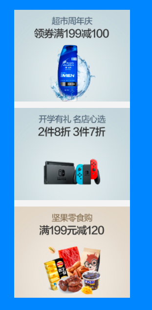
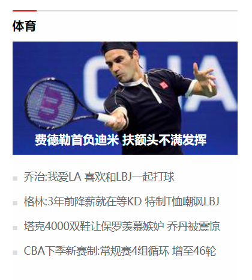

## Layout

### 一、文档流（normal flow）

1. 网页是一个多层的结构，一层摞着一层；
2.  通过CSS可以分别为每一层来设置样式；
3. 作为用户来讲只能看到最顶上一层；
4. 这些层中，最底下的一层称为文档流，文档流是网页的基础， 我们所创建的元素默认都是在文档流中进行排列；
5. 对于我们来元素主要有两个状态：
   * 在文档流中；
   * 不在文档流中（脱离文档流）；
6. 元素在文档流中的特点：
   - **块元素**
                   * 块元素会在页面中**独占一行**(自上向下垂直排列)
                   *  默认宽度是父元素的全部（会把父元素撑满）
                   * 默认高度是被内容撑开（子元素）
   - **行内元素**
        * 行内元素不会独占页面的一行，**只占自身的大小**；
        * 行内元素在页面中左向右水平排列，如果一行之中不能容纳下所有的行内元素，则元素会换到第二行继续自左向右排列（书写习惯一致）；
        * 行内元素的默认宽度和高度都是被内容撑开；


### 二、盒模型（box model）

1. CSS将页面中的所有元素都设置为了一个矩形的盒子；
2. 将元素设置为矩形的盒子后，对页面的布局就变成将不同的盒子摆放到不同的位置；
3. 每一个盒子都由以下几个部分组成：
   * 内容区（content）
   * 内边距（padding）
   * 边框（border）
   * 外边距（margin）

##### 内容区（content）

元素中的所有的子元素和文本内容都在内容区中排列；

* 内容区的大小由width 和 height两个属性来设置
  * width 设置内容区的宽度
  * height 设置内容区的高度          

##### 边框（border）

边框属于盒子边缘，边框里边属于盒子内部，出了边框都是盒子的外部（边框的大小会影响到整个盒子的大小）；

要设置边框，需要至少设置三个样式：

* 边框的宽度 border-width（可以用来指定四个方向的边框的宽度）；

  * 默认值，一般都是 3个像素
  * 四个值：上 右 下 左
  * 三个值：上 左右 下
  * 两个值：上下 左右
  * 一个值：上下左右
  * border-top-width:可以指定具体方向；

* 边框的颜色 border-color（用来指定边框的颜色，同样可以分别指定四个边的边框）；

* 边框的样式 border-style（指定边框的样式）；

  * solid 表示实线
  * dotted 点状虚线
  * dashed 虚线
  * double 双线
  * border-style的默认值是none 表示没有边框

* border简写属性，通过该属性可以同时设置边框所有的相关样式，并且没有顺序要求；

  ```css
  border: solid 10px orange;
  ```

  

##### 内边距(padding)

1. 内容区和边框之间的距离是内边距；

2. 一共有四个方向的内边距；
   * padding-top
   * padding-right
   * padding-bottom
   * padding-left

3. 内边距的设置会影响到盒子的大小；


#####  外边距（margin）

1. 外边距不会影响盒子可见框的大小，但是外边距会影响盒子的位置；
2. 一共有四个方向的外边距：
   * margin-top（上外边距，设置一个正值，元素会向下移动）
   * margin-right（默认情况下设置margin-right不会产生任何效果）
   * margin-bottom（下外边距，设置一个正值，其下边的元素会向下移动）
   * margin-left（左外边距，设置一个正值，元素会向右移动）
   * margin也可以设置负值，如果是负值则元素会向相反的方向移动；

3. 元素在页面中是按照自左向右的顺序排列的；
   * 所以默认情况下如果我们设置的左和上外边距则会移动元素自身；
   * 而设置下和右外边距会移动其他元素；
4. margin的简写属性
   * margin 可以同时设置四个方向的外边距 ，用法和padding一样；


### 三、水平方向布局

 元素在其父元素中水平方向的位置由以下几个属性共同决定；

* margin-left
* border-left
* padding-left
* width
* padding-right
* border-right
* margin-right


**AUTO**

如果这七个值中没有为auto的情况，则浏览器会自动调整margin-right值以使等式满足。如果将一个宽度和一个外边距设置为auto，则宽度会调整到最大，设置为auto的外边距会自动为0

1. 如果将两个外边距设置为auto，宽度固定值，则会将外边距设置为相同的值；所以我们经常利用这个特点来使一个元素在其父元素中水平居中；

   ```css
   .outer{
           width: 800px;
           height: 200px;
           border: 10px red solid;
   }
   
   .inner {
           width: 200px;
           height: 200px;
           margin-left: auto;
           margin-right: auto;
           background-color: #bbffaa;
   }
   ```

   

### 四、垂直方向的布局

子元素是在父元素的内容区中排列的，如果子元素的大小超过了父元素，则子元素会从父元素中溢出，使用 overflow 属性来设置父元素如何处理溢出的子元素；

*  visible，默认值 子元素会从父元素中溢出，在父元素外部的位置显示；
* hidden 溢出内容将会被裁剪不会显示；
* scroll 生成两个滚动条，通过滚动条来查看完整的内容；
* auto 根据需要生成滚动条；


### 五、外边距的折叠

 相邻的垂直方向外边距会发生重叠现象；

1. 兄弟元素

   * 兄弟元素间的相邻垂直外边距会取两者之间的较大值（两者都是正值）；

   * 兄弟元素之间的外边距的重叠，对于开发是有利的，所以我们不需要进行处理；

   ```css
    .box1{
       background-color: #bfa;
   
       /* 设置一个下外边距 */
       margin-bottom: 100px;
     }
   
     .box2{
         background-color: orange;
   
         /* 设置一个上外边距 */
         margin-top: 100px;
      }
   ```

2. 父子元素

   * 父子元素间相邻外边距，子元素的会传递给父元素（上外边距）;
   * 父子外边距的折叠会影响到页面的布局，必须要进行处理；


### 六、行内元素盒模型

1. 行内元素不支持设置宽度和高度；
2. 行内元素可以设置padding，但是垂直方向padding不会影响页面的布局；
3. 行内元素可以设置border，垂直方向的border不会影响页面的布局，垂直方向的margin不会影响布局；
4. display属性（用来设置元素显示的类型）
   * inline 将元素设置为行内元素；
   * block 将元素设置为块元素；
   * inline-block 将元素设置为行内块元素（行内块，既可以设置宽度和高度又不会独占一行）；
   * table 将元素设置为一个表格；
   * none 元素不在页面中显示；
5. visibility属性（用来设置元素的显示状态）
   * visible 默认值，元素在页面中正常显示； 
   * hidden 元素在页面中隐藏 不显示，但是依然占据页面的位置；


### 七、默认样式

通常情况，浏览器都会为元素设置一些默认样式；

默认样式的存在会影响到页面的布局，通常情况下编写网页时必须要去除浏览器的默认样式（PC端的页面）；

```css
body {
   margin: 0;
}

p {
   margin: 0;
}

ul {
    margin: 0;
    padding: 0;
          
    list-style:none; 
} 

* {
    margin: 0;
    padding: 0;
}
```


### 八、盒子大小

默认情况下，盒子可见框的大小由内容区、内边距和边框共同决定;

* box-sizing 用来设置盒子尺寸的计算方式（设置width和height的作用）

  1. content-box 默认值，宽度和高度用来设置内容区的大小;
  2. border-box 宽度和高度用来设置整个盒子可见框的大小(width 和 height 指的是内容区 和 内边距 和 边框的总大小)；

  ```css
  .box1{
  	width: 100px;
  	height: 100px;
  	background-color: #bfa;
  	padding: 10px;
  	border: 10px red solid;c
  	box-sizing: border-box;
  }
  ```

  

### 九、轮廓和圆角

##### 轮廓

1. outline 用来设置元素的轮廓线，用法和border一模一样

   * 轮廓和边框不同的点，就是轮廓不会影响到可见框的大小 

   ```css
   .box1:hover{
          outline: 10px red solid;
    }
   ```


##### 阴影

1. box-shadow：用来设置元素的阴影效果，阴影不会影响页面布局 

   * 第一个值 水平偏移量 设置阴影的水平位置 正值向右移动 负值向左移动
   * 第二个值 垂直偏移量 设置阴影的水平位置 正值向下移动 负值向上移动
   * 第三个值 阴影的模糊半径
   * 第四个值 阴影的颜色

   ```css
    box-shadow: 0px 0px 50px rgba(0, 0, 0, .3) ; 
   ```


##### 圆角

1. border-radius: 用来设置圆角 圆角设置的圆的半径大小；

   ```css
   .box2{
       width: 200px;
       height: 200px;
       background-color: orange;
       border-radius: 30%;
   }
   ```

   


## 练习
#### 1. 图片列表




```html
<!DOCTYPE html>
<html lang="en">
<head>
    <meta charset="UTF-8">
    <title>图片列表</title>
    <link rel="stylesheet" href="css/reset.css">

    <style>
        /*设置body背景色*/
        body {
            background-color: #3a84ff;
        }

        /*设置ul样式*/
        .img-list {
            width: 190px;
            height: 470px;
            overflow: hidden;
            /*使ul在页面居中显示;*/
            margin: 50px auto;
            background-color: #F4F4F4;
        }

        /*设置li的位置*/
        .img-list li:not(:last-child) {
            margin-bottom: 9px;
        }

        /*设置图片的大小*/
        .img-list img { /*后代元素选择器*/
            width: 100%;
        }
    </style>
</head>
<body>
<ul class="img-list">
    <li>
        <a href="javascript:">
            
        </a>
    </li>

    <li>
        <a href="javascript:">
            
        </a>
    </li>

    <li>
        <a href="javascript:">
            
        </a>
    </li>
</ul>
</body>
</html>
```


#### 2. 仿京东列表


```html
<!DOCTYPE html>
<html lang="en">
<head>
    <meta charset="UTF-8">
    <meta name="viewport" content="width=device-width, initial-scale=1.0">
    <meta http-equiv="X-UA-Compatible" content="ie=edge">
    <title>Title</title>
    <link rel="stylesheet" href="./css/reset.css">
    <style>
        body {
            /*设置网页背景*/
            background-color: #bfa;
        }

        .left-nav {
            width: 190px;
            height: 450px;
            padding: 10px 0;
            background-color: #fefefe;
            margin: 50px;
        }

        /*设置菜单内部的item*/
        .left-nav .item {
            height: 25px;
            /*让文字在父元素中垂直居中，只需要将父元素的line-height设置为一个和父元素height一样；*/
            line-height: 25px;
            padding-left: 18px;
            /* 设置字体大小 */
            font-size: 12px;
        }

        /* 设置/的距离 */
        .item .line {
            padding: 0 2px;
        }

        /*为item设置一个鼠标移入状态*/
        .item:hover {
            background-color: #d9d9d9;
        }

        .item a {
            /*设置字体大小*/
            font-size: 14px;
            color: #333;
            /*去除下划线*/
            text-decoration: none;
        }

        .item a:hover {
            color: #c81623;
        }


    </style>
</head>
<body>
<nav class="left-nav">
    <div class="item"><a href="#">家用电器</a></div>

    <div class="item">
        <a href="#">手机</a><span class='line'>/</span><a href="#">运营商</a><span class='line'>/</span><a href="#">数码</a>
    </div>

    <div class="item">
        <a href="#">电脑</a><span class='line'>/</span><a href="#">办公</a>
    </div>

    <div class="item">
        <a href="#">家居</a><span class='line'>/</span><a href="#">家具</a><span class='line'>/</span><a href="#">家装</a><span class='line'>/</span><a href="#">厨具</a>
    </div>

    <div class="item">
        <a href="#">男装</a><span class='line'>/</span><a href="#">女装</a><span class='line'>/</span><a href="#">童装</a><span class='line'>/</span><a href="#">内衣</a>
    </div>

    <div class="item">
        <a href="#">美妆</a><span class='line'>/</span><a href="#">个护清洁</a><span class='line'>/</span><a href="#">宠物</a>
    </div>

    <div class="item">
        <a href="#">女鞋</a><span class='line'>/</span><a href="#">箱包</a><span class='line'>/</span><a href="#">钟表</a><span class='line'>/</span><a href="#">珠宝</a>
    </div>

    <div class="item">
        <a href="#">男鞋</a><span class='line'>/</span><a href="#">运动</a><span class='line'>/</span><a href="#">户外</a>
    </div>

    <div class="item">
        <a href="#">房产</a><span class='line'>/</span><a href="#">汽车</a><span class='line'>/</span><a href="#">汽车用品</a>
    </div>

    <div class="item">
        <a href="#">母婴</a><span class='line'>/</span><a href="#">玩具乐器</a>
    </div>

    <div class="item">
        <a href="#">食品</a><span class='line'>/</span><a href="#">酒类</a><span class='line'>/</span><a href="#">生鲜</a><span class='line'>/</span><a href="#">特产</a>
    </div>

    <div class="item">
        <a href="#">艺术</a><span class='line'>/</span><a href="#">礼品鲜花</a><span class='line'>/</span><a href="#">农资绿植</a>
    </div>

    <div class="item">
        <a href="#">医药保健</a><span class='line'>/</span><a href="#">计生情趣</a>
    </div>

    <div class="item">
        <a href="#">图书</a><span class='line'>/</span><a href="#">文娱</a><span class='line'>/</span><a href="#">电子书</a>
    </div>

    <div class="item">
        <a href="#">机票</a><span class='line'>/</span><a href="#">酒店</a><span class='line'>/</span><a href="#">旅游</a><span class='line'>/</span><a href="#">生活</a>
    </div>

    <div class=" item">
        <a href="#">理财</a><span class='line'>/</span><a href="#">众筹</a><span class='line'>/</span><a href="#">白条</a><span class='line'>/</span><a href="#">保险</a>
    </div>

    <div class="item">
        <a href="#">安装</a><span class='line'>/</span><a href="#">维修</a><span class='line'>/</span><a href="#">清洗</a><span class='line'>/</span><a href="#">二手</a>
    </div>

    <div class="item">
        <a href="#">工业品</a>
    </div>

</nav>
</body>
</html>
```


#### 3. 网易新闻列表



```html
<!DOCTYPE html>
<html lang="en">
<head>
    <meta charset="UTF-8">
    <title>网易新闻列表</title>
    <link rel="stylesheet" href="./css/reset.css">

    <style>
        body {
            //background-color: #3a84ff;
        }
        a {
            text-decoration: none;
        }

        .news-wrapper {
            width: 300px;
            height: 358px;
            background-color: #fefefe;
            /*设置居中*/
            margin: 50px auto;
            /*设置上边框*/
            border-top: 2px solid #dddddd;
        }

        .news-title {
            /*为了边框和文字宽度一致，将h2转换为行内块元素*/
            display: inline-block;
            height: 30px;
            border-top: 2px red solid;
            margin-top: -2px;
            padding-top: 10px;
        }

        .news-title a {
            text-decoration: none;
            color: #000000;
            font-weight: bold;
        }

        .news-img {
            height: 150px;
        }

        /*设置图片文字效果*/
        .news-img .img-title {
            margin-top: -30px;
            padding-left: 30px;
            color: #ffffff;
            font-weight: bold;
        }

        /*设置新闻列表*/
        .news-list {
            margin-top: 20px;
        }

        /*设置li*/
        .news-list li {
            margin-bottom: 17px;
        }

        /*设置li中的文字*/
        .news-list li a {
            font-size: 14px;
            color: #666666;
        }

        .news-list li a:hover {
            color: red;
        }

        .news-list li::before {
            content: '■';
            color: #dddddd;
            font-size: 12px;
            margin-right: 8px;
        }


    </style>
</head>
<body>
<div class="news-wrapper">
    <h2 class="news-title">
        <a href="#">体育</a>
    </h2>

    <div class="news-img">
        <a href="#">
            
            <h3 class="img-title">费德勒首负迪米 扶额头不满发挥</h3>
        </a>
    </div>

    <ul class="news-list">
        <li><a href="#">乔治:我爱LA 喜欢和LBJ一起打球</a></li>
        <li><a href="#">格林:3年前降薪就在等KD 特制T恤嘲讽LBJ</a></li>
        <li><a href="#">塔克4000双鞋让保罗羡慕嫉妒 乔丹被震惊</a></li>
        <li><a href="#">CBA下季新赛制:常规赛4组循环 增至46轮</a></li>
    </ul>
</div>
</body>
</html>
```

