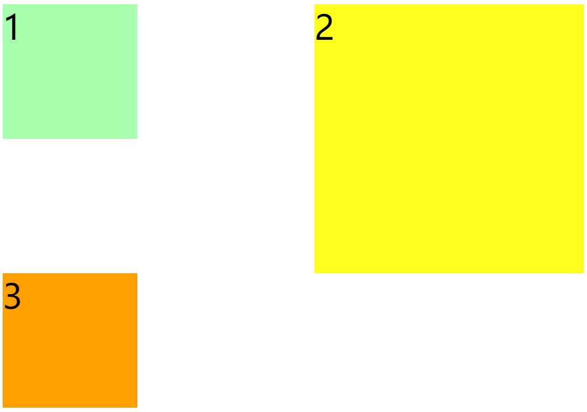
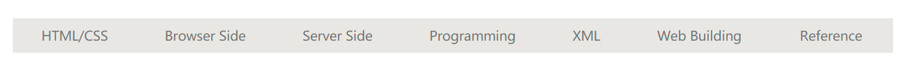

### 一、Float简介

通过浮动可以使一个元素向其父元素的左侧或右侧移动；

1. 使用 float 属性来设置于元素的浮动（元素设置浮动以后，会完全从文档流中脱离，不再占用文档流的位置，元素下边的还在文档流中的元素会自动向上移动）；
   * none 默认值 ，元素不浮动；
   * left 元素向左浮动；
   * right 元素向右浮动；

2. 浮动的特点
   * 浮动元素会完全脱离文档流，不再占据文档流中的位置
   * 设置浮动以后元素会向父元素的左侧或右侧移动，
   * 浮动元素默认不会从父元素中移出
   * 浮动元素向左或向右移动时，不会超过它前边的其他浮动元素
   * 如果浮动元素的上边是一个没有浮动的块元素，则浮动元素无法上移
   * 浮动元素不会超过它上边的浮动的兄弟元素，最多就是和它一样高
   
3. 浮动目前来讲它的主要作用就是让页面中的元素可以水平排列，通过浮动可以制作一些水平方向的布局。

   ```css
   <style>
           .box1{
               width: 400px;
               height: 200px;
               background-color: #bfa;
                    float: left;
           }
           
           .box2{
               width: 400px;
               height: 200px;
               background-color: orange;
               float: left;
           }
   
           .box3{
               width: 200px;
               height: 200px;
               background-color: yellow;
               float: right;
           }
   </style>
   
   <body>
       <div class="box1"></div>
       <div class="box2"></div>
       <div class="box3"></div> 
   </body>
   ```

   

4. 浮动元素不会盖住文字，文字会自动环绕在浮动元素的周围，所以我们可以利用浮动来设置文字环绕图片的效果;
5. 元素设置浮动以后，将会从文档流中脱离，从文档流中脱离后，元素的一些特点也会发生变化（脱离文档流以后，不需要再区分块和行内）:
   * 块元素：
     1. 块元素不在独占页面的一行；
     2. 脱离文档流以后，块元素的宽度和高度默认都被内容撑开；
   * 行内元素：
     1. 行内元素脱离文档流以后会变成块元素，特点和块元素一样；


### 二、高度坍塌问题

1. 在浮动布局中，父元素的高度默认是被子元素撑开的，当子元素浮动后，其会完全脱离文档流，子元素从文档流中脱离，将会无法撑起父元素的高度，导致父元素的高度丢失。
2. 父元素高度丢失以后，其下的元素会自动上移，导致页面的布局混乱。
3. 所以高度塌陷是浮动布局中比较常见的一个问题，这个问题我们必须要进行处理！


### 三、BFC(Block Formatting Context) 块级格式化环境

1. BFC是一个CSS中的一个隐含的属性，可以为一个元素开启BFC，开启BFC该元素会变成一个独立的布局区域；
2. 元素开启BFC后的特点：
   * 开启BFC的元素不会被浮动元素所覆盖；
   * 开启BFC的元素子元素和父元素外边距不会重叠；
   * 开启BFC的元素可以包含浮动的子元素；
3. 可以通过一些特殊方式来开启元素的BFC
   * 设置元素的浮动（不推荐）
   * 将元素设置为行内块元素（不推荐）
   * 将元素的overflow设置为一个非visible的值（ 为元素设置 overflow:hidden 开启其BFC 以使其可以包含浮动元素）


### 四、Clear属性

1. 如果我们不希望某个元素因为其他元素浮动的影响而改变位置，可以通过clear属性来清除浮动元素对当前元素所产生的影响；

2. 可选值：

   * left 清除左侧浮动元素对当前元素的影响；
   * right 清除右侧浮动元素对当前元素的影响；
   * both 清除两侧中最大影响的那侧；

3. 原理：

   设置清除浮动以后，浏览器会自动为元素添加一个上外边距，以使其位置不受其他元素的影响；



```html
<head>
    <style>

        div{
            font-size: 50px;
        }

        .box1{
            width: 200px;
            height: 200px;
            background-color: #bfa;
            float: left;
        }

        .box2{
            width: 400px;
            height: 400px;
            background-color: #ff0;
            float: right;
        }

        .box3{
            width: 200px;
            height: 200px;
            background-color: orange;
            clear: both;
        }
    </style>
</head>
<body>
    <div class="box1">1</div>
    <div class="box2">2</div>
    <div class="box3">3</div>    
</body>
```


### 五、clearFix高度塌陷终极解决方案

```html
<style>
/* clearfix 这个样式可以同时解决高度塌陷和外边距重叠的问题，当你在遇到这些问题时，直接使用clearfix这个类即可 */
.clearfix::before,
.clearfix::after {
            content: '';
            display: table;
            clear: both;
}
</style>

<body>

    <div class="box1 clearfix">
        <div class="box2"></div>
    </div>
    
</body>
```


### 六、练习

#### 1. 导航条练习



```html
<!DOCTYPE html>
<html lang="en">
<head>
    <meta charset="UTF-8">
    <title>导航条</title>
    <link rel="stylesheet" href="./css/reset.css">
    <style>
        .nav {
            width: 1210px;
            height: 48px;
            background-color: #E8E7E3;
            margin: 100px auto;
        }

        /*设置nav中的li*/
        .nav li {
            height: 48px;
            /*设置为垂直居中*/
            line-height: 48px;
            float: left;
        }

        /*设置a的样式*/
        .nav a {
            /*将a转换为块元素*/
            display: block;
            height: 48px;
            text-decoration: none;
            color: #777777;
            font-size: 18px;
            padding: 0 39px
        }

        .nav a:hover {
            background-color: #3F3F3F;
            color: #E8E7E3;
        }

        .nav li:last-child a {
            padding: 0 42px 0 41px;
        }
        
    </style>
</head>
<body>
<ul class="nav">
    <li><a href="#">HTML/CSS</a></li>
    <li><a href="#">Browser Side</a></li>
    <li><a href="#">Server Side</a></li>
    <li><a href="#">Programming</a></li>
    <li><a href="#">XML</a></li>
    <li><a href="#">Web Building</a></li>
    <li><a href="#">Reference</a></li>
</ul>
</body>
</html>
```


#### 2. 一个简单的布局

```html
<!DOCTYPE html>
<html lang="en">
<head>
    <meta charset="UTF-8">
    <meta name="viewport" content="width=device-width, initial-scale=1.0">
    <meta http-equiv="X-UA-Compatible" content="ie=edge">
    <title>Document</title>
    <style>

        header, main, footer {
            width: 1000px;
            margin: 0 auto;
        }

        /* 设置头部 */
        header {
            height: 150px;
            background-color: silver;
        }

        /* 设置主体 */
        main {
            height: 500px;
            background-color: #bfa;
            margin: 10px auto;
        }

        nav, article, aside {
            float: left;
            height: 100%;
        }

        /* 设置左侧的导航 */
        nav {
            width: 200px;
            background-color: yellow;
        }

        /* 设置中间的内容 */
        article {
            width: 580px;
            background-color: orange;
            margin: 0 10px;
        }

        /* 设置右侧的内容 */
        aside {
            width: 200px;
            background-color: pink;
        }

        /* 设置底部 */
        footer {
            height: 150px;
            background-color: tomato;
        }
    </style>
</head>
<body>

<!-- 创建头部 -->
<header></header>

<!-- 创建网页的主体 -->
<main>
    <!-- 左侧导航 -->
    <nav></nav>

    <!-- 中间的内容 -->
    <article></article>

    <!-- 右边的边栏 -->
    <aside></aside>

</main>

<!-- 网页的底部 -->
<footer></footer>
</body>
</html>
```

