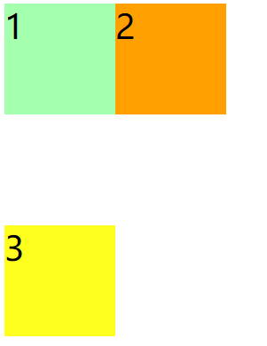
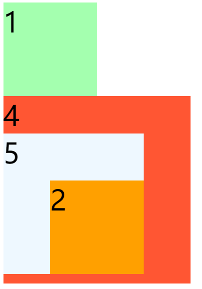

### 一、定位

1. 定位是一种更加高级的布局手段；
2. 通过定位可以将元素摆放到页面的任意位置；
3. 使用position属性来设置定位：
   * static默认值，元素是静止的没有开启定位；
   * relative开启元素的相对定位；
   * absolute开启元素的绝对定位；
   * fixed开启元素的固定定位；
   * sticky开启元素的粘滞定位；


### 二、相对定位

1. 当元素的position属性值设置为relative时则开启了元素的相对定位；

2. 相对定位的特点

   * 元素开启相对定位以后，如果不设置偏移量元素不会发生任何的变化；
   * 相对定位是参照于元素在文档流中的位置进行定位的；
   * 相对定位会提升元素的层级；
   * **相对定位不会使元素脱离文档流**；
   * 相对定位不会改变元素的性质，块还是块，行内还是行内；

3. 偏移量（offset）

   * top：定位元素和定位位置上边的距离；
   * bottom：定位元素和定位位置下边的距离；定位元素垂直方向的位置由top和bottom两个属性来控制，通常情况下我们只会使用其中一，top值越大，定位元素越向下移动，bottom值越大，定位元素越向上移动；
   * left：定位元素和定位位置的左侧距离；
   * right：定位元素和定位位置的右侧距离；定位元素水平方向的位置由left和right两个属性控制，通常情况下只会使用一个；left越大元素越靠右， right越大元素越靠左；

   ```html
   <style>
       body{
           font-size: 60px;
       }
       .box1{
           width: 200px;
           height: 200px;
           background-color: #bfa;
       }
   
       .box2{
           width: 200px;
           height: 200px;
           background-color: orange;
           position: relative;
           left: 200px;
           top: -200px;
       }
   
       .box3{
           width: 200px;
           height: 200px;
           background-color: yellow;
       }
   </style>
   
   <body>
       <div class="box1">1</div>
       <div class="box2">2</div>
       <div class="box3">3</div>   
   </body>
   ```

   


### 三、绝对定位

1. 当元素的position属性值设置为absolute时，则开启了元素的绝对定位；
2. 绝对定位的特点：
   * 开启绝对定位后，如果不设置偏移量元素的位置不会发生变化；
   * 开启绝对定位后，元素会从文档流中脱离；
   * 绝对定位会改变元素的性质，行内变成块，块的宽高被内容撑开；
   * 绝对定位会使元素提升一个层级；
   * 绝对定位元素是相对于其包含块进行定位的；
3. 包含块( containing block )
   * 正常情况下，包含块就是离当前元素最近的祖先块元素；
   * 绝对定位的包含块，就是离它最近的开启了定位的祖先元素，如果所有的祖先元素都没有开启定位，则根元素就是它的包含块；

```html
<style>
        body {
            font-size: 60px;
        }

        .box1 {
            width: 200px;
            height: 200px;
            background-color: #bfa;
        }

        .box2 {
            width: 200px;
            height: 200px;
            background-color: orange;
            position: absolute;
            left: 100px;
            top: 100px;
        }

        .box4 {
            width: 400px;
            height: 400px;
            background-color: tomato;
        }

        .box5 {
            width: 300px;
            height: 300px;
            background-color: aliceblue;
            position: relative;
        }
</style>
    
<body>

<div class="box1">1</div>
<div class="box4">4
    <div class="box5">5
        <div class="box2">2</div>
    </div>
</div>

</body>
```




### 四、固定定位

1. 将元素的position属性设置为fixed则开启了元素的固定定位;

2. 固定定位也是一种绝对定位，所以固定定位的大部分特点都和绝对定位一样，唯一不同的是固定定位永远参照于浏览器的视口进行定位，固定定位的元素不会随网页的滚动条滚动；

   ```html
    <style>
           body{
               font-size: 60px;
               height: 2000px;
           }
   
           .box1{
               width: 200px;
               height: 200px;
               background-color: #bfa;
           }
   
           .box2{
               width: 200px;
               height: 200px;
               background-color: orange;
               position: fixed;
               left: 200px;
               top: 0;
           }
   
           .box3{
               width: 200px;
               height: 200px;
               background-color: yellow;
           }
   </style>
   
   <body>
       <div class="box1">1</div>
       <div class="box2">2</div>
       <div class="box3">3</div> 
   </body>
   ```


### 五、粘滞定位

1. 当元素的position属性设置为sticky时则开启了元素的粘滞定位；
2. 粘滞定位和相对定位的特点基本一致，不同的是粘滞定位可以在元素到达某个位置时将其固定；


### 六、元素层级

1. 对于开启了定位元素，可以通过z-index属性来指定元素的层级；
2. z-index需要一个整数作为参数，值越大元素的层级越高，元素的层级越高越优先显示；
3. 如果元素的层级一样，则优先显示靠下的元素；
4. 祖先的元素的层级再高也不会盖住后代元素；


### 七、练习

##### 轮播图

```html
<!DOCTYPE html>
<html lang="en">
<head>
    <meta charset="UTF-8">
    <title>我的轮播图</title>
    <link rel="stylesheet" href="./css/reset.css">


    <style>
        .img-list {
            width: 590px;
            height: 470px;
            margin: 100px auto;
            position: relative;
        }

        /*设置li*/
        .img-list li {
            position: absolute;
        }

        /*通过修改元素的层级来显示指定图片*/
        .img-list li:nth-child(4) {
            z-index: 1;
        }

        /*设置导航点的样式*/
        .pointer a {
            /*设置元素向左浮动*/
            float: left;
            width: 10px;
            height: 10px;
            background-color: red;
            border-radius: 50%;
            margin-left: 4px;
            background-color: rgba(255, 255, 255, .3);
            background-clip: content-box;
            border: 2px solid transparent;
        }

        .pointer {
            position: absolute;
            z-index: 9999;
            bottom: 20px;
            left: 40px;
        }

        .pointer a.active,
        .pointer a:hover {
            background-color: #ffffff;
            border: 2px solid rgba(255, 255, 255, .3);
        }

    </style>
</head>
<body>
<ul class="img-list">
    <li><a href="javascript:"></a></li>
    <li><a href="javascript:"></a></li>
    <li><a href="javascript:"></a></li>
    <li><a href="javascript:"></a></li>
    <li><a href="javascript:"></a></li>
    <li><a href="javascript:"></a></li>
    <li><a href="javascript:"></a></li>
    <li><a href="javascript:"></a></li>

    <div class="pointer">
        <a class="active" href="javascript:"></a>
        <a href="javascript:"></a>
        <a href="javascript:"></a>
        <a href="javascript:"></a>
        <a href="javascript:"></a>
        <a href="javascript:"></a>
        <a href="javascript:"></a>
        <a href="javascript:"></a>
    </div>
</ul>
</body>
</html>
```

