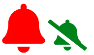
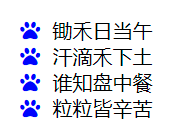
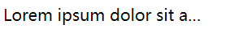

### 一、字体

1. color 用来设置字体颜色；
2. font-size 字体的大小；
3. font-family 字体族（字体的格式）；
   * serif  衬线字体
   * sans-serif 非衬线字体
   * monospace 等宽字体
4. font-family 可以同时指定多个字体，多个字体间使用,隔开，字体生效时优先使用第一个，第一个无法使用则使用第二个 以此类推；

```css
p {
    color: blue;
    font-size: 40px;
    font-family: 'Courier New', Courier, monospace;
}
```


##### 从服务器加载字体

```css
@font-face {
       /* 指定字体的名字 */
       font-family: 'myfont' ;
       /* 服务器中字体的路径 */
       src: url('./font/ZCOOLKuaiLe-Regular.ttf') format("truetype");
}
```


### 二、图标字体

1. 在网页中经常需要使用一些图标，可以通过图片来引入图标，但是图片大小本身比较大，并且非常的不灵活；
2. 在使用图标时，我们还可以将图标直接设置为字体，然后通过font-face的形式来对字体进行引入；


####  fontawesome使用

1. 将css和webfonts移动到项目中；

2. 将all.css引入到网页中；

3. 使用图标字体；

   * 直接通过类名来使用图标字体；

   ```html
   <html lang="en">
   <head>
       <meta charset="UTF-8">
       <meta name="viewport" content="width=device-width, initial-scale=1.0">
       <meta http-equiv="X-UA-Compatible" content="ie=edge">
       <title>Document</title>
       <link rel="stylesheet" href="./fa/css/all.css">
   </head>
   <body>
   <i class="fas fa-bell" style="font-size:80px; color:red;"></i>
   <i class="fas fa-bell-slash" style="font-size:50px; color:green;"></i>
   </body>
   </html>
   ```

   

4. **通过伪元素来设置图标字体**

   * 找到要设置图标的元素通过before或after选中;
   * 在content中设置字体的编码;
   * 设置字体的样式;
     * fab：（font-family: 'Font Awesome 5 Brands';）
     * fas：（font-family: 'Font Awesome 5 Free';）

   ```html
   <!DOCTYPE html>
   <html lang="en">
   <head>
       <meta charset="UTF-8">
       <meta name="viewport" content="width=device-width, initial-scale=1.0">
       <meta http-equiv="X-UA-Compatible" content="ie=edge">
       <title>Document</title>
       <link rel="stylesheet" href="./fa/css/all.css">
       <style>
           li{
               list-style: none;
           }
   
           li::before{
               content: '\f1b0';
               font-family: 'Font Awesome 5 Free';
               font-weight: 900; 
               color: blue;
               margin-right: 10px;
           }
       </style>
   </head>
   <body>
   
       <!-- <i class="fas fa-cat"></i> -->
   
       <ul>
           <li>锄禾日当午</li>
           <li>汗滴禾下土</li>
           <li>谁知盘中餐</li>
           <li>粒粒皆辛苦</li>
       </ul>
   
       <!-- 
           通过实体来使用图标字体：
               &#x图标的编码;
        -->
       <span class="fas">&#xf0f3;</span>
   </body>
   </html>
   ```

   

### 三、行高

1. 行高指的是文字占有的实际高度，可以通过line-height来设置行高；
2. 行高可以直接指定一个大小（px em），也可以直接为行高设置一个整数，如果是一个整数的话，行高将会是字体的指定的倍数；
3. 行高经常还用来设置文字的行间距：（行间距 = 行高 - 字体大小）；
4. 字体框：字体存在的格子，设置font-size实际上就是在设置字体框的高度；
5. 行高会在字体框的上下平均分配；
6. 可以将行高设置为和高度一样的值，使单行文字在一个元素中垂直居中（line-height）；


### 四、字体的简写属性

1. font 可以设置字体相关的所有属性；

   * 语法：font: 字体大小/行高 字体族 （行高 可以省略不写 如果不写使用默认值）

2. font-weight（字重 字体的加粗 ）

   * normal 默认值 不加粗
   * bold 加粗
   * 100-900 九个级别（没什么用）

3. font-style（字体的风格）

   * normal 正常的
   * italic 斜体

4. 简写

   ```css
   font: bold italic 50px/2  微软雅黑, 'Times New Roman', Times, serif;
   ```

   

### 五、文本样式（排版、对齐）

1. text-align (文本的水平对齐)

   * left 左侧对齐
   * right 右对齐
   * center 居中对齐
   * justify 两端对齐

2. vertical-align (元素垂直对齐的方式)

   * baseline 默认值 基线对齐
   * top 顶部对齐
   * bottom 底部对齐
   * middle 居中对齐

3. 图片对齐默认使用基线对齐，下方会有空白，使用vertical-align处理；

   ```css
   img {
      vertical-align: bottom;
   }
   ```

4. text-decoration (设置文本修饰)

   * none 什么都没有
   * underline 下划线
   * line-through 删除线
   * overline 上划线

5. white-space 设置网页如何处理空白

   * normal 正常
   * nowrap 不换行
   * pre 保留空白

   ```html
   .box{
      width: 200px;
      white-space: nowrap;
      overflow: hidden;
      text-overflow: ellipsis;
   }
   ```

   


### 六、练习

##### 京东导航条


```html
<!DOCTYPE html>
<html lang="en">

<head>
    <meta charset="UTF-8">
    <meta name="viewport" content="width=device-width, initial-scale=1.0">
    <meta http-equiv="X-UA-Compatible" content="ie=edge">
    <title>京东顶部导航条</title>
    <!-- 引入重置样式表 -->
    <link rel="stylesheet" href="./css/reset.css">
    <!-- 引用图标字体 -->
    <link rel="stylesheet" href="./fa/css/all.css">

    <style>

        .clearfix::before,
        .clearfix::after {
            content: '';
            display: table;
            clear: both;
        }

        body {
            /* 设置字体 */
            font: 12px/1.5 Microsoft YaHei, Heiti SC, tahoma, arial, Hiragino Sans GB, "\5B8B\4F53", sans-serif;
        }

        /* 设置外部容器的样式 */
        .top-bar-wrapper {
            /* 设置宽度 */
            width: 100%;
            /* 设置背景颜色 */
            background-color: #E3E4E5;
            height: 30px;
            /* 设置行高，没有设置高度 使文字垂直居中 */
            line-height: 30px;
            /* 设置下边框 */
            border-bottom: 1px #ddd solid
        }

        /* 设置内部容器的样式 */
        .top-bar {
            /* 固定宽度 */
            width: 1190px;
            /* 设置水平居中 */
            margin: 0 auto;

            position: relative;
        }

        /* 设置字体样式 */
        .top-bar a,
        .top-bar span,
        .top-bar i {
            color: #999;
            text-decoration: none;
        }

        .top-bar a:hover,
        .top-bar a.highlight {
            color: #f10215;
        }

        /* 设置location */
        .location {
            float: left;
        }

        /* 设置location下的小图标 */
        .location .fas {
            color: #f10215;
        }

        /* 设置城市列表的效果 */
        .location .city-list {
            display: none;
            width: 320px;
            height: 436px;
            background-color: white;
            border: 1px solid rgb(204, 204, 204);
            /* 设置绝对定位，使其不占据页面的位置 */
            position: absolute;
            top: 31px;
            z-index: 999;
            box-shadow: 0 2px 2px rgba(0, 0, 0, .2)
        }

        /* 当鼠标移入到location时，让city-list显示 */
        .location:hover .city-list {
            display: block;
        }

        .current-city {
            padding: 0 10px;
            border: 1px solid transparent;
            border-bottom: none;
            position: relative;
            z-index: 9999;
        }

        /* 设置current-city的移入的效果 */
        .location:hover .current-city {
            background-color: white;
            border: 1px solid rgb(204, 204, 204);
            border-bottom: none;
            padding-bottom: 1px;
        }


        /* 设置shortcut */
        .shortcut {
            float: right;
        }

        /* 设置分割线 */
        .shortcut .line {
            width: 1px;
            height: 10px;
            background-color: rgb(204, 202, 202);
            margin: 12px 12px 0;
        }

        /* 设置li */
        .shortcut li {
            float: left;
        }
    </style>
</head>

<body>
<!-- 创建外围的容器 -->
<div class="top-bar-wrapper">
    <!-- 创建内部容器 -->
    <div class="top-bar clearfix">
        <!-- 左侧的菜单 -->
        <div class="location">
            <div class="current-city">
                <i class="fas fa-map-marker-alt"></i>
                <a href="javascript:">北京</a>
            </div>

            <!-- 放置城市列表的div -->
            <div class="city-list"></div>
        </div>

        <!-- 右侧的菜单 -->
        <ul class="shortcut clearfix">
            <li>
                <a href="javascript:">你好，请登录</a>
                <a class="highlight" href="javascript:;">免费注册</a>
            </li>

            <!-- 分割线 -->
            <li class="line"></li>
            <li><a href="javascript:;">我的订单</a></li>

            <li class="line"></li>
            <li>
                <a href="javascript:;">我的京东</a>
                <i class="fas fa-angle-down"></i>
            </li>


            <li class="line"></li>
            <li><a href="javascript:;">京东会员</a></li>

            <li class="line"></li>
            <li>
                <a class="highlight" href="javascript:;">企业采购</a>
                <i class="fas fa-angle-down"></i>
            </li>


            <li class="line"></li>
            <li>
                <span>客户服务</span>
                <i class="fas fa-angle-down"></i>
            </li>

            <li class="line"></li>
            <li>
                <span>网站导航</span>
                <i class="fas fa-angle-down"></i>
            </li>

            <li class="line"></li>
            <li><span>手机京东</span></li>
        </ul>
    </div>
</div>
</body>

</html>
```

