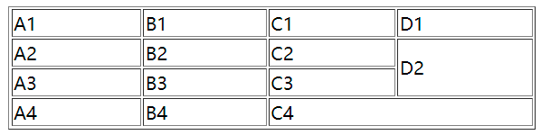

### 一、表格简介

在网页中我们也需要使用表格，我们通过table标签来创建一个表格；

1. 在table中使用tr表示表格中的一行，有几个tr就有几行；
2. 在tr中使用td表示一个单元格，有几个td就有几个单元格；
3. rowspan 纵向的合并单元格；
4. colspan 横向的合并单元格；



```html
<table border="1" width='50%' align="center">
        <tr>
            <td>A1</td>
            <td>B1</td>
            <td>C1</td>
            <td>D1</td>
        </tr>
        <tr>
            <td>A2</td>
            <td>B2</td>
            <td>C2</td>
            <td rowspan="2">D2</td>
        </tr>
        <tr>
            <td>A3</td>
            <td>B3</td>
            <td>C3</td>
        </tr>
        <tr>
            <td>A4</td>
            <td>B4</td>
            <td colspan="2">C4</td>
        </tr>
</table>
```

##### 长表格

可以将一个表格分成三个部分：

* 头部 thead
* 主体 tbody
* 底部 tfoot

> th 表示头部的单元格

```css
<table border="1" width='50%' align="center">
    <thead>
    <tr>
        <th>日期</th>
        <th>收入</th>
        <th>支出</th>
        <th>合计</th>
    </tr>
    </thead>
    <tbody>
    <tr>
        <td>2000.1.1</td>
        <td>500</td>
        <td>200</td>
        <td>300</td>
    </tr>
    </tbody>
    <tfoot>
    <tr>
        <td></td>
        <td></td>
        <td>合计</td>
        <td>300</td>
    </tr>
    </tfoot>
</table>
```


### 二、表格的样式

1. border-spacing:  指定边框之间的距离；

   ```css
   border-spacing: 0px; //此时会出现两个1像素边框合并后为2像素；
   ```

2. border-collapse: 设置边框的合并；

   ```css
    border-collapse: collapse;
   ```

3.  tr不是table的子元素

   * 如果表格中没有使用tbody而是直接使用tr，那么浏览器会自动创建一个tbody，并且将tr全都放到tbody中。

4. 将元素设置为单元格 td (以后尽量不要再用表格布局)

   ```css
   .box1{
       width: 300px;
       height: 300px;
       background-color: orange;
   
       /* 将元素设置为单元格 td  */
       display: table-cell;
       vertical-align: middle;
   }
   ```

   

### 三、表单

1. 在网页中使用表单，网页中的表单用于将本地的数据提交给远程的服务器；

2. 使用form标签来创建一个表单；

3. form的属性

   * action表单要提交的服务器的地址；
   * 文本框、密码框：数据要提交到服务器中，必须要为元素指定一个name属性值；
   *  单选按钮：必须要指定一个value属性，value属性最终会作为用户的填写的值传递给服务器；
     * checked 可以将单选按钮设置为默认选中；
   * 多选框：可以同时选中多个；
   * 下拉列表： 使用select

   ```html
   <form action="target.html">
       文本框 <input type="text" name="username">
       <br><br>
       
       密码框 <input type="password" name="password">
       <br><br>
       
       单选按钮 <input type="radio" name="hello" value="a">
       <input type="radio" name="hello" value="b" checked>
       <br><br>
       
       多选框 <input type="checkbox" name="test" value="1">
       <input type="checkbox" name="test" value="2">
       <input type="checkbox" name="test" value="3" checked>
       <br><br>
   
       <!-- 下拉列表 -->
       <select name="haha">
           <option value="i">选项一</option>
           <option value="ii">选项二</option>
           <option value="iii" selected>选项三</option>
       </select>
       <br><br>
       
       <!-- 提交按钮-->
       <input type="submit" value="注册">
   </form>
   ```

   

4. 提交、重置、普通按钮的表示

   ```html
   <input type="submit">
   
   <!-- 重置按钮 -->
   <input type="reset">
   
   <!-- 普通的按钮 -->
   <input type="button" value="按钮">
   <br><br>
           
   <button type="submit">提交</button>
   <button type="reset">重置</button>
   <button type="button">按钮</button>
   ```

5. 表单input的几种设置

   * autocomplete="off" 关闭自动补全；
   * readonly 将表单项设置为只读，数据会提交；
   * disabled 将表单项设置为禁用，数据不会提交；
   * autofocus 设置表单项自动获取焦点；

   