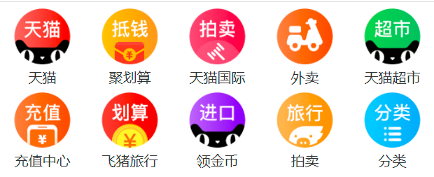

### 一、Flex简介

1. flex(弹性盒、伸缩盒)，是CSS中的又一种布局手段，它主要用来代替浮动来完成页面的布局；

2. flex可以使元素具有弹性，让元素可以跟随页面的大小的改变而改变；

3. **弹性容器**

   * 要使用弹性盒，必须先将一个元素设置为弹性容器；(通过 display 来设置弹性容器)
   * display:flex  设置为块级弹性容器；
   * display:inline-flex 设置为行内的弹性容器；

4. **弹性元素**

   弹性容器的子元素是弹性元素（弹性项）；

   弹性元素可以同时是弹性容器；

### 二、弹性元素的属性

1. flex-grow 指定弹性元素的伸展的系数；
   * 当父元素有多余空间的时，子元素如何伸展；
   * 父元素的剩余空间，会按照比例进行分配；
2. flex-shrink 指定弹性元素的收缩系数；
   * 当父元素中的空间不足以容纳所有的子元素时，如果对子元素进行收缩；

##### 使用flex创建导航条

```html
<!DOCTYPE html>
<html lang="en">
<head>
    <meta charset="UTF-8">
    <title>Title</title>
    <link rel="stylesheet" href="css/reset.css">
    <style>
        
        .nav {
            width: 1210px;
            height: 48px;
            line-height: 48px;
            margin: 50px auto;
            background-color: #E8E7E3;
            display: flex;
        }

        .nav li {
            flex-grow: 1;
        }

        .nav a {
            text-align: center;
            display: block;
            color: #808080;
            text-decoration: none;
            font-size: 16px;
        }

        .nav a:hover {
            background-color: #636363;
            color: #ffffff;
        }
    </style>
</head>
<body>
<ul class="nav">
    <li><a href="#">HTML/CSS</a></li>
    <li><a href="#">Browser side</a></li>
    <li><a href="#">Server Side</a></li>
    <li><a href="#">Programming</a></li>
    <li><a href="#">XML</a></li>
    <li><a href="#">web building</a></li>
    <li><a href="#">Reference</a></li>
</ul>
</body>
</html>
```

##### 淘宝导航



```html
<!DOCTYPE html>
<html lang="en">
<head>
    <meta charset="UTF-8">
    <title>Title</title>
    <style>
        * {
            margin: 0;
            padding: 0;
        }

        .nav {
            width: 100%;
        }

        .nav-inner {
            display: flex;
            justify-content: space-around;
        }

        .item {
            width: 18%;
            text-align: center;
        }

        .item img {
            width: 100%;
        }

        .item a {
            color: #333333;
            text-decoration: none;
        }
    </style>
</head>
<body>
<nav class="nav">
    <div class="nav-inner">
        <div class="item"><a href="#"><span>天猫</span></a></div>
        <div class="item"><a href="#"><span>聚划算</span></a></div>
        <div class="item"><a href="#"><span>天猫国际</span></a></div>
        <div class="item"><a href="#"><span>外卖</span></a></div>
        <div class="item"><a href="#"><span>天猫超市</span></a></div>
    </div>

    <div class="nav-inner">
        <div class="item"><a href="#"><span>充值中心</span> </a></div>
        <div class="item"><a href="#"><span>飞猪旅行</span></a></div>
        <div class="item"><a href="#"><span>领金币</span></a></div>
        <div class="item"><a href="#"><span>拍卖</span> </a></div>
        <div class="item"><a href="#"><span>分类</span></a></div>
    </div>
</nav>
</body>
</html>
```


### 三、像素

1. 在前端开发中像素要分成两种情况讨论：CSS像素和物理像素；

   * 物理像素，上述所说的小点点就属于物理像素；
   * CSS像素，编写网页时，我们所用像素都是CSS像素；

2. 浏览器在显示网页时，需要将CSS像素转换为物理像素然后再呈现， 一个css像素最终由几个物理像素显示，由浏览器决定。

3. 视口（viewport）

   视口就是屏幕中用来显示网页的区域，我们可以通过改变视口的大小，来改变CSS像素和物理像素的比值；

4. 移动端

   * 默认情况下，移动端的网页都会将视口设置为980像素（css像素）， 以确保pc端网页可以在移动端正常访问，但是如果网页的宽度超过了980，移动端的浏览器会自动对网页缩放以完整显示网页。

   * 所以基本大部分的pc端网站都可以在移动端中正常浏览，但是往往都不会有一个好的体验，为了解决这个问题，大部分网站都会专门为移动端设计网页。

   *  编写移动页面时，必须要确保有一个比较合理的像素比：

     * 1css像素 对应 2个物理像素；
     * 1css像素 对应 3个物理像素；

   * 可以通过meta标签来设置视口大小

     ```css
      <meta name="viewport" content="width=200px">
     ```

   * 每一款移动设备设计时，都会有一个最佳的像素比，一般我们只需要将像素比设置为该值即可得到一个最佳效果，将像素比设置为最佳像素比的视口大小我们称其为完美视口；

     ```css
      <meta name="viewport" content="width=device-width, initial-scale=1.0">
     ```

5. 视口

   由于不同设备视口和像素比不同，所以同样的375个像素在不同的设备下意义是不一样，比如在iphone6中 375就是全屏，而到了plus中375就会缺一块，在移动端开发时，就不能再使用px来进行布局。

   * vw 表示的是视口的宽度（viewport width），vw这个单位永远相当于视口宽度进行计算；
     * 100vw = 一个视口的宽度
     * 1vw = 1%视口宽度

6. VW适配


### 四、响应式布局

1. 网页可以根据不通的设备或窗口大小呈现出不同的效果；

2. 使用响应式布局，可以使一个网页适用于所有设备；

3. 响应布局的关键就是媒体查询，通过媒体查询，可以为不通的设备，或设备不同状态来分别设置样式；

   ```css
   @media only screen and (min-width: 500px) and (max-width:700px){
        body{
             background-color: #bfa;
        }
   }
   ```

   

