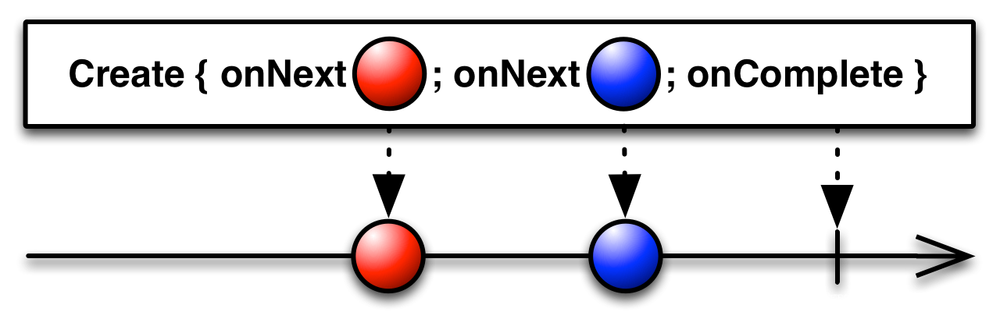
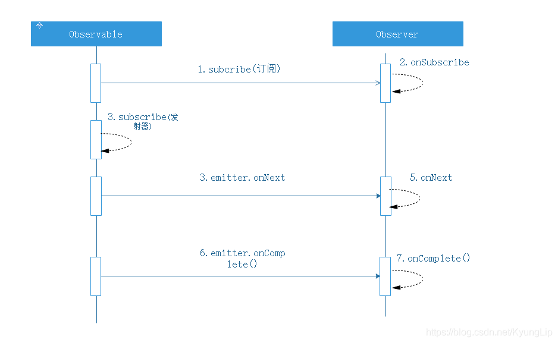
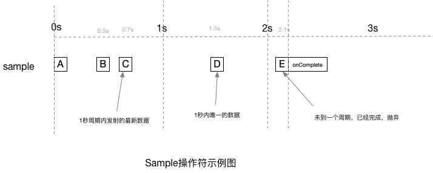
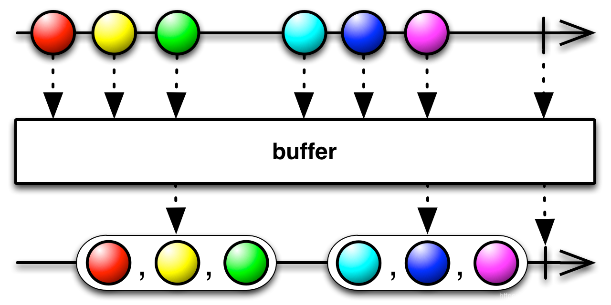

## 一 Rxjava3简介


### ReactiveX的历史

Rx是一个编程模型，目标是提供一致的编程接口，帮助开发者更方便的处理异步数据流


### 什么是ReactiveX

微软给的定义是，Rx是一个函数库，让开发者可以利用可观察序列和LINQ风格查询操作符来编写异步和基于事件的程序，使用Rx，开发者可以用Observables表示异步数据流，用LINQ操作符查询异步数据流， 用Schedulers参数化异步数据流的并发处理，Rx可以这样定义：Rx = Observables + LINQ + Schedulers。

ReactiveX.io给的定义是，Rx是一个使用可观察数据流进行异步编程的编程接口，ReactiveX结合了观察者模式、迭代器模式和函数式编程的精华。


## 二 Rx中的一些概念


### 2.1 字段含义

* **Reactive** 直译为反应性的，有活性的，根据上下文一般翻译为反应式、响应式；

* **Iterable** 可迭代对象，支持以迭代器的形式遍历，许多语言中都存在这个概念；

* **Observable** 可观察对象，在Rx中定义为更强大的Iterable，在观察者模式中是被观察的对象，一旦数据产生或发生变化，会通过某种方式通知观察者或订阅者；

* **Observer** 观察者对象，监听Observable发射的数据并做出响应，Subscriber是它的一个特殊实现；

* **emit** 直译为发射，发布，发出，含义是Observable在数据产生或变化时发送通知给Observer，调用Observer对应的方法，文章里一律译为发射；

* **items** 直译为项目，条目，在Rx里是指Observable发射的数据项，文章里一律译为数据，数据项；


### 2.2 上/下流

在RxJava中，数据以流的方式组织：Rxjava包括一个源数据流，源数据流后跟着若干个用于消费数据流的步骤。在代码中，对于operator2来说，在它前面叫做上流，在它后面的叫做下流。

```java
source
  .operator1()
  .operator2()
  .operator3()
  .subscribe(consumer)
```


### 2.3 流对象

在RxJava的文档中，emission, emits, item, event, signal, data and message都被认为在数据流中被传递的数据对象。


### 2.4 背压(Backpressure)

当上下游在不同的线程中，通过Observable发射，处理，响应数据流时，如果**上游发射数据的速度快于下游接收处理数据的速度**，这样对于那些没来得及处理的数据就会造成积压，这些数据既不会丢失，也不会被垃圾回收机制回收，而是存放在一个异步缓存池中，如果缓存池中的数据一直得不到处理，越积越多，最后就会造成内存溢出，这便是响应式编程中的背压（backpressure）问题。

为此，RxJava带来了backpressure的概念。背压是一种流量的控制步骤，在不知道上流还有多少数据的情形下控制内存的使用，表示它们还能处理多少数据。**背压是指在异步场景中，被观察者发送事件速度远快于观察者的处理速度的情况下，一种告诉上游的被观察者降低发送速度的策略。**

在Rxjava1.0中，有的Observable支持背压，有的不支持，为了解决这种问题，2.0把支持背压和不支持背压的Observable区分开来：支持背压的有Flowable类，不支持背压的有Observable，Single, Maybe and Completable类。

* 在订阅的时候如果使用FlowableSubscriber，那么需要通过s.request(Long.MAX_VALUE)去主动请求上游的数据项。如果遇到背压报错的时候，FlowableSubscriber默认已经将错误try-catch，并通过onError()进行回调，程序并不会崩溃；
* 在订阅的时候如果使用Consumer，那么不需要主动去请求上游数据，默认已经调用了s.request(Long.MAX_VALUE)。如果遇到背压报错、且对Throwable的Consumer没有new出来，则程序直接崩溃；
* 背压策略的上游的默认缓存池是128。

背压策略：

1. error， 缓冲区大概在128
2. buffer， 缓冲区在1000左右
3. drop， 把存不下的事件丢弃
4. latest， 只保留最新的
5. missing, 缺省设置，不做任何操作


### 2.5 线程调度器（Schedulers）

对于Android开发者而言，RxJava最简单的是通过调度器来方便地切换线程。在不同平台还有不同的调度器，例如我们Android的主线程：`AndroidSchedulers.mainThread()`。

| 调度器                         | 功能                                                         |
| :----------------------------- | ------------------------------------------------------------ |
| AndroidSchedulers.mainThread() | 需要引用rxandroid, 切换到UI线程                              |
| Schedulers.computation()       | 用于计算任务，如事件循环和回调处理，默认线程数等于处理器数量 |
| Schedulers.io()                | 用于IO密集型任务，如异步阻塞IO操作，这个调度器的线程池会根据需求，它默认是一个CacheThreadScheduler |
| Schedulers.newThread()         | 为每一个任务创建一个新线程                                   |
| Schedulers.trampoline()        | 在当前线程中立刻执行，如当前线程中有任务在执行则将其暂停， 等插入进来的任务执行完成之后，在将未完成的任务继续完成。 |
| Scheduler.from(executor)       | 指定Executor作为调度器                                       |


### 2.6 事件调度器

RxJava事件发出去并不是置之不顾，要有合理的管理者来管理它们，在合适的时机要进行释放事件，这样才不会导致内存泄漏，这里的管理者我们称为事件调度器(或事件管理者)CompositeDisposable。


### 2.7 基类

RxJava 3 中的基类相比RxJava 2 没啥改变，主要有以下几个基类：

* io.reactivex.Flowable：发送0个N个的数据，支持Reactive-Streams和背压；
* io.reactivex.Observable：发送0个N个的数据，不支持背压；
* io.reactivex.Single：只能发送单个数据或者一个错误；
* io.reactivex.Completable：没有发送任何数据，但只处理 onComplete 和 onError 事件；
* io.reactivex.Maybe：能够发射0或者1个数据，要么成功，要么失败；


### 2.8 Observables的"热"和"冷"

Observable什么时候开始发射数据序列？这取决于Observable的实现，一个"热"的Observable可能一创建完就开始发射数据，因此所有后续订阅它的观察者可能从序列中间的某个位置开始接受数据（有一些数据错过了）。一个"冷"的Observable会一直等待，直到有观察者订阅它才开始发射数据，因此这个观察者可以确保会收到整个数据序列。

在一些ReactiveX实现里，还存在一种被称作Connectable的Observable，不管有没有观察者订阅它，这种Observable都不会开始发射数据，除非Connect方法被调用。


## 三 操作符全解


### 1.1 用操作符组合Observable

对于ReactiveX来说，Observable和Observer仅仅是个开始，它们本身不过是标准观察者模式的一些轻量级扩展，目的是为了更好的处理事件序列。

ReactiveX真正强大的地方在于它的操作符，操作符让你可以变换、组合、操纵和处理Observable发射的数据。

Rx的操作符让你可以用声明式的风格组合异步操作序列，它拥有回调的所有效率优势，同时又避免了典型的异步系统中嵌套回调的缺点。


**下面是常用的操作符列表：**

* **创建操作** Create, Defer, Empty/Never/Throw, From, Interval, Just, Range, Repeat, Start, Timer
* **变换操作** Buffer, FlatMap, GroupBy, Map, Scan和Window
* **过滤操作** Debounce, Distinct, ElementAt, Filter, First, IgnoreElements, Last, Sample, Skip, SkipLast, Take, TakeLast
* **组合操作** And/Then/When, CombineLatest, Join, Merge, StartWith, Switch, Zip
* **错误处理** Catch和Retry
* **辅助操作** Delay, Do, Materialize/Dematerialize, ObserveOn, Serialize, Subscribe, SubscribeOn, TimeInterval, Timeout, Timestamp, Using
* **条件和布尔操作** All, Amb, Contains, DefaultIfEmpty, SequenceEqual, SkipUntil, SkipWhile, TakeUntil, TakeWhile
* **算术和集合操作** Average, Concat, Count, Max, Min, Reduce, Sum
* **转换操作** To
* **连接操作** Connect, Publish, RefCount, Replay
* **反压操作**，用于增加特殊的流程控制策略的操作符


### 1.2 操作符分类

ReactiveX的每种编程语言的实现都实现了一组操作符的集合。不同的实现之间有很多重叠的部分，也有一些操作符只存在特定的实现中。每种实现都倾向于用那种编程语言中他们熟悉的上下文中相似的方法给这些操作符命名。

如果你想实现你自己的操作符，可以参考这里：[`实现自定义操作符`](https://mcxiaoke.gitbooks.io/rxdocs/content/topics/Implementing-Your-Own-Operators.html)


#### 1.2.1 创建操作符

用于创建Observable的操作符。

| 操作       | 简介                               |
| ---------- | ---------------------------------- |
| create()   | 创建最简单的事件流                 |
| from()     | 创建事件流，可发送不同类型的数据流 |
| just()     | 创建事件流，可发送多个参数的数据流 |
| defer()    | 创建事件流，可缓存可激活事件流     |
| range()    | 创建事件流，可发送范围内的数据流   |
| interval() | 创建延时重复的事件流               |
| repeat()   | 创建可重复次数的事件流             |
| timer()    | 创建一次延时的事件流               |


##### 1. create()

通过调用观察者的方法从头创建一个Observable。创建Observable最原始的方式，onNext/onComplete/onError方法可完全自由控制。在Rxjava3文档级教程：入门到掌握 （一 基本用法 ）中，被观察者的创建基本都用的这种方式。

```java
// 1.创建被观察者
Observable<Integer> observable = Observable.create(new ObservableOnSubscribe<Integer>() {
            @Override
            public void subscribe(@NonNull ObservableEmitter<Integer> emitter) throws Throwable {
                for (int i = 0; i < 5; i++) {
                    emitter.onNext(i);
                }
                emitter.onComplete();
            }
        });
```

```java
//2.创建观察者/订阅者
Observer<Integer> observer = new Observer<Integer>() {

            @Override
            public void onSubscribe(@NonNull Disposable d) {
                System.out.println("onSubscribe");
            }

            @Override
            public void onNext(@NonNull Integer integer) {
                System.out.println("onNext:" + integer);
            }

            @Override
            public void onError(@NonNull Throwable e) {
                System.out.println("onError");
            }

            @Override
            public void onComplete() {
                System.out.println("onComplete");
            }
        };
```

```javascript
//订阅,此时触发1步中subscribe方法的执行
observable.subscribe(observer);
```

```java
//输出结果
onSubscribe
onNext:0
onNext:1
onNext:2
onNext:3
onNext:4
onComplete
```

调用时序图如下：



**源码分析**

1. 在订阅的方法中，创建了发射器parent；
2.  调用了Observer的onSubscribe方法，并把发射器parent作为形参传递进去。CreateEmitter实现了Disposable接口，所以在Observer的onSubscribe方法中接收到的参数为Disposable。
3. 调用source也就是(Observable)的subscribe方法，并把发射器parent传递进去。
4. 执行之前我们在subscribe(ObservableEmitter<Integer> emitter)写的代码。

```java
//在执行observable.subscribe(observer)后，会回调下面的方法；
    @Override
    protected void subscribeActual(Observer<? super T> observer) {
        //1.构建发射器
        CreateEmitter<T> parent = new CreateEmitter<T>(observer);
        //2.调用Observer的onSubscribe方法
        observer.onSubscribe(parent);
 
        try {
            //3.调用Observable的subscribe方法，里面有我们自己实现的内容；onNext、onComplete、onError等
            source.subscribe(parent);
        } catch (Throwable ex) {
            Exceptions.throwIfFatal(ex);
            parent.onError(ex);
        }
    }
```


##### 2. from() 

fromArray()

快速创建被观察者对象（Observable），能发送10个以上事件（数组形式）

```java
Integer[] items = {1,2,3,4};
Observable<Integer> observable = Observable.fromArray(items);
```

fromIterable()

快速创建被观察者对象（Observable）发送10个以上事件（集合形式）

```java
ArrayList<Integer> list = new ArrayList<>();
list.add(11);
list.add(12);
list.add(13);
list.add(14);

Observable<Integer> observable = Observable.fromIterable(list);
```


##### 3. Just()

just重载了多个参数数量不同的方法，最大可带10个参数，just实际上同样是调用的fromArray方法；

```java
Observable<Integer> just = Observable.just(1, 2, 3);
```


##### 4. defer()

直到有观察者（Observer）订阅时，才动态创建被观察对象（Observable）以及发送事件，保证Observable的状态是最新的。

```java
Observable<Integer> defer = Observable.defer(new Supplier<ObservableSource<? extends Integer>>() {
          @Override
          public ObservableSource<?extends Integer> get() throws Throwable {
              return Observable.just(1);
          }
});
        
defer.subscribe(observer);
```


##### 5. range()

快速创建1个被观察者对象（Observable）,连续发送 1个事件序列，可指定范围，发送的事件序列 = 从0开始、无限递增1的的整数序列。

```java
Observable<Integer> range = Observable.range(10, 5);
range.subscribe(observer);
```

```java
//输出
onSubscribe
onNext:10
onNext:11
onNext:12
onNext:13
onNext:14
onComplete
```


##### 6. interval()

interval用于定时发送

```java
//每3秒发个自增整数
Observable.interval(3, TimeUnit.SECONDS);
//初始延时1秒，每3秒发一个自增整数
Observable.interval(1, 3, TimeUnit.SECONDS);
//初始延时2秒，后每1秒发一个从10开始的整数，发5个（发到14）停止
Observable.intervalRange(10, 5, 2, 1, TimeUnit.SECONDS);
```


##### 7. repeat()

repeat操作符可以重复发送指定次数的某个事件流，repeat操作符默认在trampoline调度器上执行，repeat默认重复次数为Long.MAX_VALUE，可使用重载方法指定次数以及使用repeatUntil指定条件。

```java
//一直重复
Observable.fromArray(1, 2, 3, 4).repeat();
//重复发送5次
Observable.fromArray(1, 2, 3, 4).repeat(5);
//重复发送直到符合条件时停止重复
Observable.fromArray(1, 2, 3, 4).repeatUntil(new BooleanSupplier() {
	@Override
    public boolean getAsBoolean() throws Exception {
	//自定判断条件，为true即可停止，默认为false
	return false;
	}
});
```


##### 8. timer()

timer用于延时发送。

```java
//延时3秒后，发送一个整数0
Observable.timer(3, TimeUnit.SECONDS);
```


#### 1.2.2 过滤操作符

过滤操作符主要是指对数据源进行选择和过滤的常用操作符。

| 操作符           | 简介                                     |
| ---------------- | ---------------------------------------- |
| bounce()         | 事件流只发射规定范围时间内的数据项       |
| distinct()       | 事件流只发射不重复的数据项               |
| elementAt()      | 事件流只发射第N个数据项                  |
| filter()         | 事件流只发射符合规定函数的数据项         |
| first()          | 事件流只发射第一个数据项                 |
| last()           | 事件流只发射最后一项数据项               |
| ignoreElements() | 忽略事件流的发射，只发射事件流的终止事件 |
| sample()         | 事件流对指定的时间间隔进行数据项的采样   |
| skip()           | 事件流忽略前N个数据项                    |
| skipLast()       | 事件流忽略后N个数据项                    |
| take()           | 事件流只发射前N个数据项                  |
| takeLast()       | 事件流只发射后N个数据项                  |


##### 1. skip() / skiplast()

表示源发射数据前，跳过多少个。skipLast(n)操作表示从流的尾部跳过n个元素。

```java
Integer[] items = {1, 2, 3, 4,5,6};
Observable<Integer> observable = Observable.fromArray(items).skip(2);
observable.subscribe(observer);
//只输出3,4,5,6
```

```java
Integer[] items = {1, 2, 3, 4,5,6};
Observable<Integer> observable = Observable.fromArray(items).skiplast(2);
observable.subscribe(observer);
//只输出1,2,3,4
```


##### 2. debounce()

在Android开发，通常为了防止用户重复点击而设置标记位，而通过RxJava的debounce操作符可以有效达到该效果。在规定时间内，用户重复点击只有最后一次有效，

```java
Observable<String> observable = Observable.create(new ObservableOnSubscribe<String>() {
    @Override
    public void subscribe(@NonNull ObservableEmitter<String> emitter) throws Throwable {
                emitter.onNext("A");
                Thread.sleep(1500);
                emitter.onNext("B");
                Thread.sleep(500);
                emitter.onNext("C");
                Thread.sleep(800);
                emitter.onNext("D");
                emitter.onComplete();
            }
     }).debounce(1,TimeUnit.SECONDS);
observable.subscribe(stringObserver);

//最后输出为：
onSubscribe
onNext:A
onNext:D
onComplete
```

数据源以一定的时间间隔发送A,B,C,D,E。操作符debounce的时间设为1秒，发送A后1.5秒并没有发射其他数据，所以A能成功发射。发射A后，在1秒之内，又发射了B、C，但B、C都失效,只有D有效。


##### 3. distinct()

去掉数据源重复的数据。distinctUntilChanged()去掉相邻重复数据。

```java
Observable.just(2, 3, 4, 4, 2, 1)
        .distinct()
        .subscribe(observer);
// 打印:2 3 4 1

Observable.just(1, 1, 2, 1, 2, 3, 3, 4)
        .distinctUntilChanged()
        .subscribe(observer);
//打印：1 2 1 2 3 4
```


##### 4. elementAt()

从数据源获取指定位置的元素，从0开始。elementAtOrError：指定元素的位置超过数据长度，则发射异常。

```java
Maybe<Integer> distinct = Observable.just(1,2,3,4).elementAt(2);
distinct.subscribe(maybeObserver);
//返回3;
```


##### 5. filter()

过滤操作符，在filter中返回true表示发射该元素，返回false表示过滤该数据。

```java
Integer[] items = {1, 2, 3, 1, 1, 6};
Observable.fromArray(items).filter(new Predicate<Integer>() {
     @Override
     public boolean test(Integer integer) throws Throwable {
          return integer % 2 == 0;
     }
}).subscribe(observer);

//输出结果
2、6
```


##### 6. first()

发射数据源第一个数据，如果没有则发送默认值。

```java
Integer[] items = {1, 2, 3, 1, 1, 6};
Observable.fromArray(items).last(10010).subscribe(singleObserver);
//输出1
```


##### 7. last()

last、lastElement、lastOrError与fist、firstElement、firstOrError相对应。

```java
Integer[] items = {1, 2, 3, 1, 1, 6};
Observable.fromArray(items).last(10010).subscribe(singleObserver);
//输出6
```


##### 8. ignoreElements()

忽略所有源Observable产生的结果，只会执行onCpmpleted()或者onError()方法。


##### 9. ofType()

过滤选择类型

```java
Observable<? extends Number> just = Observable.just(1, 4.0f, 3, 5.4f);
Observable<Integer> observable1 = just.ofType(Integer.class);
observable1.subscribe(observer);

//输出 1,3
```


##### 10. sample()

sample操作符会在指定的事件内从数据项中采集所需要的数据。与debounce的区别是，sample是以时间为周期的发射，一秒又一秒内的最新数据。而debounce是最后一个有效数据开始。

```java
Observable<String> source = Observable.create(emitter -> {
    emitter.onNext("A");
 
    Thread.sleep(500);
    emitter.onNext("B");
 
    Thread.sleep(200);
    emitter.onNext("C");
 
    Thread.sleep(800);
    emitter.onNext("D");
 
    Thread.sleep(600);
    emitter.onNext("E");
    emitter.onComplete();
});
 
source.subscribeOn(Schedulers.io())
        .sample(1, TimeUnit.SECONDS)
        .blockingSubscribe(
                item -> System.out.print(item+" "),
                Throwable::printStackTrace,
                () -> System.out.print("onComplete"));
                
// 打印： C D onComplete
```



##### 11.throttleFirst & throttleLast & throttleWithTimeout & throttleLatest

throttleFirst是指定周期内第一个数据，throttleLast与smaple一致。throttleWithTimeout与debounce一致。throttleLatest：如果源的第一个数据总会被发射，然后开始周期计时，此时的效果就会跟throttleLast一致。


##### 12. take & takeLast

take发射前n个元素。takeLast发射后n个元素。

```java
Observable<Integer> just = Observable.just(1, 2, 3, 4, 5, 6);
just.take(4).subscribe(observer);
//输出1,2,3,4
```

```java
Observable<Integer> just = Observable.just(1, 2, 3, 4, 5, 6);
just.takeLast(4).subscribe(observer);
//输出3,4,5,6
```


##### 13. timeout

后一个数据发射未在前一个元素发射后规定时间内发射则返回超时异常。

```java
Observable<Integer> integerObservable = Observable.create(new ObservableOnSubscribe<Integer>() {
            @Override
            public void subscribe(@NonNull ObservableEmitter<Integer> emitter) throws Throwable {
                emitter.onNext(1);

                Thread.sleep(500);
                emitter.onNext(2);

                Thread.sleep(200);
                emitter.onNext(3);

                Thread.sleep(1500);
                emitter.onNext(4);
                emitter.onComplete();
            }
        });

integerObservable.timeout(1, TimeUnit.SECONDS).subscribe(observer);
```

```java
//输出
onSubscribe
onNext:1
onNext:2
onNext:3
onError: The source did not signal an event for 1 seconds and has been terminated.
```


#### 1.2.3 组合操作符

##### 1. merge/concat

merge操作符可以合并两个事件流，如果在merge操作符上增加延时发送的操作，那么就会导致其发射的数据项是无序的，会跟着发射的时间点进行合并。虽然是将两个事件流合并成一个事件流进行发射，但在最终的一个事件流中，发射出来的却是两次数据流。

merge和concat的区别:merge():合并后发射的数据项是无序的，concat():合并后发射的数据项是有序的。

```java
Observable<Integer> integerObservable1 = Observable.create(emitter -> {
            emitter.onNext(1);
            emitter.onNext(3);
            emitter.onNext(5);
            emitter.onComplete();
        });

Observable<Integer> integerObservable2 = Observable.create(emitter -> {
            emitter.onNext(2);
            emitter.onNext(4);
            emitter.onNext(6);
            emitter.onComplete();
        });
        
Observable.merge(integerObservable1, integerObservable2).subscribe(observer);

//输出
onSubscribe
onNext:1
onNext:3
onNext:5
onNext:2
onNext:4
onNext:6
onComplete
```


##### 2. zip()

zip操作符是将两个数据流进行指定的函数规则合并。当其中一个数据源发射完事件之后，若其他数据源还有数据未发射完毕，也会停止。

```java
Observable<Integer> integerObservable1 = Observable.create(emitter -> {
            emitter.onNext(1);
            emitter.onNext(3);
            emitter.onNext(5);
            emitter.onComplete();
        });

Observable<Integer> integerObservable2 = Observable.create(emitter -> {
            emitter.onNext(2);
            emitter.onNext(4);
            emitter.onNext(6);
            emitter.onComplete();
        });

Observable.zip(integerObservable1, integerObservable2, new BiFunction<Integer, Integer, String>() {
            @Override
            public String apply(Integer integer, Integer integer2) throws Throwable {
                return integer + "," + integer2;
            }
}).subscribe(stringObserver);

//输出
onSubscribe
onNext:1,2
onNext:3,4
onNext:5,6
onComplete
```


##### 3. startWith()

startWith操作符是将另一个数据流合并到原数据流的开头。

```java
Observable<Integer> integerObservable1 = Observable.create(emitter -> {
            emitter.onNext(1);
            emitter.onNext(3);
            emitter.onNext(5);
            emitter.onComplete();
        });

Observable<Integer> integerObservable2 = Observable.create(emitter -> {
            emitter.onNext(2);
            emitter.onNext(4);
            emitter.onNext(6);
            emitter.onComplete();
        });

integerObservable1.startWith(integerObservable2).subscribe(observer);

//输出
onSubscribe
onNext:2
onNext:4
onNext:6
onNext:1
onNext:3
onNext:5
onComplete
```


merge / mergeWith

可作用所有数据源类型，用于合并多个数据源到一个数据源。


merge在合并数据源时，如果一个合并发生异常后会立即调用观察者的onError方法，并停止合并。可通过mergeDelayError操作符，将发生的异常留到最后处理。


#### 1.2.4 转换操作符

变换操作符用于变化数据源的数据，并转化为新的数据源。

##### 1. map()

map利用Function进行类型转换。

```java
 Observable<Integer> integerObservable = Observable.create(emitter -> {
            emitter.onNext(1);
            emitter.onNext(3);
            emitter.onNext(5);
            emitter.onComplete();
        });

integerObservable.map(new Function<Integer, String>() {
            @Override
            public String apply(Integer integer) throws Throwable {
                return "value:" + integer;
            }
}).subscribe(stringObserver);

//输出
onSubscribe
onNext:value:1
onNext:value:3
onNext:value:5
onComplete
```


##### 2. flatMap()、concatMap()

flatMap操作符将数据流进行类型转换，然后将新的数据流传递给新的事件流进行分发。concatMap与flatMap的区别:  concatMap是有序的，flatMap是无序的。


##### 3. groupBy()

RxJava中的groupBy，是将一个Observable分拆为一些Observables集合，它们中的每一个发射原始Observable的一个 子序列,哪个数据项由哪一个Observable发射是由一个函数判定 的，这个函数给每一项指定一个Key，Key相同的数据会被同一个Observable发射。

这里分组出来的事件流是按照原始事件流的顺序输出的，我们可以通过sorted()对数据项进行排序，然后输出有序的数据流。

```java
 Observable<GroupedObservable<Character, String>> groupedObservableObservable =
       Observable.just("android", "python", "ali", "phd").groupBy(new Function<String,Character>() {
            @Override
            public Character apply(String s) throws Throwable {
                return s.charAt(0);
            }
        });

Disposable subscribe = groupedObservableObservable.subscribe(new Consumer<GroupedObservable<Character, String>>() {
            @Override
            public void accept(GroupedObservable<Character, String> characterStringGroupedObservable) throws Throwable {
                Character key = characterStringGroupedObservable.getKey();
                if (key == null) {
                    return;
                }
                System.out.println("key:" + key);
                if (key == 'a') {
                    characterStringGroupedObservable.sorted().subscribe(observer);
                } else if (key == 'p') {
                    characterStringGroupedObservable.sorted().subscribe(observer);
                }
            }
        });
subscribe.dispose();

//输出
key:a
a onSubscribe
key:p
p onSubscribe
p onNext:phd
p onNext:python
p onComplete
a onNext:ali
a onNext:android
a onComplete
```


##### 4. scan()

scan操作符会对发射的数据和上一轮发射的数据进行函数处理，并返回的数据供下一轮使用，持续这个过程来产生剩余的数据流。其应用场景有简单的累加计算，判断所有数据的最小值等。

```java
Observable.just(1,2,3,4).scan(new BiFunction<Integer, Integer, Integer>() {
            @Override
            public Integer apply(Integer integer, Integer integer2) throws Throwable {
                return integer+integer2;
            }
}).subscribe(observer);

//输出
onSubscribe
onNext:1
onNext:3
onNext:6
onNext:10
onComplete
```


##### 5. buffer()

buffer操作符可以将发射出来的数据流，在给定的缓存池中进行缓存，当缓存池中的数据项溢满时，则将缓存池的数据项进行输出，重复上述过程，直到将发射出来的数据全部发射出去。如果发射出来的数据不够缓存池的大小，则按照当前发射出来的数量进行输出。如果对buffer操作符设置了skip参数，则buffer每次缓存池溢满时，会跳过指定的skip数据项，然后再进行缓存和输出。


```java
Observable<@NonNull List<Integer>> buffer = Observable.just(1, 2, 3, 4, 5, 6, 7, 8).buffer(4);
        Disposable disposable = buffer.subscribe(new Consumer<List<Integer>>() {
            @Override
            public void accept(List<Integer> integers) throws Throwable {
                System.out.println(integers.toString());
            }
        });
disposable.dispose();

//输出
[1, 2, 3, 4]
[5, 6, 7, 8]
```


##### 6. window()

window操作符和buffer操作符在功能上实现的效果是一样的，但window操作符最大区别在于同样是缓存一定数量的数据项，window操作符最终发射出来的是新的事件流integerObservable，而buffer操作符发射出来的是新的数据流，也就是说，window操作符发射出来新的事件流中的数据项，还可以经过Rxjava其他操作符进行处理。


```java
Observable<Observable<Integer>> window = Observable.just(1, 2, 3, 4, 5, 6, 7, 8).window(4);
        Disposable subscribe1 = window.subscribe(new Consumer<Observable<Integer>>() {
            @Override
            public void accept(Observable<Integer> integerObservable) throws Throwable {
                    integerObservable.subscribe(new Consumer<Integer>() {
                        @Override
                        public void accept(Integer integer) throws Throwable {
                            System.out.println("value:"+integerObservable.hashCode()+",  "+integer);
                        }
                    });
            }
        });
subscribe1.dispose();

//输出
value:1287712235,  1
value:1287712235,  2
value:1287712235,  3
value:1287712235,  4
value:1165897474,  5
value:1165897474,  6
value:1165897474,  7
value:1165897474,  8
```


##### 7.cast()

将数据元素转型成其他类型,转型失败会抛出异常。


#### 1.2.5 错误处理操作符

##### 1. onErrorReturn()

当错误发生时，它会忽略onError的回调，对错误进行处理，然后返回值，会调用观察者onNext()继续执行，执行完调用onComplete()函数结束所有事件的发射。

```java
Observable<String> stringObservable = Observable.just(1, 2, 3, 4, 5, 6, 7, 8).map(new Function<Integer, String>() {
            @Override
            public String apply(Integer integer) throws Throwable {
                if (integer == 2) {
                    throw new Exception("error test");
                }
                return "value:" + integer;
            }
        }).onErrorReturn(new Function<Throwable, String>() {
            @Override
            public String apply(Throwable throwable) throws Throwable {
                String message = throwable.getMessage();
                System.out.println("throwable:" + message);
                return message;
            }
        });

stringObservable.subscribe(observer);

//输出
onSubscribe
onNext:value:1
throwable:error test
onNext:error test
onComplete
```


##### 2. onErrorReturnItem()

与onErrorReturn类似，onErrorReturnItem不对错误进行处理，直接返回一个值。


##### 3. onExceptionResumeNext()

onErrorReturn发生异常时，回调onComplete()函数后不再往下执行，而onExceptionResumeNext则是要在处理异常的时候返回一个数据源，然后继续执行，如果返回null，则调用观察者的onError()函数。

```java
Observable<String> stringObservable = Observable.just(1, 2, 3, 4, 5, 6, 7, 8).map(new Function<Integer, String>() {
            @Override
            public String apply(Integer integer) throws Throwable {
                if (integer == 2) {
                    throw new Exception("error test");
                }
                return "value:" + integer;
            }
        }).onErrorResumeNext(new Function<Throwable, ObservableSource<? extends String>>() {
            @Override
            public ObservableSource<? extends String> apply(Throwable throwable) throws Throwable {
                System.out.println("onErrorResumeNext");
                return Observable.just("A","B","C","D");
            }
        });

stringObservable.subscribe(observer);

//输出
onSubscribe
onNext:value:1
onErrorResumeNext
onNext:A
onNext:B
onNext:C
onNext:D
onComplete
```


##### 4. retry()

可作用于所有的数据源，当发生错误时，数据源重复发射item，直到没有异常或者达到所指定的次数。

- retry():表示重试无限次
- retry(long times):表示重试指定次数
- retry(Func predicate):可以根据函数参数中的Throwable类型和重试次数决定本次需不需要重试


```java
Observable<String> stringObservable = Observable.just(1, 2, 3, 4, 5, 6, 7, 8).map(new Function<Integer, String>() {
            @Override
            public String apply(Integer integer) throws Throwable {
                if (integer == 4 && isFirst) {
                    isFirst = false;
                    System.out.println("happened exception");
                    throw new Exception("error test");
                }
                return "value:" + integer;
            }
        }).retry();
        
stringObservable.subscribe(observer);

//输出
onSubscribe
onNext:value:1
onNext:value:2
onNext:value:3
happened exception
onNext:value:1
onNext:value:2
onNext:value:3
onNext:value:4
onNext:value:5
onNext:value:6
onNext:value:7
onNext:value:8
onComplete
```


##### 5. retryUntil()

与retry类似，但发生异常时，返回值是false表示继续执行(重复发射数据)，true不再执行,但会调用onError方法。


##### 6. retryWhen()

retryWhen操作符和retry操作符相似，区别在于retryWhen将错误Throwable传递给了函数进行处理并产生新的事件流进行处理。


## 四 RxJava基本响应类型

#### 1. Observable

Observable是最基本的响应类型，但不支持背压，基本上适用大多数的应用场景。


#### 2. Flowable

Flowable和Observable的使用基本相同，但Flowable支持背压。但需要注意的是，使用Flowable的时候，必须调用Subscription的requsest方法请求，不然上游是不会发射数据的。

```java
Flowable.create(new FlowableOnSubscribe<String>() {
            @Override
            public void subscribe(@NonNull FlowableEmitter<String> emitter) throws Throwable {
                emitter.onNext("A");
                emitter.onNext("B");
                emitter.onNext("C");
                emitter.onComplete();

            }
        }, BackpressureStrategy.MISSING)
                .subscribeOn(Schedulers.io())
                .subscribe(new Subscriber<String>() {
                    @Override
                    public void onSubscribe(Subscription s) {
                        System.out.println("onSubscribe");
                    }

                    @Override
                    public void onNext(String s) {
                        System.out.println("onNext:" + s);
                    }

                    @Override
                    public void onError(Throwable t) {
                        System.out.println("onError");
                    }

                    @Override
                    public void onComplete() {
                        System.out.println("onComplete");
                    }
                });

//输出
onSubscribe
onNext:A
onNext:B
onNext:C
onComplete
```

**背压策略**

* **MISSING**： OnNext事件没有任何缓存和丢弃，下游要处理任何溢出，上游发射的数据未得到处理，就会缓存起来，当缓存容量达到128时，再增加一个未处理的数据项，就会抛出MissingBackpressureException，且带有队列已经满了的友好提示。
* **ERROR**： 上游发射的数据未得到处理，就会缓存起来，当缓存容量达到128时，再增加一个未处理的数据项，就会抛出MissingBackpressureException。
* **BUFFER**： 上游不断的发出onNext请求，直到下游处理完，上游发射的数据项的缓存池是无限大的，程序也不会抛出错误，但是要注意程序OOM的现象，因为缓存越大，占用的内存就越多。
* **DROP**： 超过缓存区大小（128）的数据项都会被丢弃。
* **LATEST**： LATEST与Drop策略一样，如果超过缓存池容量大小的数据项都会被丢弃。不同的是，不管缓存池的状态如何，LATEST都会将最后一条数据强行放入缓存池中。


#### 3. Single

Single只发射一个元素，发射onSuccess或onError方法，所以没有complete方法，不像Observable或者Flowable，数据发射完成之后，需要调用complete告诉下游已经完成。

```java
Single.create(new SingleOnSubscribe<String>() {
            @Override
            public void subscribe(@NonNull SingleEmitter<String> emitter) throws Throwable {
                emitter.onSuccess("emitter success.");
            }
        }).subscribe(new SingleObserver<String>() {
            @Override
            public void onSubscribe(@NonNull Disposable d) {
                System.out.println("onSubscribe");
            }

            @Override
            public void onSuccess(@NonNull String s) {
                System.out.println("onSuccess: " + s);
            }

            @Override
            public void onError(@NonNull Throwable e) {
                System.out.println("onError");
            }
        });

//输出
onSubscribe
onSuccess: emitter success.
```


#### 4. Completable

Completable不会发射数据，只会给下游发送一个信号。回调onComplete或onError方法。

```java
Completable.create(new CompletableOnSubscribe() {
            @Override
            public void subscribe(@NonNull CompletableEmitter emitter) throws Throwable {
                emitter.onComplete();
            }
        }).subscribe(new CompletableObserver() {
            @Override
            public void onSubscribe(@NonNull Disposable d) {
                System.out.println("onSubscribe");
            }

            @Override
            public void onComplete() {
                System.out.println("onComplete");
            }

            @Override
            public void onError(@NonNull Throwable e) {
                System.out.println("onError");
            }
        });

//输出
onSubscribe
onComplete
```


#### 5. Maybe

Maybe是Single和Completable的结合，需要注意的是onSuccess和onComplete方法只会执行其中一个，这不同于Observable和Flowable最后是以onComplete()结尾。

```java
Maybe.create(new MaybeOnSubscribe<String>() {
            @Override
            public void subscribe(@NonNull MaybeEmitter<String> emitter) throws Throwable {
                emitter.onSuccess("emitter success.");
                emitter.onComplete();
            }
        }).subscribe(new MaybeObserver<String>() {
            @Override
            public void onSubscribe(@NonNull Disposable d) {
                System.out.println("onSubscribe");
            }

            @Override
            public void onSuccess(@NonNull String s) {
                System.out.println("onSuccess:" + s);
            }

            @Override
            public void onError(@NonNull Throwable e) {
                System.out.println("onError");
            }

            @Override
            public void onComplete() {
                System.out.println("onComplete");
            }
        });

//输出 （如果onSuccess不调用，则onComplete会被执行）
onSubscribe
onSuccess:emitter success.
```

#### 总结

1. Observable:最基本的响应类型，不支持背压
2. Flowable:最基本的响应类型，支持背压
3. Single:只发射一个数据的响应类型
4. Completable:只发射一个信号的响应类型
5. Maybe:Single和Completable的结合体


## 五 实践


### 1. 用RxJava防止内存泄露

**CompositeDisposable**

如果在请求过程中，UI层destroy了怎么办，不及时取消订阅，可能会造成内存泄漏。因此，CompositeDisposable就上场了，它可以对我们订阅的请求进行统一管理。CompositeDisposable的clear方法内部，实际上就会调用Disposable的dispose方法。

1、在UI层创建的时候（比如onCreate之类的），实例化CompositeDisposable；
2、把subscribe订阅返回的Disposable对象加入管理器；
3、UI销毁时清空订阅的对象。

CompositeDisposable提供的方法中，都是对事件的管理。

- dispose():释放所有事件
- clear():释放所有事件，实现同dispose()
- add():增加某个事件
- addAll():增加所有事件
- remove():移除某个事件并释放
- delete():移除某个事件

 

### 2. 线程切换、调度

若被观察者 `（Observable）` / 观察者`（Observer）`在主线程被创建，那么他们的工作（生产事件 / 接收& 响应事件）就会发生在主线程。

##### 场景

对于一般的需求场景，需要在子线程中实现耗时的操作；然后回到主线程实现 `UI`操作。

应用到 `RxJava`模型中，可理解为：

1. 被观察者 `（Observable）` 在 **子线程** 中生产事件（如实现耗时操作等等）
2. 观察者`（Observer）`在 **主线程** 接收 & 响应事件（即实现UI操作）
   

##### 实现

采用 `RxJava`内置的**线程调度器**（ `Scheduler` ），即通过 **功能性操作符`subscribeOn（）` & `observeOn（）`**实现。

在 `RxJava`中，内置了多种用于调度的线程类型，`RxJava`内部使用 **线程池** 来维护这些线程，所以线程的调度效率非常高。

| 类型                           | 含义                  | 应用场景                         |
| ------------------------------ | --------------------- | -------------------------------- |
| Schedulers.immediate()         | 当前线程 = 不指定线程 | 默认                             |
| AndroidSchedulers.mainThread() | Android主线程         | 操作UI                           |
| Schedulers.newThread()         | 常规新线程            | 耗时等操作                       |
| Schedulers.io()                | io操作线程            | 网络请求、读写文件等io密集型操作 |
| Schedulers.computation()       | CPU计算操作线程       | 大量计算操作                     |

```java
// Observable.subscribeOn（Schedulers.Thread）：指定被观察者 发送事件的线程（传入RxJava内置的线程类型）
// Observable.observeOn（Schedulers.Thread）：指定观察者 接收 & 响应事件的线程（传入RxJava内置的线程类型）

<-- 实例使用 -->
//通过订阅（subscribe）连接观察者和被观察者
 observable.subscribeOn(Schedulers.newThread()) // 1. 指定被观察者 生产事件的线程
    .observeOn(AndroidSchedulers.mainThread())  // 2. 指定观察者 接收 & 响应事件的线程
    .subscribe(observer); // 3. 最后再通过订阅（subscribe）连接观察者和被观察者
```

