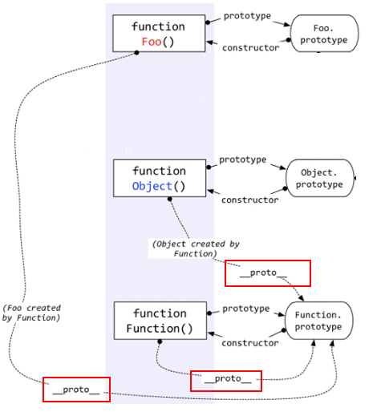

>  原文链接:https://www.cnblogs.com/loveyaxin/p/11151586.html


### 一、prototype

在JavaScript中，每个函数都有一个prototype属性，这个属性指向函数的原型对象。

```js
function Person(age) {
    this.age = age       
}

Person.prototype.name = 'kavin'
var person1 = new Person()
var person2 = new Person()
console.log(person1.name) //kavin
console.log(person2.name)  //kavin
```

**原型的概念**：每一个javascript对象(除null外)创建的时候，就会与之关联另一个对象，这个对象就是我们所说的原型，每一个对象都会从原型中“继承”属性。


### 二、__proto__

这是每个对象(除null外)都会有的属性，叫做__proto__，这个属性会指向该对象的原型。

```js
function Person() {
}
var person = new Person();
console.log(person.__proto__ === Person.prototype); // true
```

绝大部分浏览器都支持这个非标准的方法访问原型，然而它并不存在于 Person.prototype 中，实际上，它是来自于 Object.prototype ，与其说是一个属性，不如说是一个 getter/setter，当使用 obj.__proto__ 时，可以理解成返回了 Object.getPrototypeOf(obj)。


### 三、constructor

每个原型都有一个constructor属性，指向该关联的构造函数。

```js
function Person() {
}
console.log(Person===Person.prototype.constructor)  //true
```

```js
function Person() {
}

var person = new Person();
console.log(person.__proto__ == Person.prototype) // true
console.log(Person.prototype.constructor == Person) // true
// 顺便学习一个ES5的方法,可以获得对象的原型
console.log(Object.getPrototypeOf(person) === Person.prototype) // true
```

```js
function Person() {
}
var person = new Person();
console.log(person.constructor === Person); // true
```

> 当获取 person.constructor 时，其实 person 中并没有 constructor 属性,当不能读取到constructor 属性时，会从 person 的原型也就是 Person.prototype 中读取，正好原型中有该属性，所以：
>
> person.constructor === Person.prototype.constructor


### 四、实例与原型

 当读取实例的属性时，如果找不到，就会查找与对象关联的原型中的属性，如果还查不到，就去找原型的原型，一直找到最顶层为止。

```js
function Person() {
}

Person.prototype.name = 'Kevin';
var person = new Person();

person.name = 'Daisy';
console.log(person.name) // Daisy

delete person.name;
console.log(person.name) // Kevin
```

我们给实例对象 person 添加了 name 属性，当我们打印 person.name 的时候，结果自然为 Daisy。

但是当我们删除了 person 的 name 属性时，读取 person.name，从 person 对象中找不到 name 属性就会从 person 的原型也就是 person.__proto__ ，也就是 Person.prototype中查找，幸运的是我们找到了 name 属性，结果为 Kevin。


### 五、原型的原型

我们知道原型也是一个对象，既然是对象，我们就可以用最原始的方式创建它，那就是：

```js
var obj = new Object();
obj.name = 'Kevin'
console.log(obj.name) // Kevin
```

其实原型对象就是通过 Object 构造函数生成的，结合之前所讲，实例的 __proto__ 指向构造函数的 prototype。


### 六、原型链

简单的回顾一下构造函数、原型和实例的关系：

每个构造函数都有一个原型对象，

原型对象都包含一个指向构造函数的指针，

而实例都包含一个指向原型对象的内部指针。

那么假如我们让原型对象等于另一个类型的实例，结果会怎样？

显然，此时的原型对象将包含一个指向另一个原型的指针，相应地，另一个原型中也包含着一个指向另一个构造函数的指针。

假如另一个原型又是另一个类型的实例，那么上述关系依然成立。如此层层递进，就构成了实例与原型的链条。这就是所谓的原型链的基本概念。


**那 Object.prototype 的原型呢？**

```
console.log(Object.prototype.__proto__ === null) // true
```

null 表示“没有对象”，即该处不应该有值。

所以 Object.prototype.__proto__ 的值为 null 跟 Object.prototype 没有原型，其实表达了一个意思。


### 七、instanceof

表达式: A instanceof B

* 如果B函数的显式原型对象在A对象的原型链上, 返回true, 否则返回false；


### 八、示例

```js
//测试题1
 var A = function() {

  }
  A.prototype.n = 1

  var b = new A()

  A.prototype = {
    n: 2,
    m: 3
  }

  var c = new A()
  console.log(b.n, b.m, c.n, c.m)

//输出
// 1 undefined 2 3
```

```js
//测试题2
var F = function(){};
  Object.prototype.a = function(){
    console.log('a()')
  };
  Function.prototype.b = function(){
    console.log('b()')
  };
  var f = new F();
  f.a()  // a()
  f.b()  //调用不到
  F.a()  //a()
  F.b()  //b()
```


### 九、构造函数、原型、实例对象关系




