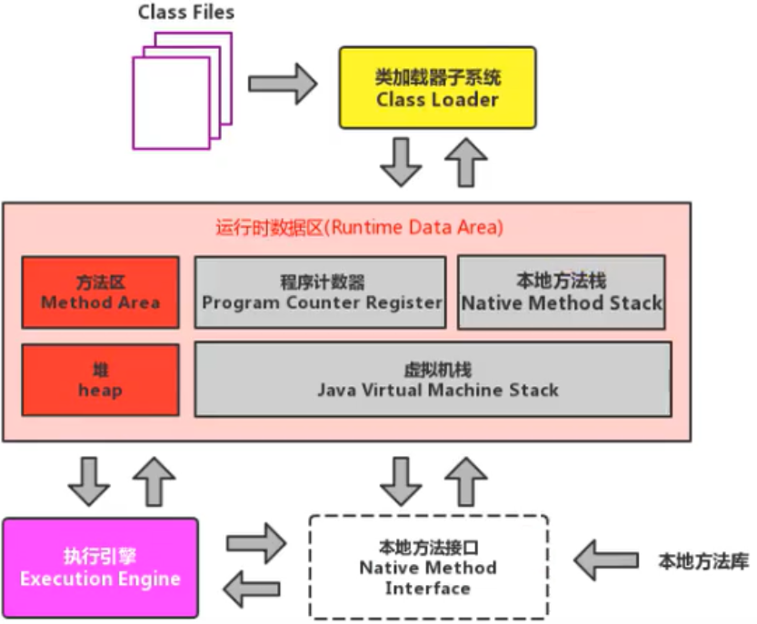
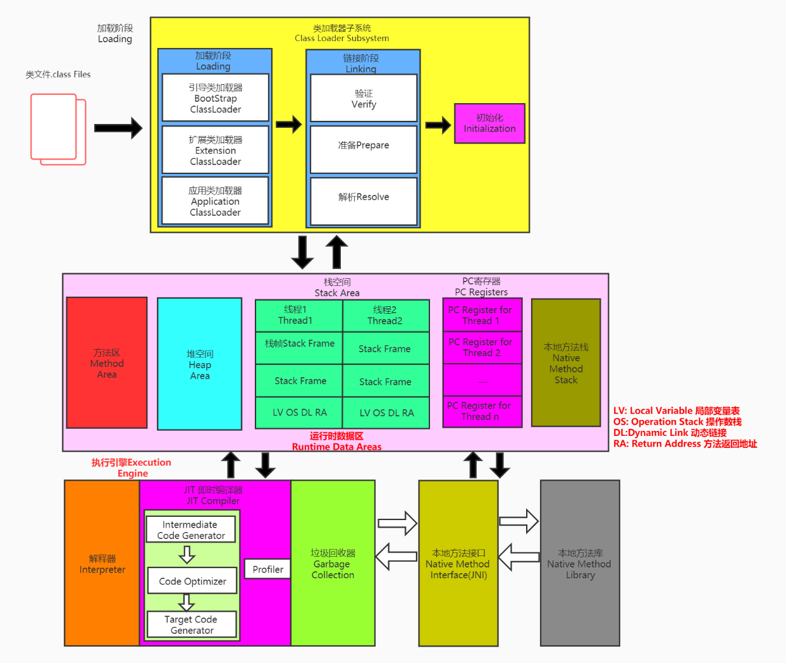
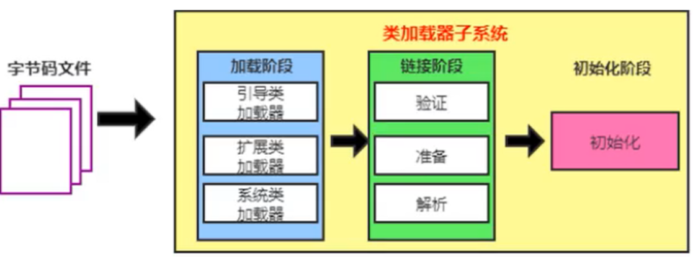
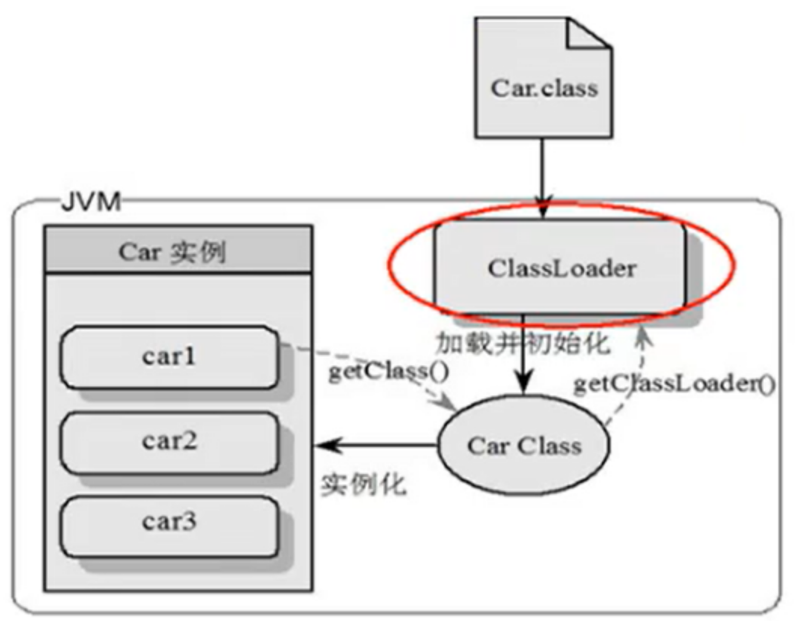
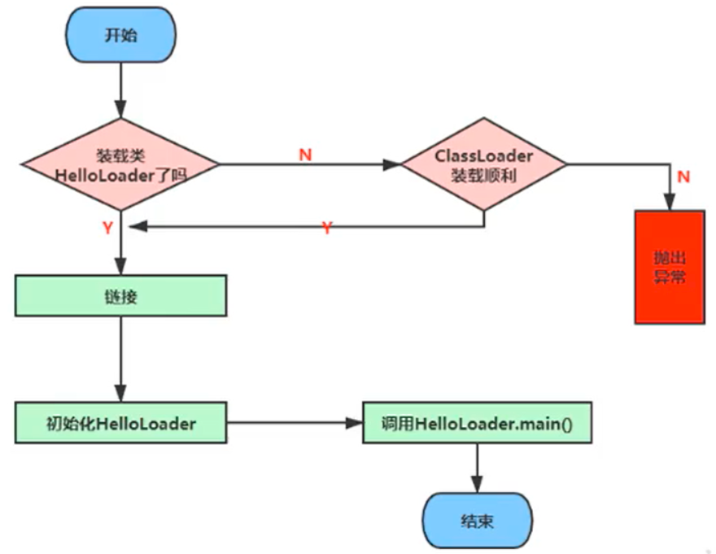

## 类加载子系统


### 一、内存结构概述






**如果自己手写一个Java虚拟机的话，主要考虑哪些结构呢？**

类加载器、执行引擎


### 二、类加载器与类的加载过程


#### 1. 类加载器子系统作用



* 类加载器子系统负责从文件系统或者网络中加载class文件，class文件在文件开头有特定的文件标识。
* Class Loader只负责class文件的加载，至于它是否可以运行，则由Execution Engine 决定。
* 加载的类信息存放于一块称为方法区的内存空间。除了类的信息外，方法区中还会存放运行时常量池信息，可能包括字符串字面量和数字常量（这部分常量信息是class文件中常量池部分的内存映射）。



* class file存在于本地硬盘上，可以理解为设计师画在纸上的模板，而最终这个模版在执行的时候是要加载到 JVM 当中来根据这个文件实例化出n个一模一样的实例。
* class file加载到JVM中，被称为DNA元数据模板，放在方法区.
* 在.class 文件ー> JVM ->最终成为元数据模板，此过程就要一个运输工具（类装载器 Class Loader ），扮演一个快递员的角色


#### 2. 类加载过程

整体加载过程的三个环节：

1. 加载
2. 链接
   * 验证
   * 准备
   * 解析

3. 初始化

##### 加载

1. 通过一个类的全限定名获取定义此类的二进制字节流；

2. 将这个字节流所代表的静态存储结构转化为 **方法区** 的运行时数据结构；

3. **在内存中生成一个代表这个类的 java.lang.Class 对象**，作为方法区这个类的各种数据的访问入口；

   

   **补充：加载** **.class** **文件的方式**

   * 从本地系统中直接加载；
   * 通过网络获取，典型场景： Web Applet；
   * 从 zip 压缩包中读取，成为日后 jar 、 war 格式的基础；
   * 运行时计算生成，使用最多的是：动态代理技术；
   * 由其他文件生成，典型场景： JSP 应用；
   * 从专有数据库中提取 .class 文件，比较少从加密文件中获取，典型的防 class 文件被反编译的保护措施；

##### 链接

1. 验证( Verify)
   * 目的在于确保 class 文件的字节流中包含信息符合当前虚拟机要求，保证被加载类的正确性，不会危害虚拟机自身安全；
   * 主要包括四种验证，文件格式验证，元数据验证，字节码验证，符号引用验证；

2. 准备（ Prepare ）
   * 为类变量分配内存并且设置该类变量的默认初始值，即零值；
   * 这里不包含用 final修饰的static，因为final在编译的时候就会分配了，准备阶段会显式初始化；
   * 这里不会为实例变量分配初始化，类变量会分配在方法区中，而实例变量是会随着对象一起分配到Java堆中。

3. 解析（ Resolve ）
   * 将常量池内的符号引用转换为直接引用的过程；
   * 事实上，解析操作往往会伴随着 JVM 在执行完初始化之后再执行；
   * 符号引用就是一组符号来描述所引用的目标。符号引用的字面量形式明确定义在《Java 虚拟机规范》的 class 文件格式中。直接引用就是直接指向目标的指针、相对偏移量或一个间接定位到目标的句柄；
   * 解析动作主要针对类或接口、字段、类方法、接口方法、方法类型等。对应常量池中的CONSTANT_Class_info、CONSTANT_Fieldref_info、CONSTANT_Methodref_info

##### 初始化

1. 初始化阶段就是执行类构造器方法 <clinit>() 的过程。

2. 此方法不需定义，是javac编译器自动收集类中的所有类变量的赋值动作和静态代码块中的语句合并而来。

3. 构造器方法中指令按语句在源文件中出现的顺序执行。

4. <clinit>() 不同于类的构造器。（关联：构造器是虚拟机视角下的 <init>() ）。

5. 若该类具有父类， JVM 会保证子类的 <clinit>() 执行前，父类的 <clinit>() 已经执行完毕。虚拟机必须保证一个类的 <clinit>() 方法在多线程下被同步加锁。

   ```java
   public class ClassInitTest {
      private static int num = 1;
   
      static {
          num = 2;
          number = 20;
          System.out.println(num);
          //System.out.println(number);//报错：非法的前向引用。
      }
   
      private static int number = 10;  //linking之prepare: number = 0 --> initial: 20 --> 10
   
       public static void main(String[] args) {
           System.out.println(ClassInitTest.num);//2
           System.out.println(ClassInitTest.number);//10
       }
   }
   ```

   