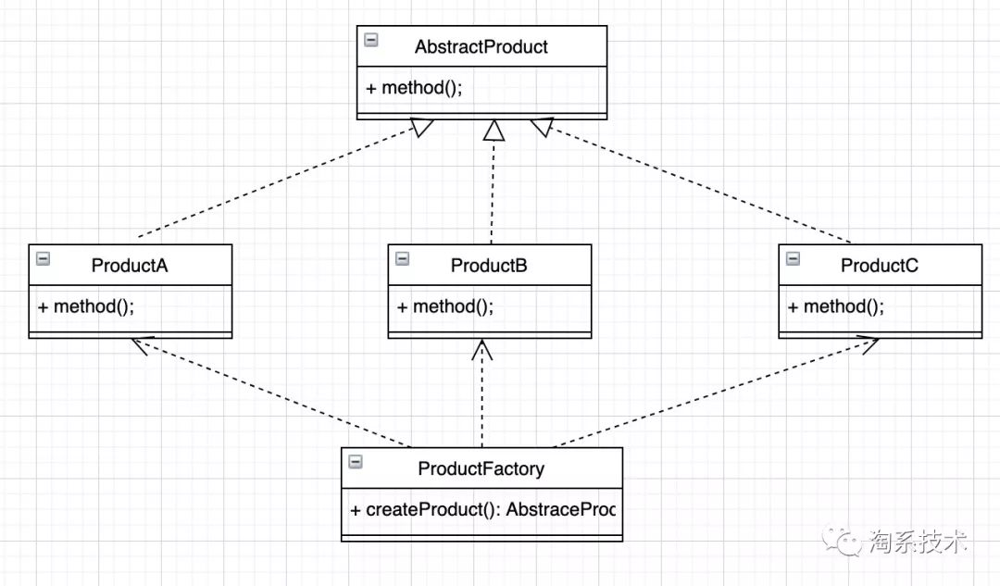
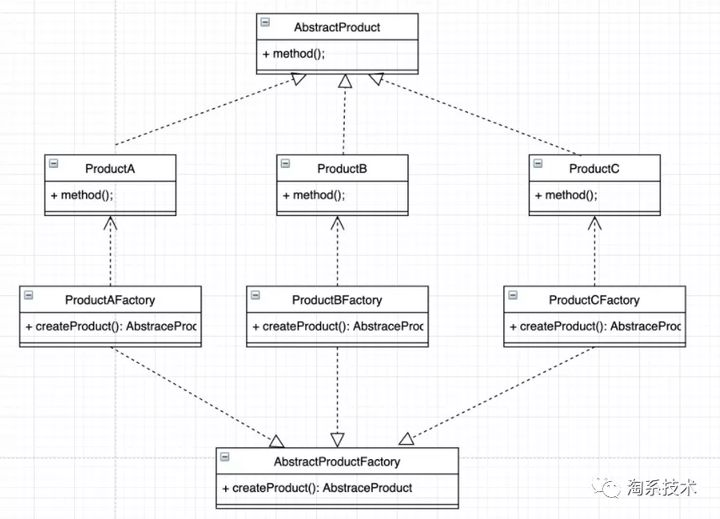

## 1. 背景

在我们平常创建对象的时候，都是通过关键字 new 来实现的，例：Class A = new A() 。

在一些情况下，要创建的对象需要一系列复杂的初始化操作，比如查配置文件、查数据库表、初始化成员对象等，如果把这些逻辑放在构造函数中，会极大影响代码的可读性。不妨定义一个类来专门负责对象的创建，这样的类就是工厂类，这种做法就是工厂模式，在任何需要生成复杂对象的地方，都可以使用工厂模式。

工厂模式包括：**简单工厂（不在23种设计模式中）、工厂方法和抽象工厂。**

我们把被创建的对象成为“产品”，把创建产品的对象成为“工厂”。如果要创建的产品不多，只要一个工厂类就可以完成，这种模式键“简单工厂模式”，它不属于23种经典设计模式，它的缺点是增加新产品时会违背“开闭原则”。

“工厂方法模式”是对简单工厂模式的进一步抽象画，其好处是可以是系统自不修改原来代码的情况下引进新的产品，即满足开闭原则。

**解决的问题**

* 客户端在调用时不想判断来实例化哪一个类或者实例化的过程过于复杂。

* 在工厂模式中，具体的实现类创建过程对客户端是透明的，客户端不决定具体实例化哪一个类，而是交由“工厂”来实例化。


### 简单工厂

定义一个创建对象的接口，让其子类自己决定实例化哪一个工厂类。




```java
public abstract class Product {
    public abstract void method();
}
```

```java
public class ConcreteProductA extends Product {
    @Override
    public void method() {
        System.out.println("我是实例产品A");
    }
}
```

```java
public class ConcreteProductB extends Product {
    @Override
    public void method() {
        System.out.println("我是实例产品B");
    }
}
```

```java
public class ProductFactory {
    public Product createProduct(ProductEnum productEnum) {
        if (productEnum == ProductEnum.PRODUCT_A) {
            return new ConcreteProductA();
        } else if (productEnum == ProductEnum.PRODUCT_B) {
            return new ConcreteProductB();
        }
        return null;
    }
}
```

```java
public class Client {
    public static void main(String[] args) {
        ProductFactory factory = new ProductFactory();
        Product product = factory.createProduct(ProductEnum.PRODUCT_B);
        product.method();
    }
}

//output
//我是实例产品B
```


**缺点**

上面的工厂实现是一个具体的类，而非接口或者抽象类，create()方法利用if-else创建并返回具体产品实例，如果增加新的产品子类，产品工厂的创建方法中就要增加新的if-else。这种做法扩展性差，违背了开闭原则，也影响了可读性。


>  可以使用反射，实现动态创建

```java
public abstract class Factory {
    public abstract <T extends Product>T createProduct(Class<T> clz);
}
```

```java
public class ConcreteFactory extends Factory {

    @Override
    public <T extends Product> T createProduct(Class<T> clz) {
        Product p =null;
        try {
            p = (Product) Class.forName(clz.getName()).newInstance();
        } catch (Exception e) {
            e.printStackTrace();
        }
        return (T) p;
    }
}
```

```java
public class Client {
    public static void main(String[] args) {
        ConcreteFactory factory = new ConcreteFactory();
        ConcreteProductA product = factory.createProduct(ConcreteProductA.class);
        product.method();
    }
}
```


### 工厂方法模式

为了解决上面提到的"增加if-else"的问题，可以为每一个产品子类建立一个对应的工厂子类，这些工厂子类实现同一个抽象工厂接口。这样，创建不同的产品，只需要实现不同的工厂子类。当有新产品加入时，新建具体工厂继承抽象工厂，而不用修改任何一个类。

工厂方法模式的定义：定义一个创建产品对象的工厂接口，将产品对象的实际创建工作推迟都具体工厂类中。当满足创建型模式中所要求的“创建与使用相分离”的特点。




- 抽象工厂：声明了工厂方法的接口。
- 具体产品工厂：实现工厂方法的接口，负责创建产品对象。
- 产品抽象类或接口：定义工厂方法所创建的产品对象的接口。
- 具体产品实现：具有统一父类的具体类型的产品。

```java
public interface Factory {
    public abstract Product createProduct();
}
```

```java
public class ProductAFactory implements Factory{
    @Override
    public Product createProduct() {
        return new ConcreteProductA();
    }
}
```

```java
public class ProductBFactory implements Factory {
    @Override
    public Product createProduct() {
        return new ConcreteProductB();
    }
}
```

```java
public class Client {
    public static void main(String[] args) {
        ProductAFactory productAFactory = new ProductAFactory();
        Product aFactoryProduct = productAFactory.createProduct();
        aFactoryProduct.method();
    }
}
```

```
//output
我是实例产品A
```

**缺点**

每一种产品对应一个工厂子类，在创建具体产品对象时，需要实例化不同的工厂子类。但是，如果业务涉及的子类越来越多，每一个子类都要对应一个工厂类。