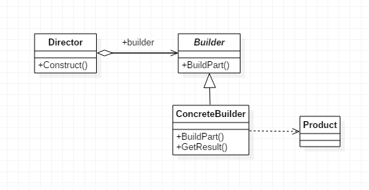

在软件开发过程中有时需要创建一个复杂对象，这个复杂对象通常由多个子部件按一定的步骤组成而已。例如，计算机有 CPU、主板、内存、硬盘、显卡、机箱、显示器、键盘、鼠标等部件组装而成的，采购员不可能自己去组装计算机，而是将计算机的配置要求告诉计算机销售公司，计算机销售公司安排技术人员去组装计算机，然后再交给要买计算机的采购员。

计算机是由多个部件构成的，各个部件可以灵活选择，但其创建步骤都大同小异。这类产品的创建无法用前面介绍的工厂模式描述，只有创建者模式可以很好地描述该类产品的创建。


**当一个类的构造函数参数个数超过4个，而且这些参数有些是可选的参数，考虑使用构造者模式。**


## 1. 定义

**建造者模式（Builder）**，将一个复杂的对象的构建与它的表示分离，使得同样的构建过程可以创建不同的表示。




- Product: 最终要生成的对象，例如 Computer实例。
- Builder： 构建者的抽象基类（有时会使用接口代替）。其定义了构建Product的抽象步骤，其实体类需要实现这些步骤。其会包含一个用来返回最终产品的方法`Product getProduct()`。
- ConcreteBuilder: Builder的实现类。
- Director: 决定如何构建最终产品的算法。其会包含一个负责组装的方法`void Construct(Builder builder)`， 在这个方法中通过调用builder的方法，就可以设置builder，等设置完成后，就可以通过builder的 `getProduct()` 方法获得最终的产品。


```java
public class Product {
    private String partA;
    private String partB;
    private String partC;

    public void setPartA(String partA) {
        this.partA = partA;
    }

    public void setPartB(String partB) {
        this.partB = partB;
    }

    public void setPartC(String partC) {
        this.partC = partC;
    }

    public void show() {
        //显示产品的特性
        System.out.println("显示产品特性");
    }
}
```

```java
public abstract class Builder {
    //创建产品对象
    protected Product product = new Product();

    public abstract void buildPartA();

    public abstract void buildPartB();

    public abstract void buildPartC();

    //返回产品对象
    public Product getResult() {
        return product;
    }
}
```

```java
public class ConcreteBuilder extends Builder {
    public void buildPartA() {
        product.setPartA("建造 PartA");
    }

    public void buildPartB() {
        product.setPartA("建造 PartB");
    }

    public void buildPartC() {
        product.setPartA("建造 PartC");
    }
}
```

```java
public class Director {
    private Builder builder;

    public Director(Builder builder) {
        this.builder = builder;
    }

    //产品构建与组装方法
    public Product construct() {
        builder.buildPartA();
        builder.buildPartB();
        builder.buildPartC();
        return builder.getResult();
    }
}
```

```java
public class Client {
    public static void main(String[] args) {
		Builder builder = new ConcreteBuilder();
        Director director = new Director(builder);
        Product product = director.construct();
        product.show();
    }
}
```

```java
//output
显示产品特性
```


## 典型示例

要构建的产品类

```java
public class Computer {
    private String cpu;//必须
    private String ram;//必须
    private int usbCount;//可选
    private String keyboard;//可选
    private String display;//可选

    public Computer(String cpu, String ram) {
        this.cpu = cpu;
        this.ram = ram;
    }

    public void setUsbCount(int usbCount) {
        this.usbCount = usbCount;
    }

    public void setKeyboard(String keyboard) {
        this.keyboard = keyboard;
    }

    public void setDisplay(String display) {
        this.display = display;
    }

    @Override
    public String toString() {
        return "Computer{" +
                "cpu='" + cpu + '\'' +
                ", ram='" + ram + '\'' +
                ", usbCount=" + usbCount +
                ", keyboard='" + keyboard + '\'' +
                ", display='" + display + '\'' +
                '}';
    }
}
```

```java
public abstract class ComputerBuilder {
    public abstract void setUsbCount();
    public abstract void setKeyboard();
    public abstract void setDisplay();

    public abstract Computer getComputer();
}
```

```java
public class MacComputerBuilder extends ComputerBuilder {
    private Computer computer;

    public MacComputerBuilder(String cpu, String ram) {
        computer = new Computer(cpu, ram);
    }

    @Override
    public void setUsbCount() {
        computer.setUsbCount(2);
    }

    @Override
    public void setKeyboard() {
        computer.setKeyboard("苹果键盘");
    }

    @Override
    public void setDisplay() {
        computer.setDisplay("苹果显示器");
    }

    @Override
    public Computer getComputer() {
        return computer;
    }
}
```

```java
public class LenovoComputerBuilder extends ComputerBuilder {
    private Computer computer;

    public LenovoComputerBuilder(String cpu, String ram) {
        computer = new Computer(cpu, ram);
    }

    @Override
    public void setUsbCount() {
        computer.setUsbCount(4);
    }

    @Override
    public void setKeyboard() {
        computer.setKeyboard("联想键盘");
    }

    @Override
    public void setDisplay() {
        computer.setDisplay("联想显示器");
    }

    @Override
    public Computer getComputer() {
        return computer;
    }
}
```

```java
public class ComputerDirector {
    public void makeComputer(ComputerBuilder builder){
        builder.setUsbCount();
        builder.setDisplay();
        builder.setKeyboard();
    }
}
```

```java
public class Client {
    public static void main(String[] args) {
        ComputerDirector director = new ComputerDirector();
        ComputerBuilder builder = new MacComputerBuilder("I5处理器", "三星125");
        director.makeComputer(builder);
        Computer macComputer = builder.getComputer();
        System.out.println("mac computer:" + macComputer.toString());

        ComputerBuilder lenovoBuilder = new LenovoComputerBuilder("I7处理器", "海力士222");
        director.makeComputer(lenovoBuilder);
        Computer lenovoComputer = lenovoBuilder.getComputer();
        System.out.println("lenovo computer:" + lenovoComputer.toString());
    }
}
```

```java
//output
mac computer:Computer{cpu='I5处理器', ram='三星125', usbCount=2, keyboard='苹果键盘', display='苹果显示器'}
lenovo computer:Computer{cpu='I7处理器', ram='海力士222', usbCount=4, keyboard='联想键盘', display='联想显示器'}
```


> 下面是传统builder模式的变种， 首先省略director 这个角色，将构建算法交给了client端;
>
> 其次将builder 写到了要构建的产品类里面，最后采用了链式调用。


#### 如何实现

1. 在Computer 中创建一个静态内部类 Builder，然后将Computer 中的参数都复制到Builder类中。
2. 在Computer中创建一个private的构造函数，参数为Builder类型。
3. 在Builder中创建一个`public`的构造函数，参数为Computer中必填的那些参数，cpu和ram。
4. 在Builder中创建设置函数，对Computer中那些可选参数进行赋值，返回值为Builder类型的实例
5. 在Builder中创建一个`build()`方法，在其中构建Computer的实例并返回


```java
public class Computer {
    private final String cpu;//必须
    private final String ram;//必须
    private final int usbCount;//可选
    private final String keyboard;//可选
    private final String display;//可选

    private Computer(Builder builder) {
        this.cpu = builder.cpu;
        this.ram = builder.ram;
        this.usbCount = builder.usbCount;
        this.keyboard = builder.keyboard;
        this.display = builder.display;
    }

    @Override
    public String toString() {
        return "Computer{" +
                "cpu='" + cpu + '\'' +
                ", ram='" + ram + '\'' +
                ", usbCount=" + usbCount +
                ", keyboard='" + keyboard + '\'' +
                ", display='" + display + '\'' +
                '}';
    }

    public static class Builder {
        private String cpu;//必须
        private String ram;//必须
        private int usbCount;//可选
        private String keyboard;//可选
        private String display;//可选

        public Builder(String cup, String ram) {
            this.cpu = cup;
            this.ram = ram;
        }

        public Builder setUsbCount(int usbCount) {
            this.usbCount = usbCount;
            return this;
        }

        public Builder setKeyboard(String keyboard) {
            this.keyboard = keyboard;
            return this;
        }

        public Builder setDisplay(String display) {
            this.display = display;
            return this;
        }

        public Computer build() {
            return new Computer(this);
        }
    }
}
```

```java
public class Client {
    public static void main(String[] args) {
        Computer computer = new Computer.Builder("因特尔", "三星")
                .setDisplay("三星24寸")
                .setKeyboard("罗技")
                .setUsbCount(2)
                .build();

        System.out.println("result:" + computer.toString());
    }
}
```

