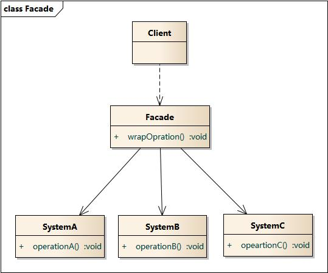

外观模式(Facade Pattern)：外部与一个子系统的通信必须通过一个统一的外观对象进行，为子系统中的一组接口提供一个一致的界面，外观模式定义了一个高层接口，这个接口使得这一子系统更加容易使用。


### 结构

外观模式包含如下角色：

- Facade: 外观角色
- SubSystem:子系统角色





### 优点

外观（Facade）模式是“迪米特法则”的典型应用，它有以下主要优点：

* 降低了子系统与客户端之间的耦合度，使得子系统的变化不会影响调用它的客户类。
* 对客户屏蔽了子系统组件，减少了客户处理的对象数目，并使得子系统使用起来更加容易。
* 降低了大型软件系统中的编译依赖性，简化了系统在不同平台之间的移植过程，因为编译一个子系统不会影响其他的子系统，也不会影响外观对象。


### 缺点

外观（Facade）模式的主要缺点如下。

1. 不能很好地限制客户使用子系统类，很容易带来未知风险。
2. 增加新的子系统可能需要修改外观类或客户端的源代码，违背了“开闭原则”。


### 实例

```java
class SubSystemA {
    public void MethodA() {
        //业务实现代码
    }
}

class SubSystemB {
    public void MethodB() {
        //业务实现代码
     }
}

class SubSystemC {
    public void MethodC() {
        //业务实现代码
    }
}
```

```java
class Facade {
    private SubSystemA obj1 = new SubSystemA();
    private SubSystemB obj2 = new SubSystemB();
    private SubSystemC obj3 = new SubSystemC();

    public void Method() {
        obj1.MethodA();
        obj2.MethodB();
        obj3.MethodC();
    }
}
```

```java
class Client {
    static void Main(string[] args) {
        Facade facade = new Facade();
        facade.Method();
    }
}
```

