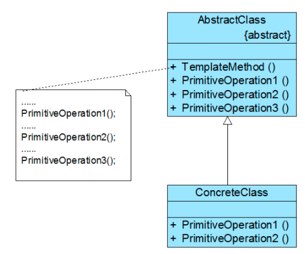

# 模板方法模式


## 1. 定义

定义一个操作中算法的框架，而将一些步骤延迟到子类中。模板方法模式使得子类可以不改变一个算法的结构即可重定义该算法的某些特定步骤。

模板方法模式是结构最简单的行为型设计模式，在其结构中只存在父类与子类之间的继承关系。通过使用模板方法模式，可以将一些复杂流程的实现步骤封装在一系列基本方法中，在抽象父类中提供一个称之为模板方法的方法来定义这些基本方法的执行次序，而通过其子类来覆盖某些步骤，从而使得相同的算法框架可以有不同的执行结果。模板方法模式提供了一个模板方法来定义算法框架，而某些具体步骤的实现可以在其子类中完成。


## 2. 优势&缺点

**优势**

- 封装不变部分，扩展可变部分

- 提取公共部分代码，便于维护

- 行为由父类控制，子类实现

  

**缺点：**每一个不同的实现都需要一个子类来实现，导致类的个数增加，使得系统更加庞大。

**使用场景：** 1、有多个子类共有的方法，且逻辑相同。 2、重要的、复杂的方法，可以考虑作为模板方法。

**注意事项：**为防恶意操作，一般模板方法都加上final关键字。


## 3. 结构



**AbstractClass(抽象类)：**在抽象类中定义了一系列基本操作(PrimitiveOperations)，这些基本操作可以是具体的，也可以是抽象的，每一个基本操作对应算法的一个步骤，在其子类中可以重定义或实现这些步骤。同时，在抽象类中实现了一个模板方法(Template Method)，用于定义一个算法的框架，模板方法不仅可以调用在抽象类中实现的基本方法，也可以调用在抽象类的子类中实现的基本方法，还可以调用其他对象中的方法。

**ConcreteClass(具体子类):** 它是抽象类的子类，用于实现在父类中声明的抽象基本操作以完成子类特定算法的步骤，也可以覆盖在父类中已经实现的具体基本操作。


## 4.示例

```java
//抽象模板类
public abstract class AbstractClass {
      public abstract void PrimitiveOperation1();
      public abstract void PrimitiveOperation2();
      
      public void TemplateMethod() {
          PrimitiveOperation1();
          PrimitiveOperation2();
      }     
}
```

```java
//具体模板类
public class ConcreteClass extends AbstractClass {
      @Override
      public void PrimitiveOperation1() {
          System.out.println("具体方法A方法1实现");
      }
  
      @Override
      public void PrimitiveOperation2() {
         System.out.println("具体方法A方法2实现");
      }
}
```

```java
//client
public class Client {
      public static void main(String[] args) {
          AbstractClass abstractClass = new ConcreteClass();
          abstractClass.TemplateMethod();
     }     
 }
```

