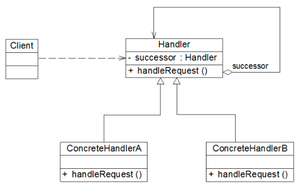

# 责任链模式


### 一 概述

责任链模式（Chain of Responsibility Pattern）为请求创建了一个接收者对象的链。这种模式给予请求的类型，对请求的发送者和接收者进行解耦。这种类型的设计模式属于行为型模式。

通常每个接收者都包含对另一个接收者的引用。如果一个对象不能处理该请求，那么它会把相同的请求传给下一个接收者，依此类推。




**Handler（抽象处理者）**：它定义了一个处理请求的接口，一般设计为抽象类，由于不同的具体处理者处理请求的方式不同，因此在其中定义了抽象请求处理方法。因为每一个处理者的下家还是一个处理者，因此在抽象处理者中定义了一个抽象处理者类型的对象（如结构图中的successor），作为其对下家的引用。通过该引用，处理者可以连成一条链。

**ConcreteHandler（具体处理者）**：它是抽象处理者的子类，可以处理用户请求，在具体处理者类中实现了抽象处理者中定义的抽象请求处理方法，在处理请求之前需要进行判断，看是否有相应的处理权限，如果可以处理请求就处理它，否则将请求转发给后继者；在具体处理者中可以访问链中下一个对象，以便请求的转发。

在职责链模式里，很多对象由每一个对象对其下家的引用而连接起来形成一条链。请求在这个链上传递，直到链上的某一个对象决定处理此请求。发出这个请求的客户端并不知道链上的哪一个对象最终处理这个请求，这使得**系统可以在不影响客户端的情况下动态地重新组织链和分配责任**。


##### 优点

降低耦合度。它将请求的发送者和接收者解耦。
简化了对象。使得对象不需要知道链的结构。
增强给对象指派职责的灵活性。通过改变链内的成员或者调动它们的次序，允许动态地新增或者删除责任
增加新的请求处理类很方便。

##### 缺点
不能保证请求一定被接收

##### 适用场景

1. 有多个对象可以处理同一个请求，具体哪个对象处理该请求由运行时刻自动确定。
2. 在不明确指定接收者的情况下，向多个对象中的一个提交一个请求。 
3. 可动态指定一组对象处理请求。


### 二 实现

```java
//抽象处理者
abstract class Handler {
	//维持对下家的引用
protected Handler successor;
	
	public void setSuccessor(Handler successor) {
		this.successor=successor;
	}
	
	public abstract void handleRequest(String request);
}
```

```java
//具体处理者角色1
class ConcreteHandler1 extends Handler {
    public void handleRequest(String request) {
        if (request.equals("one")) {
            System.out.println("具体处理者1负责处理该请求！");
        } else {
            if (getNext() != null) {
                getNext().handleRequest(request);
            } else {
                System.out.println("没有人处理该请求！");
            }
        }
    }
}
```

````java
//具体处理者角色2
class ConcreteHandler2 extends Handler {
    public void handleRequest(String request) {
        if (request.equals("two")) {
            System.out.println("具体处理者2负责处理该请求！");
        } else {
            if (getNext() != null) {
                getNext().handleRequest(request);
            } else {
                System.out.println("没有人处理该请求！");
            }
        }
    }
}
````

```java
public class ChainOfResponsibilityPattern {
    public static void main(String[] args) {
        //组装责任链
        Handler handler1 = new ConcreteHandler1();
        Handler handler2 = new ConcreteHandler2();
        handler1.setNext(handler2);
        //提交请求
        handler1.handleRequest("two");
    }
}

//输出
具体处理者2负责处理该请求！
```


### 三 实例

请假审批流程

```java
/**
 * ① 如果请假天数小于3天，主任审批
 * ② 如果请假天数大于等于3天，小于10天，经理审批
 * ③ 大于等于10天，小于20天的请假，副总经理审批
 * ④ 如果大于等于20天，小于30天，总经理审批
 * ⑤ 如果大于等于30天，提示拒绝；
 */

public class Client {
    public static void main(String[] args) {
        Director director = new Director("张三");
        Manager manager = new Manager("李四");
        ViceGeneralManager viceGeneralManager = new ViceGeneralManager("王五");
        GeneralManager generalManager = new GeneralManager("赵六");

        director.setNextLeader(manager);
        manager.setNextLeader(viceGeneralManager);
        viceGeneralManager.setNextLeader(generalManager);

        //开始请假操作
        LeaveRequest request = new LeaveRequest("Jack", 251, "回来家探亲");
        director.handleRequest(request);
    }
}
```

```java
//定义抽象处理者(Handler)
public abstract class Leader {

    protected String name;
    protected Leader nextLeader; //责任链上的后继对象

    public Leader(String name) {
        super();
        this.name = name;
    }

    //设定责任链上的后继对象
    public void setNextLeader(Leader nextLeader) {
        this.nextLeader = nextLeader;
    }

    //处理请求的核心的业务方法
    public abstract void handleRequest(LeaveRequest request);
}
```

```java
/**
 * 主任
 */
public class Director extends Leader {

    public Director(String name) {
        super(name);
    }

    @Override
    public void handleRequest(LeaveRequest request) {
        if (request.getLeaveDays() < 3) {
            String str = "员工：" + request.getEmpName() +
                    ", 请假，天数：" + request.getLeaveDays() +
                    ", 理由：" + request.getReason();
            
            System.out.println(str);
            System.out.println("主任：" + this.name + ",审批通过！");
        } else {
            if (this.nextLeader != null) {
                this.nextLeader.handleRequest(request);
            }
        }
    }
}
```

```java
/**
 * 经理
 */
public class Manager extends Leader {

    public Manager(String name) {
        super(name);
    }

    @Override
    public void handleRequest(LeaveRequest request) {
        if (request.getLeaveDays() < 10) {
            String str = "员工：" + request.getEmpName() +
                    ", 请假，天数：" + request.getLeaveDays() +
                    ", 理由：" + request.getReason();
            
            System.out.println(str);
            System.out.println("经理：" + this.name + ",审批通过！");
        } else {
            if (this.nextLeader != null) {
                this.nextLeader.handleRequest(request);
            }
        }
    }
}
```

```java
/**
 * 副总经理
 */
public class ViceGeneralManager extends Leader {

    public ViceGeneralManager(String name) {
        super(name);
    }

    @Override
    public void handleRequest(LeaveRequest request) {
        if (request.getLeaveDays() < 20) {
            String str = "员工：" + request.getEmpName() + 
                    ", 请假，天数：" + request.getLeaveDays() + 
                    ", 理由：" + request.getReason();
            
            System.out.println(str);
            System.out.println("副总经理：" + this.name + ",审批通过！");
        } else {
            if (this.nextLeader != null) {
                this.nextLeader.handleRequest(request);
            }
        }
    }
}
```

```java
/**
 * 总经理
 */
public class GeneralManager extends Leader {

    public GeneralManager(String name) {
        super(name);
    }

    @Override
    public void handleRequest(LeaveRequest request) {
        if (request.getLeaveDays() < 30) {
            String str = "员工：" + request.getEmpName() +
                    ", 请假，天数：" + request.getLeaveDays() +
                    ", 理由：" + request.getReason();
            System.out.println(str);
            System.out.println("总经理：" + this.name + ",审批通过！");
        } else {
            System.out.println("莫非" + request.getEmpName() + "想辞职，居然请假" + request.getLeaveDays() + "天！");
        }
    }
}
```


### 四 注意事项

职责链模式可分为**纯的职责链模式**和**不纯的职责链模式**两种。

**纯的职责链模式**要求一个具体处理者对象只能在两个行为中选择一个：**要么承担全部责任，要么将责任推给下家**，不允许出现某一个具体处理者对象在承担了一部分或全部责任后又将责任向下传递的情况。

**不纯的职责链模式**中允许某个请求被一个具体处理者部分处理后再**向下传递**，或者一个具体处理者处理完某请求后其后继处理者可以继续处理该请求，而且一个请求可以最终不被任何处理者对象所接收。

### 参考文章

https://blog.csdn.net/LoveLion/article/details/7420893