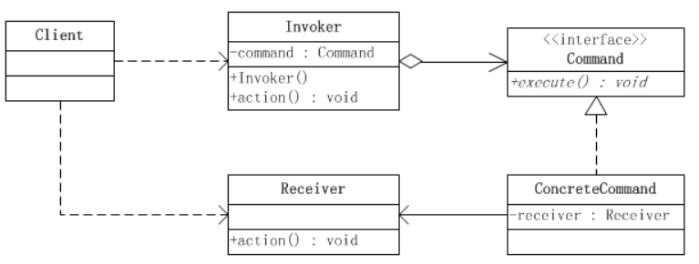
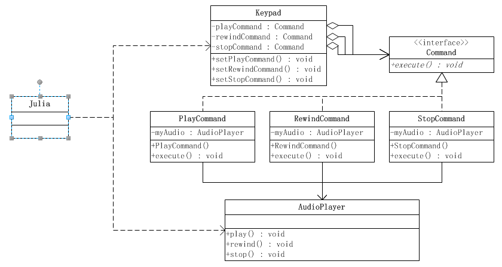

# 命令模式


### 一 概述


**定义：**命令模式把一个请求或者操作封装到一个对象中。命令模式允许系统使用不同的请求把客户端参数化，对请求排队或者记录请求日志，可以提供命令的撤销和恢复功能。

**解决的问题：**在软件系统中，行为请求者与行为实现者通常是一种紧耦合的关系，但某些场合，比如需要对行为进行记录、撤销或重做、事务等处理时，这种无法抵御变化的紧耦合的设计就不太合适。

**如何解决：**通过调用者调用接受者执行命令，顺序：调用者→命令→接受者。

**何时使用：**在某些场合，比如要对行为进行"记录、撤销/重做、事务"等处理，这种无法抵御变化的紧耦合是不合适的。在这种情况下，如何将"行为请求者"与"行为实现者"解耦？将一组行为抽象为对象，可以实现二者之间的松耦合。


命令模式是对命令的封装。命令模式把发出命令的责任和执行命令的责任分割开，委派给不同的对象。每一个命令都是一个操作：请求的一方发出请求要求执行一个操作；接收的一方收到请求，并执行操作。命令模式允许请求的一方和接收的一方独立开来，使得请求的一方不必知道接收请求的一方的接口，更不必知道请求是怎么被接收，以及操作是否被执行、何时被执行，以及是怎么被执行的。

命令允许请求的一方和接收请求的一方能够独立演化，从而具有以下的优点：

* 命令模式使新的命令很容易地被加入到系统里。
* 允许接收请求的一方决定是否要否决请求。
* 能较容易地设计一个命令队列。
* 可以容易地实现对请求的撤销和恢复。
* 在需要的情况下，可以较容易地将命令记入日志。


**结构**

* **Command（抽象命令类）**：声明了抽象命令对象的具体接口。

* **ConcreteCommand（具体命令类）**：定义一个接收者和行为之间的弱耦合；实现execute()方法，负责调用接收者的相应操作。execute()方法通常叫做执行方法。

* **Invoker（调用者/请求者）**：请求的发送者，它通过命令对象来执行请求。一个调用者并不需要在设计时确定其接收者，因此它只与抽象命令来之间存在关联。在程序运行时，将调用命令对象的execute() ，间接调用接收者的相关操作。

* **Receiver（接收者）**：接收者执行与请求相关的操作，真正执行命令的对象。具体实现对请求的业务处理。未抽象前，实际执行操作内容的对象。

* **Client（客户端）**：在客户类中需要创建调用者对象，具体命令类对象，在创建具体命令对象时指定对应的接收者。发送者和接收者之间没有关系，都通过命令对象来调用。


### 二 实现

```java
//接收者角色类
public class Receiver {
    
    //真正执行命令相应的操作
    public void action() {
        System.out.println("执行操作");
    }
}
```

```java
//抽象命令角色类
public interface Command {
    //执行方法
    void execute();
}
```

```java
//具体命令角色类
public class ConcreteCommand implements Command {
   	//持有相应的接收者对象
    private Receiver receiver = null;
  
    public ConcreteCommand(Receiver receiver) {
        this.receiver = receiver;
    }
    
    @Override
    public void execute() {
        //通常会转调接收者的形影方法，让接收者来真正执行功能
        receiver.action();
    }
}
```

```java
//请求者角色类
public class Invoker {
    //持有命令对象
    private Command command = null;
   
    public Invoker(Command command) {
        this.command = command;
    }
    
    //行动方法
    public void action() {
        command.execute();
    }
}
```

```java
//客户端角色类
public class Client {
    public static void main(String[] args) {
        //创建接收者
        Receiver receiver = new Receiver();
        //创建命令对象，设定其接收者
        Command command = new ConcreteCommand(receiver);
        //创建请求者，把命令对象设置进去
        Invoker invoker = new Invoker(command);
        //执行方法
        invoker.action();
    }
}
```


### 三 实例

AudioPlayer系统

小女孩茱丽(Julia)有一个盒式录音机，此录音机有播音(Play)、倒带(Rewind)和停止(Stop)功能，录音机的键盘便是请求者(Invoker)角色；茱丽(Julia)是客户端角色，而录音机便是接收者角色。Command类扮演抽象命令角色，而PlayCommand、StopCommand和RewindCommand便是具体命令类。茱丽(Julia)不需要知道播音(play)、倒带(rewind)和停止(stop)功能是怎么具体执行的，这些命令执行的细节全都由键盘(Keypad)具体实施。茱丽(Julia)只需要在键盘上按下相应的键便可以了。

录音机是典型的命令模式。录音机按键把客户端与录音机的操作细节分割开来。



```java
//接收者角色，由录音机类扮演
public class AudioPlayer { 
    public void play(){
        System.out.println("播放...");
    }
    
    public void rewind(){
        System.out.println("倒带...");
    }
    
    public void stop(){
        System.out.println("停止...");
    }
}
```

```java
//抽象命令角色类
public interface Command {
    //执行方法
    public void execute();
}
```

```java
//具体命令角色类
public class PlayCommand implements Command {
    private AudioPlayer myAudio;
 
    public PlayCommand(AudioPlayer audioPlayer){
        myAudio = audioPlayer;
    }
    
    //执行方法
    @Override
    public void execute() {
        myAudio.play();
    }
}

public class RewindCommand implements Command {

    private AudioPlayer myAudio;
    
    public RewindCommand(AudioPlayer audioPlayer){
        myAudio = audioPlayer;
    }
    
    @Override
    public void execute() {
        myAudio.rewind();
    }
}

public class StopCommand implements Command {
    private AudioPlayer myAudio;
    
    public StopCommand(AudioPlayer audioPlayer){
        myAudio = audioPlayer;
    }
    
    @Override
    public void execute() {
        myAudio.stop();
    }
}
```

```java
//请求者角色，由键盘类扮演
public class Keypad {
    private Command playCommand;
    private Command rewindCommand;
    private Command stopCommand;
    
    public void setPlayCommand(Command playCommand) {
        this.playCommand = playCommand;
    }
    public void setRewindCommand(Command rewindCommand) {
        this.rewindCommand = rewindCommand;
    }
    public void setStopCommand(Command stopCommand) {
        this.stopCommand = stopCommand;
    }
    
    //执行播放方法
    public void play(){
        playCommand.execute();
    }
    
    //执行倒带方法
    public void rewind(){
        rewindCommand.execute();
    }
    
    //执行播放方法
    public void stop(){
        stopCommand.execute();
    }
}
```

```java
//客户端角色
public class Julia {
    public static void main(String[]args){
        //创建接收者对象
        AudioPlayer audioPlayer = new AudioPlayer();
        //创建命令对象
        Command playCommand = new PlayCommand(audioPlayer);
        Command rewindCommand = new RewindCommand(audioPlayer);
        Command stopCommand = new StopCommand(audioPlayer);
        //创建请求者对象
        Keypad keypad = new Keypad();
        keypad.setPlayCommand(playCommand);
        keypad.setRewindCommand(rewindCommand);
        keypad.setStopCommand(stopCommand);
        //测试
        keypad.play();
        keypad.rewind();
        keypad.stop();
        keypad.play();
        keypad.stop();
    }
}
```


### 四 注意事项

**优点**

首先，命令模式的封装性很好：每个命令都被封装起来，对于客户端来说，需要什么功能就去调用相应的命令，而无需知道命令具体是怎么执行的。比如有一组文件操作的命令：新建文件、复制文件、删除文件。如果把这三个操作都封装成一个命令类，客户端只需要知道有这三个命令类即可，至于命令类中封装好的逻辑，客户端则无需知道。

 其次，命令模式的扩展性很好，在命令模式中，在接收者类中一般会对操作进行最基本的封装，命令类则通过对这些基本的操作进行二次封装，当增加新命令的时候，对命令类的编写一般不是从零开始的，有大量的接收者类可供调用，也有大量的命令类可供调用，代码的复用性很好。比如，文件的操作中，我们需要增加一个剪切文件的命令，则只需要把复制文件和删除文件这两个命令组合一下就行了，非常方便。


**缺点**

使用命令模式可能会导致某些系统有过多的具体命令类。


**使用场景**

对于大多数请求-响应模式的功能，比较适合使用命令模式，正如命令模式定义说的那样，命令模式对实现记录日志、撤销操作等功能比较方便。


**总结**

 对于一个场合到底用不用模式，这对所有的开发人员来说都是一个很纠结的问题。有时候，因为预见到需求上会发生的某些变化，为了系统的灵活性和可扩展性而使用了某种设计模式，但这个预见的需求偏偏没有，相反，没预见到的需求倒是来了不少，导致在修改代码的时候，使用的设计模式反而起了相反的作用，以至于整个项目组怨声载道。这样的例子，我相信每个程序设计者都遇到过。所以，基于敏捷开发的原则，我们在设计程序的时候，如果按照目前的需求，不使用某种模式也能很好地解决，那么我们就不要引入它，因为要引入一种设计模式并不困难，我们大可以在真正需要用到的时候再对系统进行一下，引入这个设计模式。

> 拿命令模式来说吧，我们开发中，请求-响应模式的功能非常常见，一般来说，我们会把对请求的响应操作封装到一个方法中，这个封装的方法可以称之为命令，但不是命令模式。到底要不要把这种设计上升到模式的高度就要另行考虑了，因为，如果使用命令模式，就要引入调用者、接收者两个角色，原本放在一处的逻辑分散到了三个类中，设计时，必须考虑这样的代价是否值得。


### 参考文章

https://blog.csdn.net/zhengzhb/article/details/7550895