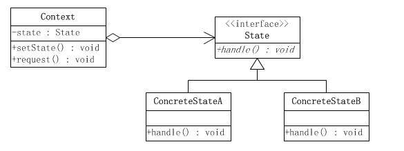

## 状态模式

### 一、定义

允许一个对象在其内部状态改变时改变它的行为，对象看起来似乎修改了它的类。 其别名为状态对象(Objects for States)，状态模式是一种对象行为型模式。

**主要解决：**对象的行为依赖于它的状态（属性），并且可以根据它的状态改变而改变它的相关行为。

**何时使用：**代码中包含大量与对象状态有关的条件语句。

**如何解决：**将各种具体的状态类抽象出来。


**优点：** 

1、封装了转换规则。 

2、枚举可能的状态，在枚举状态之前需要确定状态种类。 

3、将所有与某个状态有关的行为放到一个类中，并且可以方便地增加新的状态，只需要改变对象状态即可改变对象的行为。

4、允许状态转换逻辑与状态对象合成一体，而不是某一个巨大的条件语句块。 

5、可以让多个环境对象共享一个状态对象，从而减少系统中对象的个数。


**缺点：** 

1、状态模式的使用必然会增加系统类和对象的个数。 

2、状态模式的结构与实现都较为复杂，如果使用不当将导致程序结构和代码的混乱。 

3、状态模式对"开闭原则"的支持并不太好，对于可以切换状态的状态模式，增加新的状态类需要修改那些负责状态转换的源代码，否则无法切换到新增状态，而且修改某个状态类的行为也需修改对应类的源代码。


**使用场景：** 

1、行为随状态改变而改变的场景。 

2、条件、分支语句的代替者。


**注意事项：**

在行为受状态约束的时候使用状态模式，而且状态不超过 5 个。


### 二、结构



状态模式把所研究的对象的行为包装在不同的状态对象里，每一个状态对象都属于一个抽象状态类的一个子类。状态模式的意图是让一个对象在其内部状态改变的时候，其行为也随之改变。

* **环境(Context)：**定义客户端所感兴趣的接口，并且保留一个具体状态类的实例。这个具体状态类的实例给出此环境对象的现有状态。

* **抽象状态(State)角色：**定义一个接口，用以封装环境（Context）对象的一个特定的状态所对应的行为。

* **具体状态(ConcreteState)角色：**每一个具体状态类都实现了环境（Context）的一个状态所对应的行为。

  

### 三、示例代码

```java
//环境角色类
public class Context {
    //持有一个State类型的对象实例
    private State state;

    public void setState(State state) {
        this.state = state;
    }
    /**
     * 用户感兴趣的接口方法
     */
    public void request(String sampleParameter) {
        //转调state来处理
        state.handle(sampleParameter);
    }
}
```

```java
//抽象状态类
public interface State {
    /**
     * 状态对应的处理
     */
    public void handle(String sampleParameter);
}
```

```java
//具体状态类A
public class ConcreteStateA implements State {

    @Override
    public void handle(String sampleParameter) {
        System.out.println("ConcreteStateA handle ：" + sampleParameter);
    }
}
```

```java
//具体状态类B
public class ConcreteStateB implements State {
    
    @Override
    public void handle(String sampleParameter) {    
        System.out.println("ConcreteStateB handle ：" + sampleParameter);
    }
}
```

```java
//客户端类
public class Client {

    public static void main(String[] args){
        //创建状态
        State state = new ConcreteStateB();
        //创建环境
        Context context = new Context();
        //将状态设置到环境中
        context.setState(state);
        //请求
        context.request("test");
    }
}
```

环境类Context的行为request()是委派给某一个具体状态类。

通过使用多态性原则，可以动态改变环境类Context的属性State的内容，使其从指向一个具体状态类变换到指向另一个具体状态类，从而使环境类的行为request()由不同的具体状态类来执行。


### **与策略模式的对比**

- 具体子类之间的交互问题

- - 策略模式不同的子类之间没有交互，完全由客户端执行哪种策略
  - 状态模式不同的子类之间有交互，可以在子类里面实现状态的转换


- 环境角色的职责不同

- - 策略模式的环境角色只是一个委托作用，负责算法的替换
  - 状态模式的环境角色不仅仅是委托行为，它还具有登记状态变化的功能，与具体的状态类协作，共同完成状态切换行为随之切换的任务。


- 解决问题的重点不同

- - 策略模式旨在解决内部算法如何改变的问题，也就是将内部算法的改变对外界的影响降低到最小，它保证的是算法可以自由地切换
  - 状态模式旨在解决内在状态的改变而引起行为改变的问题，它的出发点是事物的状态，封装状态而暴露行为，一个对象的状态改变，从外界来看就好像是行为改变。