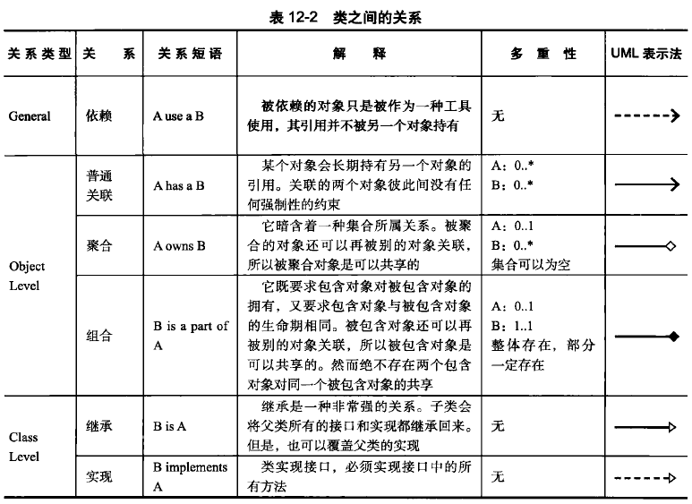
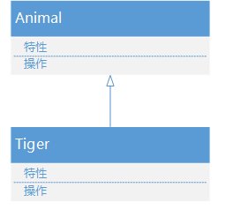
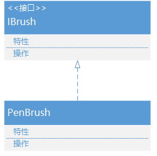
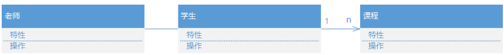
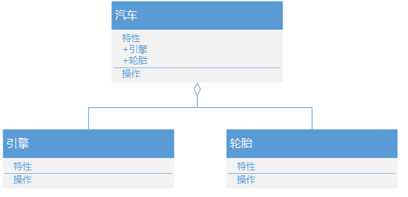
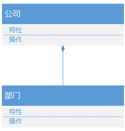
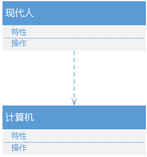
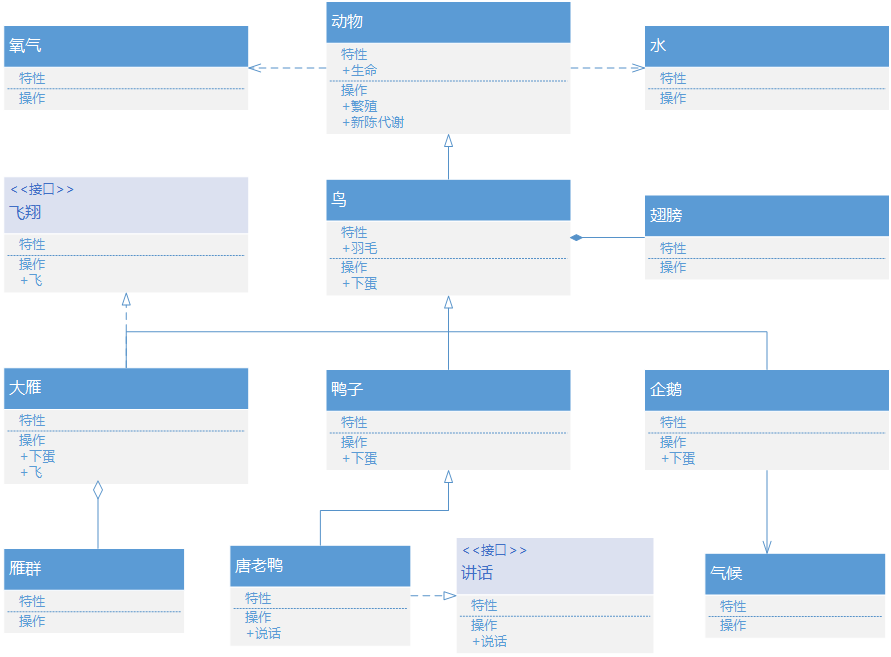
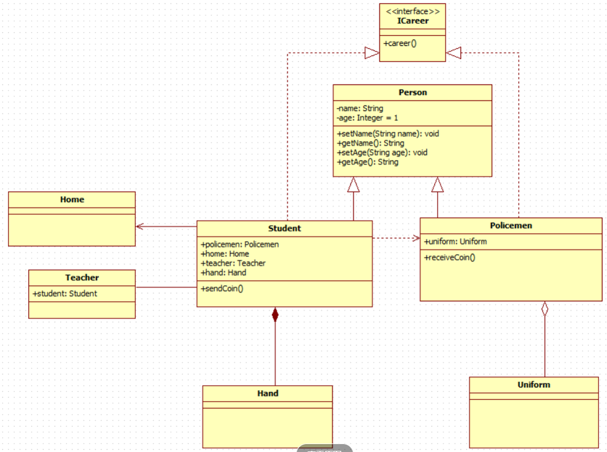

## UML类图


用户根据用例图抽象成类，描述类的内部结构和类与类之间的关系，是一种静态结构图。 在UML类图中，常见的有以下几种关系: 

- 泛化（Generalization）
- 实现（Realization）
- 关联（Association)
- 聚合（Aggregation）
- 组合(Composition)
- 依赖(Dependency)

各种关系的强弱顺序： 泛化 = 实现 > 组合 > 聚合 > 关联 > 依赖


#### 1.【泛化关系】
一种继承关系，表示一般与特殊的关系，它指定了子类如何继承父类的所有特征和行为。例如：老虎是动物的一种，即有老虎的特性也有动物的共性。



#### 2.【实现关系】
一种类与接口的关系，表示类是接口所有特征和行为的实现



#### 3.【关联关系】
一种拥有的关系，它使一个类知道另一个类的属性和方法；如：老师与学生，丈夫与妻子关联可以是双向的，也可以是单向的。

老师与学生是双向关联，老师有多名学生，学生也可能有多名老师。但学生与某课程间的关系为单向关联，一名学生可能要上多门课程，课程是个抽象的东西他不拥有学生。 



#### 4.【聚合关系】
整体与部分的关系，且部分可以离开整体而单独存在。如车和轮胎是整体和部分的关系，轮胎离开车仍然可以存在。

聚合关系是关联关系的一种，是强的关联关系；关联和聚合在语法上无法区分，必须考察具体的逻辑关系。



#### 5.【组合关系】
整体与部分的关系，但部分不能离开整体而单独存在。如公司和部门是整体和部分的关系，没有公司就不存在部门。

组合关系是关联关系的一种，是比聚合关系还要强的关系，它要求普通的聚合关系中代表整体的对象负责代表部分的对象的生命周期。



#### 6.【依赖关系】
一种使用的关系，即一个类的实现需要另一个类的协助，所以要尽量不使用双向的互相依赖.



### 参考资料

https://blog.csdn.net/feng98ren/article/details/79472383?depth_1-utm_source=distribute.pc_relevant.none-task&utm_source=distribute.pc_relevant.none-task

## 示例
#### P1



#### P2




## 组合，聚合，关联，依赖 的区别

强弱顺序： 泛化 = 实现 > 组合 > 聚合 > 关联 > 依赖


### 依赖(Dependency ) 

依赖关系仅仅描述了类与类之间的一种使用与被使用的关系;

**体现:** 在Java和C++中体现为局部变量、方法/函数的参数或者是对静态方法的调用;

一个人(Person)可以买车(car)和房子(House)，Person类依赖于Car类和House类的定义，因为Person类引用了Car和House。与关联不同的是，Person类里并没有Car和House类型的属性，Car和House的实例是以参量的方式传入到buy()方法中去的。一般而言，依赖关系在Java语言中体现为局域变量、方法的形参，或者对静态方法的调用。

```java
class Car {   
    public static void run(){   
        System.out.println("汽车在奔跑");   
    }   
}   
     
class Driver {   
    //使用形参方式发生依赖关系   
    public void drive1(Car car){   
        car.run();   
    }   
    //使用局部变量发生依赖关系   
    public void drive2(){   
        Car car = new Car();   
        car.run();   
    }   
    //使用静态变量发生依赖关系   
    public void drive3(){   
        Car.run();   
    }   
} 
```


### 关联(Association)

类与类之间的连结,关联关系使一个类知道另外一个类的属性和方法;通常含有“知道”,“了解”的含义。关联可以是双向的，也可以是单向的。

**体现:**在Java和C++中,关联关系是通过成员变量来实现的。表现在代码上，就是一个类包含另一个类的实例，通常表现为被关联类以类属性的形式出现在关联类的类定义中，也可以表现为关联类引用了一个类型为被关联类的全局变量。

```java
class Driver {   
    //使用成员变量形式实现关联   
    Car mycar;   
    public void drive(){   
        mycar.run();   
    }   
    ...   
    //使用方法参数形式实现关联   
    public void drive(Car car){   
        car.run();   
    }   
}  
```


### 聚合(aggregation)

关联关系的一种，是一种强关联关系（has-a）。

聚合关系是整体和个体/部分之间的关系，关联关系的两个类处于同一个层次上，而聚合关系的两个类处于不同的层次上，一个是整体，一个是个体/部分。

**体现:**C++中,聚合关系通过将被聚合者的（数组）指针作为内部成员来实现的。

**图示:**空心菱形 + 实线 + 箭头;箭头指向被聚合的类,也就是说,箭头指向个体/部分;

汽车类与引擎类、轮胎类，以及其它的零件类之间的关系便整体和个体的关系。与关联关系一样，聚合关系也是通过实例变量实现的。但是关联关系所涉及的两个类是处在同一层次上的，而在聚合关系中，两个类是处在不平等层次上的，一个代表整体，另一个代表部分。

```java
class Driver {   
    //使用成员变量形式实现聚合关系   
    Car mycar;   
    public void drive(){   
        mycar.run();   
    }   
}  
```


### 组合(Composition)

关联关系的一种（is-a）,但它是比聚合关系更强的关系。组合关系要求聚合关系中代表整体的对象要负责代表个体/部分的对象的整个生命周期。如果代表整体的对象被销毁或破坏，那么代表个体/部分的对象也一定会被销毁或破坏。

**体现:** 在Java和C++中,组合关系是通过成员变量来实现的。

**图示: **实心菱形 + 实线 + 箭头; 箭头指向代表个体/部分的对象，也就是被合成/组合的类的对象。


**聚合和组合的区别**：

聚合是个体离开了整体，依然可以存在。

组合是个体和整体不可以分开，个体不能离开整体单独存在。


**依赖，关联 和聚合，组合的区别:**

依赖，关联：类之间的关系是在同一层次上；
聚合，组合：类之间的关系表现为整体和部分；