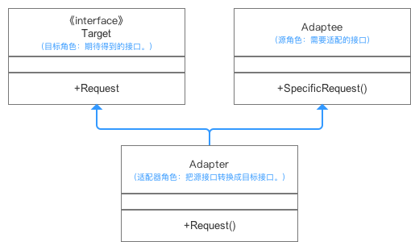
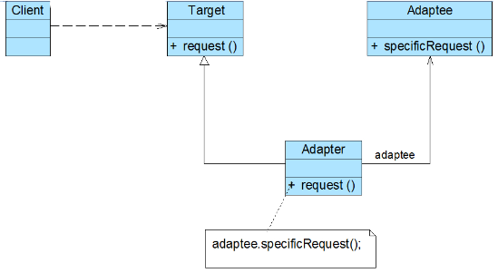

## 适配器模式


### 一、定义

把一个类的接口变换成客户端所期待的另一种接口，从而使原本接口不匹配而无法一起工作的两个类能够在一起工作。

适配器模式的形式分为：**类的适配器模式**和**对象的适配器模式**。

##### 优点

* **更好地复用性**

  系统需要使用现有的类，而此类的接口不符合系统的需要。那么通过适配器模式就可以让这些功能得到更好的复用。


* **更好地扩展性**

  在实现适配器功能的时候，可以调用自己开发的功能，从而自然地扩展系统的功能。


* **解耦性**

  将目标类和适配者类解耦，通过引入一个适配器类重用现有的适配者类，而无需修改原有代码。


* **符合开放-关闭原则**

  同一个适配器可以把适配者类和它的子类都适配到目标接口；可以为不同的目标接口实现不同的适配器，而不需要修改待适配类。


##### 总结

建议尽量使用对象的适配器模式，多用合成/聚合、少用继承。


### 二、结构

##### 类适配器

> 类的适配器模式是把适配的类的API转换成为目标类的API。



* 冲突：Target期待调用Request方法，而Adaptee并没有（这就是所谓的不兼容了）。

* 解决方案：为使Target能够使用Adaptee类里的SpecificRequest方法，故提供一个中间环节Adapter类（继承Adaptee & 实现Target接口），把Adaptee的API与Target的API衔接起来（适配）。


```java
public interface Target {
    //源类没有的方法
    public void request();
}
```

```java
//源类
public class Adaptee {
    public void specificRequest(){
        System.out.println("源类中的specific request方法...");
    }
}
```

```java
//适配器类
public class Adapter extends Adaptee implements Target{
    @Override
    public void request() {
        this.specificRequest();
    }
}
```

```java
public class Main {
    public static void main(String[] args) {
        Target target = new Adapter();
        target.request();
    }
}
```

##### 对象适配器



**Target（目标抽象类）**：目标抽象类定义客户所需接口，可以是一个抽象类或接口，也可以是具体类。

**Adapter（适配器类）**：适配器可以调用另一个接口，作为一个转换器，对Adaptee和Target进行适配，适配器类是适配器模式的核心，在对象适配器中，它通过继承Target并关联一个Adaptee对象使二者产生联系。

**Adaptee（适配者类**）：适配者即被适配的角色，它定义了一个已经存在的接口，这个接口需要适配，适配者类一般是一个具体类，包含了客户希望使用的业务方法，在某些情况下可能没有适配者类的源代码。


> 与类的适配器模式相同，对象的适配器模式也是把**适配的类的API转换成为目标类的API**。
>
> 与类的适配器模式不同的是，**对象的适配器模式不是使用继承关系连接到Adaptee类，而是使用关联的方式连接到Adaptee类**。


```java
public interface Target {
    //源类Adaptee没有的方法
    public void request();
}
```

```java
public class Adaptee {
    public void specificRequest(){
        System.out.println("specific request...");
    }
}
```

```java
public class Adapter implements Target {

    private final Adaptee adaptee;

    public Adapter(Adaptee adaptee) {
        this.adaptee = adaptee;
    }

    @Override
    public void request() {
        adaptee.specificRequest();
    }
}
```

```java
public class Main {
    public static void main(String[] args) {
        Target adapter = new Adapter(new Adaptee());
        adapter.request();
    }
}
```


