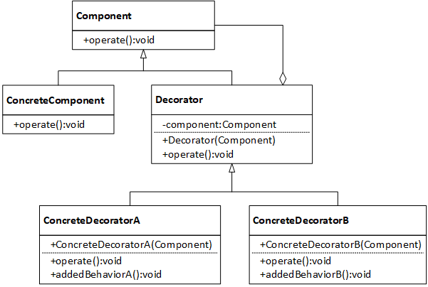
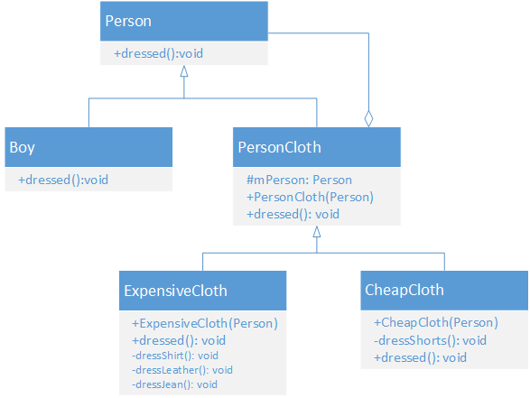

## 装饰模式

### 一、定义

装饰器模式（Decorator Pattern）允许向一个现有的对象添加新的功能，同时又不改变其结构。这种类型的设计模式属于结构型模式，它是作为现有的类的一个包装。

装饰模式也称为包装模式；

1. 使用一种对客户端透明的方式来动态扩展对象的功能，也是继承关系的一种替代方案之一。
2. 动态地给一个对象添加一些额外的职责，就增加功能来说，装饰模式相比生成子类更为灵活。


**优点**

* 装饰器的好处不仅能够封装原有的功能，而且还可以在已有功能的基础上添加新的功能。

* 符合设计模式中的开放关闭原则。

**缺点**

多层装饰比较复杂。


### 二、结构




**抽象组件角色(Component):**  定义可以动态添加任务的对象的接口。

**具体组件角色(ConcreteComponent)：**定义一个要被装饰器装饰的对象，即 Component 的具体实现。

**抽象装饰器(Decorator):** 维护对组件对象和其子类组件的引用。

**具体装饰器角色(ConcreteDecorator)：**向组件添加新的职责。


### 三、代码示例

##### 示例一

```java
//抽象组件类和具体组件类;
abstract class Component {
    public abstract void operation();
}

class ConcreteComponent extends Component {
    public void operation(){
        System.out.println("ConcreteComponent execute...");
    }
}
```

```java
//抽象装饰器类和具体装饰器类;
abstract class Decorator extends Component {
    protected Component component;

    public Decorator(Component component) {
        this.component = component;
    }
    public void operation(){
        component.operation();
    }
}

class ConcreteDecoratorA extends Decorator {
    public ConcreteDecoratorA(Component component){
        super(component);
    }
    private void operationFirst(){
        System.out.println("operationAFirst EXE");
    }
    private void operationLast(){
        System.out.println("operationALast EXE");
    }
    public void operation() {
        operationFirst();
        super.operation();
        operationLast();
    }
}

class ConcreteDecoratorB extends Decorator {
    public ConcreteDecoratorA(Component component){
        super(component);
    }
    private void operationFirst(){
        System.out.println("operationBFirst execute");
    }
    private void operationLast(){
        System.out.println("operationBLast execute");
    }
    public void operation() {
        operationFirst();
        super.operation();
        operationLast();
    }
}
```

```java
//客户端类
public class DecoratorMain {
    public static void main(String[] args) {
        ConcreteComponent component = new ConcreteComponent();
        Decorator decoratorA = new ConcreteDecoratorA(component);
        decoratorA.operation();
        System.out.println("---------");
        Decorator decoratorB = new ConcreteDecoratorB(decoratorA);
        decoratorB.operation();
    }
}
```

执行结果

```java
operation_A_First execute
ConcreteComponent execute...
operation_A_Last execute
---------
operation_B_First execute
operation_A_First execute
ConcreteComponent execute...
operation_A_Last execute
operation_B_Last execute
```


##### 示例二





```java
public class Main {
    public static void main(String[] args) {
        Person boy = new Boy();

        System.out.println("----------- 穿便宜的衣服 -------------");
        CheapCloth cheapCloth = new CheapCloth(boy);
        cheapCloth.dressed();

        System.out.println("\n----------- 穿贵的衣服 -------------");
        ExpensiveCloth expensiveCloth = new ExpensiveCloth(boy);
        expensiveCloth.dressed();
    }
}
```

```java
public class Boy extends Person {
    @Override
    public void dressed() {
        System.out.println("穿上内裤");
    }
}
```

```java
public class CheapCloth extends PersonCloth {
    public CheapCloth(Person person) {
        super(person);
    }

    private void dressShorts(){
        System.out.println("穿条短裤！");
    }

    @Override
    public void dressed() {
        super.dressed();
        dressShorts();
    }
}

```

```java
public class ExpensiveCloth extends PersonCloth{
    public ExpensiveCloth(Person person) {
        super(person);
    }

    private void dressShirt(){
        System.out.println("穿件短袖");
    }

    private void dressLeather(){
        System.out.println("穿件皮衣");
    }

    private void dressJean(){
        System.out.println("穿条牛仔裤");
    }

    @Override
    public void dressed() {
        super.dressed();
        dressShirt();
        dressLeather();
        dressJean();
    }
}

```

```java
public abstract class Person {
    public abstract void dressed();
}
```

```java
public abstract class PersonCloth extends Person {

    protected Person person;

    public PersonCloth(Person person) {
        this.person = person;
    }

    public void dressed(){
        person.dressed();
    }
}

```

输出结果：
```java
----------- 穿便宜的衣服 -------------
穿上内裤
穿条短裤！

----------- 穿贵的衣服 -------------
穿上内裤
穿件短袖
穿件皮衣
穿条牛仔裤
```