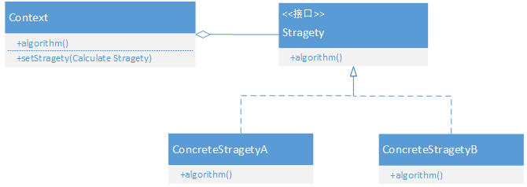

# 策略模式

### 优势

策略模式主要用来分离算法，在相同的行为抽象下有不同的具体实现策略。这个模式和好的展示了开闭原则，也就是定义抽象，注入不同实现，从而达到很好的扩展性。

原有if-else模式不能够遵循开闭原则。




**Context:** 是上下文，用一个ConcreteStrategy来配置，维护一个对Strategy对象的引用；

**Strategy:** 是策略类，用于定义所有支持算法的公共接口；

**ConcreteStrategy:** 是具体策略类，封装了具体的算法或行为，继承于Strategy。


```java
public interface CalculateStrategy {
    int calculatePrice(int km);
}
```

```java
public class BusStrategy implements CalculateStrategy {
    @Override
    public int calculatePrice(int km) {
        int extraTotal =km-10;
        int extraFactor = extraTotal/5;
        int fraction = extraFactor%5;
        int price = 1 + extraFactor*1;
        return fraction>0? ++price:price;
    }
}
```

```java
public class SubwayStrategy implements CalculateStrategy {
    @Override
    public int calculatePrice(int km) {
        if (km <= 6) {
            return 3;
        } else if (km > 6 && km < 12) {
            return 4;
        } else if (km > 12 && km < 22) {
            return 5;
        } else {
            return 7;
        }
    }
}
```

```java
public class TransportCalculator {

    private CalculateStrategy strategy;

    public static void main(String[] args) {
        TransportCalculator transportCalculator = new TransportCalculator();
        transportCalculator.setCalculateStrategy(new BusStrategy());
        System.out.println("乘坐公交16公里价格为："+transportCalculator.calculatePrice(16));
    }

    public void setCalculateStrategy(CalculateStrategy strategy){
        this.strategy = strategy;
    }

    public int calculatePrice(int km){
       return strategy.calculatePrice(km);
    }
}
```