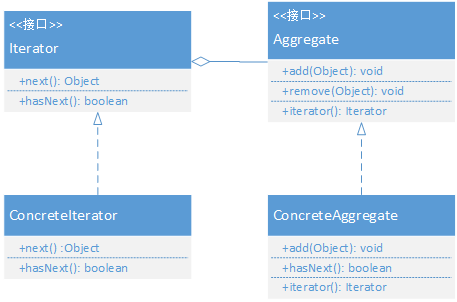

# 迭代器模式

## 定义
提供一种方法顺序访问一个容器对象中的各个元素，而又不需要暴露该对象的内部表示。



**Iterator:** 是迭代抽象类，用于定义得到开始对象、得到下一个对象、判断是否到结尾、当前对象等抽象方法，统一接口；

**ConcreteIterator:** 是具体迭代器类，继承Iterator，实现开始、下一个、是否结尾、当前对象等方法。

**Aggregate:** 是聚集抽象类，负责提供创建具体迭代器角色的接口；

**ConcreteAggregate:** 是具体聚集类，继承Aggregate；


## 示例代码

```
public interface Iterator<T> {
    boolean hasNext();
    T next();
}
```

```java
public class ConcreteIterator<T> implements Iterator<T> {

    private List<T> list = new ArrayList<>();
    private int cursor = 0;

    public ConcreteIterator(List<T> list) {
        this.list = list;
    }

    @Override
    public boolean hasNext() {
        return cursor!=list.size();
    }

    @Override
    public T next() {
        T obj = null;
        if (this.hasNext()){
            obj = this.list.get(cursor++);
        }
        return obj;
    }
}
```

```java
public interface Aggregate<T> {
    void add(T obj);
    void remove(T obj);
    Iterator<T> iterator();
}
```

```java
public class ConcreteAggregate<T> implements Aggregate<T> {
    private List<T> list = new ArrayList<>();

    @Override
    public void add(T obj) {
        list.add(obj);
    }

    @Override
    public void remove(T obj) {
        list.remove(obj);
    }

    @Override
    public Iterator<T> iterator() {
        return new ConcreteIterator<>(list);
    }
}
```

```java
public class Client {
    public static void main(String[] args) {
        ConcreteAggregate<String> aggregate = new ConcreteAggregate<>();
        aggregate.add("one");
        aggregate.add("two");
        aggregate.add("three");

        Iterator<String> iterator = aggregate.iterator();
        while (iterator.hasNext()){
            System.out.println(iterator.next());
        }
    }
}
```