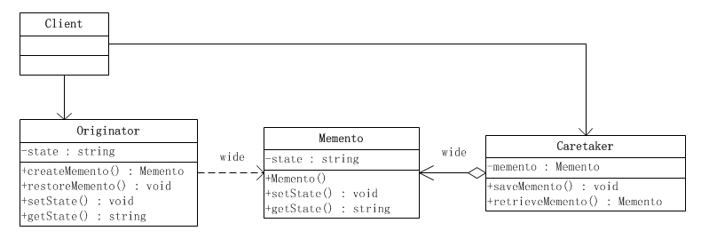
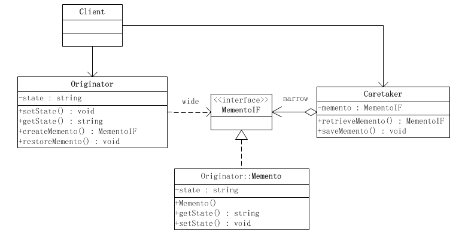
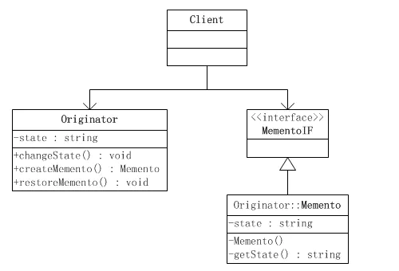

## 备忘录模式


### 一、定义 

忘录模式就是在不破坏封装的前提下，捕获一个对象的内部状态，并在该对象之外保存这个状态，从而可以在将来合适的时候把这个对象还原到存储起来的状态。

### 二、结构


##### “白箱”备忘录实现

备忘录角色对任何对象都提供一个接口，即宽接口，备忘录角色的内部所存储的状态就对所有对象公开。因此这个实现又叫做“白箱实现”。

“白箱”实现将发起人角色的状态存储在一个大家都看得到的地方，因此是破坏封装性的。



**Originator：** 发起人角色。负责创建一个备忘录，用以记录当前对象的内部状态。并使用备忘录对象存储其内部状态。

**Caretaker：**  负责人角色。负责保存好备忘录，不能对备忘录的内容进行操作和访问，只能够将备忘录传递给其他对象。

**Memento：** 备忘录角色。用于存储Originator的内部状态，并且可以防止Originator以外的对象访问Memento。在备忘录Memento中有两个接口，其中Caretaker只能看到备忘录中的窄接口，它只能将备忘录传递给其他对象。Originator可以看到宽接口，这个宽接口允许它读取所有的数据，以便根据这些数据恢复这个发起人对象的内部状态。


##### ”黑箱“备忘录实现

备忘录角色对发起人（Originator）角色对象提供一个宽接口，而为其他对象提供一个窄接口。这样的实现叫做“黑箱实现”。

在JAVA语言中，实现双重接口的办法就是将**备忘录角色类**设计成**发起人角色类**的内部成员类。

将Memento设成Originator类的内部类，从而将Memento对象封装在Originator里面；在外部提供一个标识接口MementoIF给Caretaker以及其他对象。这样，Originator类看到的是Menmento的所有接口，而Caretaker以及其他对象看到的仅仅是标识接口MementoIF所暴露出来的接口。




### 三、示例代码

```java
/**
 * 发起人角色类
 */
public class Originator {
    private String state;

    public Memento createMemento() {
        return new Memento(state);
    }

    public void restoreMemento(Memento memento) {
        this.state = memento.getState();
    }
    public String getState() {
        return state;
    }
    public void setState(String state) {
        this.state = state;
        System.out.println("当前状态：" + this.state);
    }
}
```

```java
/**
 * 备忘录角色类
 */
public class Memento {
    private String state;

    public Memento(String state) {
        this.state = state;
    }

    public String getState() {
        return state;
    }

    public void setState(String state) {
        this.state = state;
    }
}
```

```java
/**
 * 负责人角色类
 */
public class Caretaker {
    private Memento memento;

    public Memento retrieveMemento() {
        return this.memento;
    }

    public void saveMemento(Memento memento) {
        this.memento = memento;
    }
}
```

```java
public class MementoClient {
    public static void main(String[] args) {
        Originator originator = new Originator();
        Caretaker caretaker = new Caretaker();
        //改变发起人对象的状态
        originator.setState("On");
        //创建备忘录对象，并将发起人对象的状态存储起来
        caretaker.saveMemento(originator.createMemento());
        //修改发起人对象的状态
        originator.setState("Off");
        //恢复发起人对象的状态
        originator.restoreMemento(caretaker.retrieveMemento());

        //发起人对象的状态
        System.out.println("发起人对象的当前状态为：" + originator.getState());
    }
}
```

```java
//输出结果
当前状态：On
当前状态：Off
发起人对象的当前状态为：On
```

##### 黑盒备忘录实现

```java
//发起人角色，定义了一个内部类类Memento，该类接口私有，只有自己和发起人角色可以调用；
public class Originator {
    private String state;

    public String getState() {
        return state;
    }
    public void setState(String state) {
        this.state = state;
        System.out.println("赋值状态：" + state);
    }

    public MementoIF createMemento(){
        return new Memento(state);
    }

    public void restoreMemento(MementoIF memento){
        this.setState(((Memento)memento).getState());
    }

    private static class Memento implements MementoIF{

        private String state;

        private Memento(String state){
            this.state = state;
        }

        private String getState() {
            return state;
        }
        private void setState(String state) {
            this.state = state;
        }
    }
}
```

```java
public interface MementoIF {
}
```

```java
public class Caretaker {
    private MementoIF memento;

    public MementoIF retrieveMemento(){
        return memento;
    }

    public void saveMemento(MementoIF memento){
        this.memento = memento;
    }
}
```

```java
public class Client {
    public static void main(String[] args) {
        Originator o = new Originator();
        Caretaker c = new Caretaker();
        //改变负责人对象的状态
        o.setState("On");
        //创建备忘录对象，并将发起人对象的状态存储起来
        c.saveMemento(o.createMemento());
        //修改发起人对象的状态
        o.setState("Off");
        //恢复发起人对象的状态
        o.restoreMemento(c.retrieveMemento());

        //发起人对象的状态
        System.out.println("发起人对象的当前状态为：" + o.getState());
    }
}
```


### 四、"自述历史"模式

“自述历史”模式(History-On-Self Pattern)实际上就是备忘录模式的一个变种。在备忘录模式中，发起人角色`Originator`、负责人角色`Caretaker`和备忘录角色`Mementor`都是独立的角色。虽然在实现上备忘录角色类可以成为发起人角色类的内部成员类，但是备忘录角色类仍然保持作为一个角色的独立意义。

在“自述历史”模式里面，发起人角色自己兼任负责人角色。



##### 示例代码

```java
public interface MementoIF {
}
```

```java
public class Originator {
    private String state;
  
    public void changeState(String state) {
        this.state = state;
        System.out.println("状态改变为：" + this.state);
    }
   
    public Memento createMemento() {
        return new Memento(this);
    }
   
    public void restoreMemento(MementoIF memento) {
        changeState(((Memento)memento).getState());
    }
    
    public class Memento implements MementoIF {
        private String state;
       
        private Memento(Originator originator) {
            this.state = originator.state;
        }
        private String getState() {
            return this.state;
        }
    }
}
```

```java
public class Client {
    public static void main(String[] args) {
        Originator originator = new Originator();
        //修改状态
        originator.changeState("State 0");
        //创建备忘录
        MementoIF memento = originator.createMemento();
        //修改状态
        originator.changeState("State 1");
        //按照备忘录对象存储的状态恢复发起人对象的状态
        originator.restoreMemento(memento);
    }
}
```

