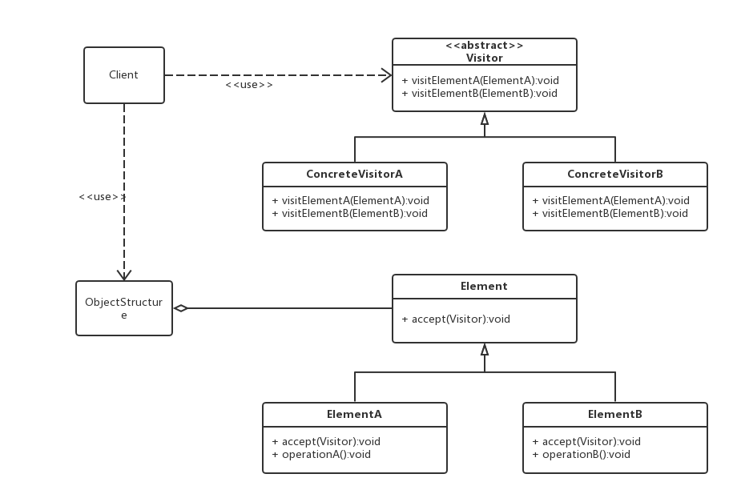

## 访问者模式


### 一、定义

将作用于某种数据结构中的各元素的操作分离出来封装成独立的类，使其在不改变数据结构的前提下可以添加作用于这些元素的新的操作，为数据结构中的每个元素提供多种访问方式。它将对数据的操作与数据结构进行分离，是行为类模式中最复杂的一种模式。

访问者（Visitor）模式是一种对象行为型模式。**如果一个对象结构比较复杂，同时结构稳定不易变化，但却需要经常在此结构上定义新的操作，那就非常合适使用访问者模式**。


**意图：**主要将数据结构与数据操作分离。

**主要解决：**稳定的数据结构和易变的操作耦合问题。

**何时使用：**需要对一个对象结构中的对象进行很多不同的并且不相关的操作，而需要避免让这些操作"污染"这些对象的类，使用访问者模式将这些封装到类中。

**如何解决：**在被访问的类里面加一个对外提供接待访问者的接口。


**主要优点**

- 扩展性好。能够在不修改对象结构中的元素的情况下，为对象结构中的元素添加新的功能。
- 复用性好。可以通过访问者来定义整个对象结构通用的功能，从而提高系统的复用程度。
- 灵活性好。访问者模式将数据结构与作用于结构上的操作解耦，使得操作集合可相对自由地演化而不影响系统的数据结构。
- 符合单一职责原则。访问者模式把相关的行为封装在一起，构成一个访问者，使每一个访问者的功能都比较单一。


**主要缺点**

- 增加新的元素类很困难。在访问者模式中，每增加一个新的元素类，都要在每一个具体访问者类中增加相应的具体操作，这违背了“开闭原则”。
- 破坏封装。访问者模式中具体元素对访问者公布细节，这破坏了对象的封装性。
- 违反了依赖倒置原则。访问者模式依赖了具体类，而没有依赖抽象类。


### 二、结构



* **Visitor：**接口或者抽象类，它定义了对每一个元素（Element）访问的行为，它的参数就是可以访问的元素，它的方法数理论上来讲与元素个数是一样的，因此，访问者模式要求元素的类族要稳定，如果经常添加、移除元素类，必然会导致频繁地修改Visitor接口，如果这样则不适合使用访问者模式。

* **ConcreteVisitor1、ConcreteVisitor2：**具体的访问类，它需要给出对每一个元素类访问时所产生的具体行为。

* **Element：**元素接口或者抽象类，它定义了一个接受访问者的方法（Accept），其意义是指每一个元素都要可以被访问者访问。

* **ConcreteElementA、ConcreteElementB：**具体的元素类，它提供接受访问方法的具体实现，而这个具体的实现，通常情况下是使用访问者提供的访问该元素类的方法。

* **ObjectStructure：**定义当中所说的对象结构，对象结构是一个抽象表述，它内部管理了元素集合，并且可以迭代这些元素供访问者访问。


### 三、示例代码

```java
//抽象访问者
interface Visitor {
    void visit(ConcreteElementA element);

    void visit(ConcreteElementB element);
}
```

```java
//具体访问者A
public class ConcreteVisitorA implements Visitor {
    public void visit(ConcreteElementA element) {
        System.out.println("具体访问者A访问-->" + element.operationA());
    }

    public void visit(ConcreteElementB element) {
        System.out.println("具体访问者A访问-->" + element.operationB());
    }
}
```

```java
//具体访问者B
public class ConcreteVisitorB implements Visitor {
    public void visit(ConcreteElementA element) {
        System.out.println("具体访问者B访问-->" + element.operationA());
    }

    public void visit(ConcreteElementB element) {
        System.out.println("具体访问者B访问-->" + element.operationB());
    }
}
```

```java
//抽象元素类
public interface Element {
    void accept(Visitor visitor);
}
```

```java
//具体元素类A
public class ConcreteElementA implements Element {
    public void accept(Visitor visitor) {
        visitor.visit(this);
    }

    public String operationA() {
        return "具体元素A的操作。";
    }
}
```

```java
//具体元素类B
public class ConcreteElementB implements Element {
    public void accept(Visitor visitor) {
        visitor.visit(this);
    }

    public String operationB() {
        return "具体元素B的操作。";
    }
}
```

```java
//对象结构角色
public class ObjectStructure {
    private final List<Element> list = new ArrayList<>();

    public void accept(Visitor visitor) {
        for (Element element : list) {
            element.accept(visitor);
        }
    }

    public void add(Element element) {
        list.add(element);
    }

    public void remove(Element element) {
        list.remove(element);
    }
}
```

```java
public class Client {
    public static void main(String[] args) {
        ObjectStructure os = new ObjectStructure();
        os.add(new ConcreteElementA());
        os.add(new ConcreteElementB());
        Visitor visitor = new ConcreteVisitorA();
        os.accept(visitor);
        System.out.println("------------------------");
        visitor = new ConcreteVisitorB();
        os.accept(visitor);
    }
}
```

```java
//输出
具体访问者A访问-->具体元素A的操作。
具体访问者A访问-->具体元素B的操作。
------------------------
具体访问者B访问-->具体元素A的操作。
具体访问者B访问-->具体元素B的操作。
```

