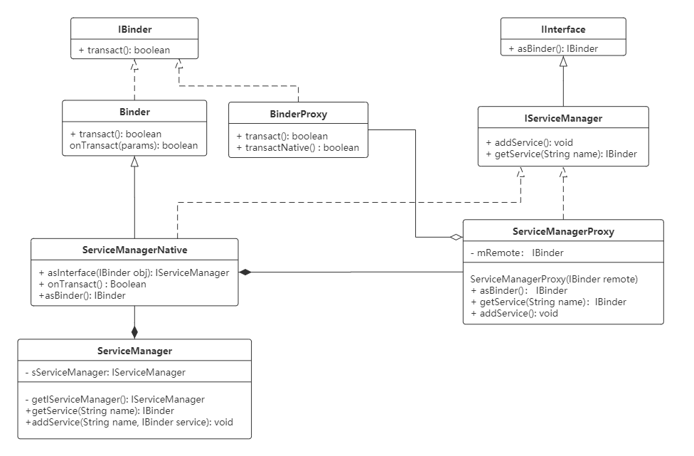
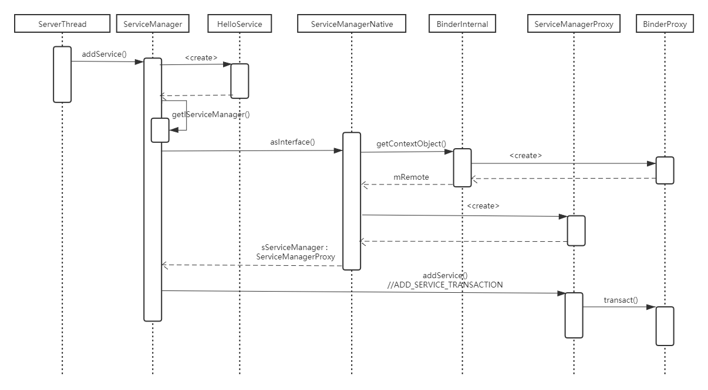

>本文demo使用罗升阳博客中提供的示例，分析Binder通信Java代码调用流程；
>
>原文链接：https://blog.csdn.net/Luoshengyang/article/details/6578352


# UML类图




### 1. AIDL实现

 **IHelloService.aidl**

```java
package android.os;
 
interface IHelloService {
    void setVal(int val);
    int getVal();
}
```

**由aidl文件生成的IHelloService.java文件**

```java
/*
 * This file is auto-generated.  DO NOT MODIFY.
 * Original file: frameworks/base/core/java/android/os/IHelloService.aidl
 */
package android.os;
public interface IHelloService extends android.os.IInterface
{
	/** Local-side IPC implementation stub class. */
	public static abstract class Stub extends android.os.Binder implements android.os.IHelloService
	{
		private static final java.lang.String DESCRIPTOR = "android.os.IHelloService";
		/** Construct the stub at attach it to the interface. */
		public Stub()
		{
			this.attachInterface(this, DESCRIPTOR);
		}
 
		/**
		* Cast an IBinder object into an android.os.IHelloService interface,
		* generating a proxy if needed.
		*/
		public static android.os.IHelloService asInterface(android.os.IBinder obj)
		{
			if ((obj==null)) {
				return null;
			}
			android.os.IInterface iin = (android.os.IInterface)obj.queryLocalInterface(DESCRIPTOR);
			if (((iin!=null)&&(iin instanceof android.os.IHelloService))) {
				return ((android.os.IHelloService)iin);
			}
			return new android.os.IHelloService.Stub.Proxy(obj);
		}
 
		public android.os.IBinder asBinder()
		{
			return this;
		}
 
		@Override 
		public boolean onTransact(int code, android.os.Parcel data, android.os.Parcel reply, int flags) throws android.os.RemoteException
		{
			switch (code)
			{
				case INTERFACE_TRANSACTION:
				{
					reply.writeString(DESCRIPTOR);
					return true;
				}
				case TRANSACTION_setVal:
				{
					data.enforceInterface(DESCRIPTOR);
					int _arg0;
					_arg0 = data.readInt();
					this.setVal(_arg0);
					reply.writeNoException();
					return true;
				}
				case TRANSACTION_getVal:
				{
					data.enforceInterface(DESCRIPTOR);
					int _result = this.getVal();
					reply.writeNoException();
					reply.writeInt(_result);
					return true;
				}
			}
			return super.onTransact(code, data, reply, flags);
		}
 
		private static class Proxy implements android.os.IHelloService
		{
			private android.os.IBinder mRemote;
 
			Proxy(android.os.IBinder remote)
			{
				mRemote = remote;
			}
 
			public android.os.IBinder asBinder()
			{
				return mRemote;
			}
 
			public java.lang.String getInterfaceDescriptor()
			{
				return DESCRIPTOR;
			}
 
			public void setVal(int val) throws android.os.RemoteException
			{
				android.os.Parcel _data = android.os.Parcel.obtain();
				android.os.Parcel _reply = android.os.Parcel.obtain();
				try {
					_data.writeInterfaceToken(DESCRIPTOR);
					_data.writeInt(val);
					mRemote.transact(Stub.TRANSACTION_setVal, _data, _reply, 0);
					_reply.readException();
				}
				finally {
					_reply.recycle();
					_data.recycle();
				}
			}
 
			public int getVal() throws android.os.RemoteException
			{
				android.os.Parcel _data = android.os.Parcel.obtain();
				android.os.Parcel _reply = android.os.Parcel.obtain();
				int _result;
				try {
					_data.writeInterfaceToken(DESCRIPTOR);
					mRemote.transact(Stub.TRANSACTION_getVal, _data, _reply, 0);
					_reply.readException();
					_result = _reply.readInt();
				}
				finally {
					_reply.recycle();
					_data.recycle();
				}
				return _result;
			}
		}
 
		static final int TRANSACTION_setVal = (android.os.IBinder.FIRST_CALL_TRANSACTION + 0);
		static final int TRANSACTION_getVal = (android.os.IBinder.FIRST_CALL_TRANSACTION + 1);
	}
 
	public void setVal(int val) throws android.os.RemoteException;
	public int getVal() throws android.os.RemoteException;
}
```

### 2. Server端实现

**HelloService.java**

```java
package com.android.server;

import android.content.Context;
import android.os.IHelloService;

public class HelloService extends IHelloService.Stub {
	
    HelloService() {
		init_native();
	}
	public void setVal(int val) {
		setVal_native(val);
	}	
	public int getVal() {
		return getVal_native();
	}
	
	private static native boolean init_native();
    private static native void setVal_native(int val);
	private static native int getVal_native();
};
```

#### Service启动

修改HelloService.java文件，在ServerThread::run函数中增加加载HelloService的代码;

```java
@Override
public void run() {
	try {
		   Slog.i(TAG, "Hello Service");
		   ServiceManager.addService("hello", new HelloService());
		} catch (Throwable e) {
		   Slog.e(TAG, "Failure starting Hello Service", e);
	    }
}      

```

### 3. Client端实现

```java
private IHelloService helloService = null;

//获取HelloService的远程接口
helloService = IHelloService.Stub.asInterface(ServiceManager.getService("hello"));

//调用方法
int val = helloService.getVal();
helloService.setVal(val);
```


### 4. 调用流程

#### service



#### client

