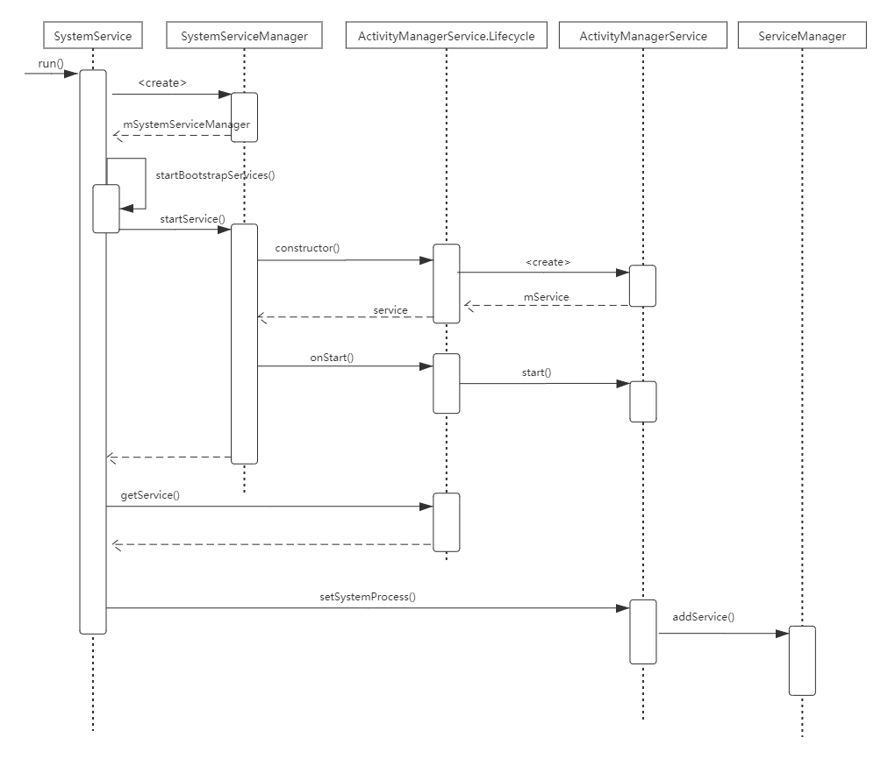

 # 一、各种服务的启动

安卓启动的入口在于zygote()，Zygote进程启动了SyetemServer进程，在main()方法中，启动三种类型的服务，分别是引导服务、核心服务和其他服务；


**startBootstrapServices**

ActivityManagerService、PowerManagerService、PackageManagerService


**startCoreServices**

BatteryService、UsageStatsService和WebViewUpdateService


**startOtherServices**

CameraService、AlarmManagerService、WindowManagerService


# 二、ActivityManagerService启动

ActivityManagerService启动到将该服务添加到ServiceManger的源码调用流程如下：

> 参考资料
>
> https://blog.csdn.net/ccjhdopc/article/details/52712280




# 三. WindowManagerService的启动

   ```java
   1. startOtherServices()#SystemServer
   2. WindowManagerService wm = WindowManagerService.main()
   3. DisplayThread.getHandler().runWithScissors();//在"android.display"线程中创建WMS对象
   4. WindowManagerService() #WindowManagerService //执行构造函数
      // 执行一些初始化工作，获取IMS引用，获取Display屏幕信息，持有AMS引用，创建WindowAnimator
      // 对象等；
   5. initPolicy()#WindowManagerService 
      // 构造方法内调用；初始化了窗口管理策略的接口类WindowManagerPolicy
   6. UiThread.getHandler().runWithScissors();
      //initPolicy()内调用；
   7. displayReady()#WindowManagerService
   8. systemReady()#WindowManagerService
   ```

"system_server"线程中会调用WMS的main方法，main方法中会创建WMS，创建WMS的过程运行在"android.display"线程中，它的优先级更高一些，因此要等创建WMS完毕后才会唤醒处于等待状态的"system_server"线程。

WMS初始化时会执行initPolicy方法，initPolicy方法会调用PWM的init方法，这个init方法运行在"android.ui"线程，并且优先级更高，因此要先执行完PWM的init方法后，才会唤醒处于等待状态的"android.display"线程。

PWM的init方法执行完毕后会接着执行运行在"system_server"线程的代码，比如本文前部分提到WMS的 systemReady方法。
