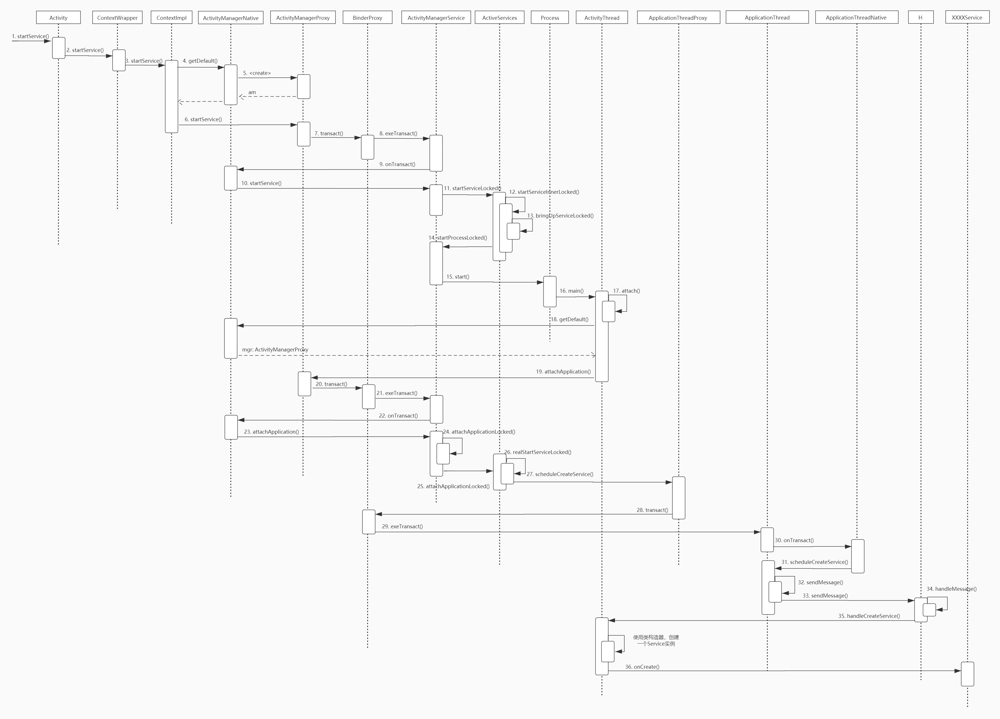

# 一、startService()的过程

在主进程调用startService函数时，会通过Binder进程间通信机制来通知ActivitManagerService来创建新进程，并且启动指定的服务。

1. **startService()#ContextImpl**

   内部又调用了ActivityManagerProxy类的startService()进行跨进程调用；

2. **在AMS内，最后通过Process类创建了一个新的进程；**

   一个进程对应一个ActivityThread，创建后执行它的main()函数；

3. **main()函数中会通过代理，调用AMS的attachApplication(mAppThread)函数；**

   其中，mAPPThread类型为ApplicationThread，这里将这个引用传到AMS中，以后AMS通过匿
   名binder的方式，与当前进程进行跨进程调用。

   又回到AMS进程的原始是，需要获取在新进程启动的服务的相关信息；

4. **因为持有一个ApplicationThread代理引用，所以继续一个快进程调用**

   实则调用scheduleCreateService()#ApplicationThread

5. **到了新创建的进程，然后发送一个创建服务的Handler消息，类型为H.CREATE_SERVICE**

   在消息处理内部，使用ClassLoader创建一个Service子类；

**startService()生命周期**

onCreate()

onStartCommand()

onDestroy()

**bindService()生命周期**

onCreate()

onBind()

onUnbind()

onDestroy()

