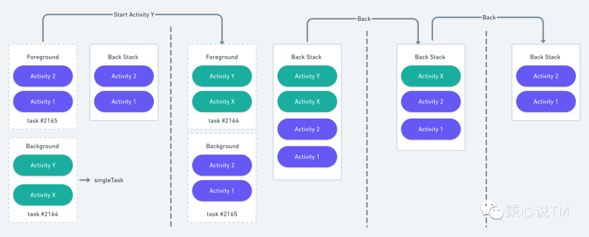
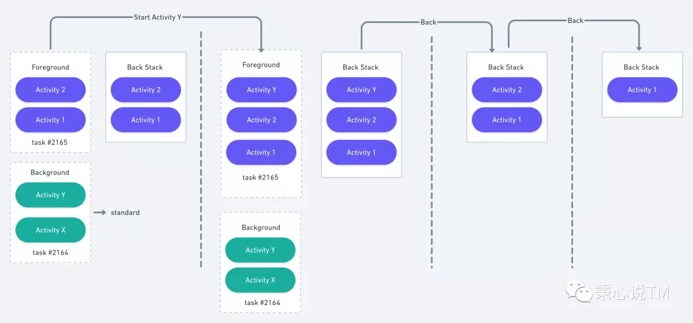
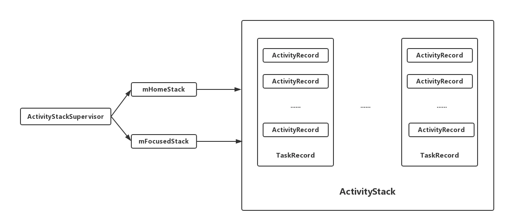
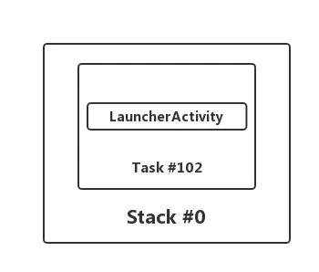
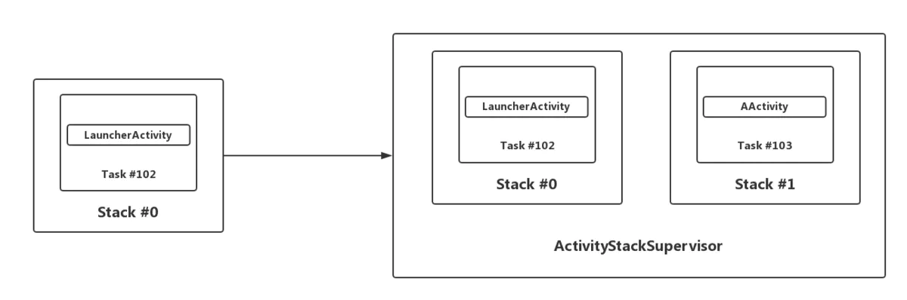
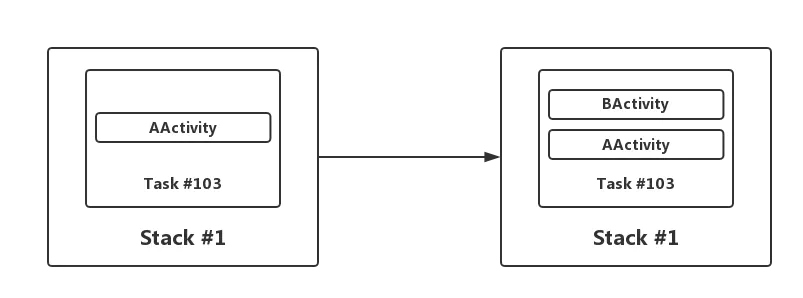
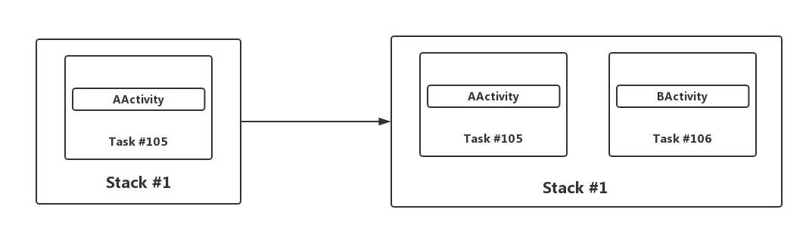

参考文章

https://mp.weixin.qq.com/s/9fwQscSZ10pFdmi7bUFaaA

https://www.jianshu.com/p/94816e52cd77


## 启动模式

声明启动模式有两种方式，如果在一次启动过程中，两种方案都设置了，后者优先级比较高。

1. 在清单文件中声明待启动的 Activity 的 launchMode 属性
2. 代码中通过 Intent 启动 Activity 时，设置 flag


`launchMode` 属性有四种取值 ：`standard` 、 `singleTop` 、 `singleTask` 、 `singleInstance` 。


####  standard: 标准启动模式

也是默认的启动模式，每次启动 Activity 都会新建一个新的实例。待启动 Activity 会进入源 Activity 所属任务栈。

> 同一个 Activity 可能被实例化多次 。


#### singleTop: 栈顶复用模式

待启动 Activity 已经位于源 Activity 所属的任务栈的栈顶时，不会创建新的 Activity，而是直接使用栈顶的 Activity，并回调它的 **onNewIntent** 方法，**onCreate** 和 **onStart** 不会被调用，直接回调 **onResume** 。

否则的话，在栈顶创建一个新的 Activity  实例。


#### singleTask：栈内复用模式

**全局单实例**，首先会寻找要启动的 Activity 想要的任务栈(默认或者 `taskAffinity` 属性指定)，如果没有找到，则创建新的任务栈并将 Activity 实例放入。如果找到了想要的任务栈，这时候要判断栈中是否已经存在该 Activity 的实例，如果已经存在，会将该 Activity 以上的其他 Activity 实例弹出，把自己放到栈顶，同样也是回调 `onNewIntent` 和 `onResume`。如果实例不存在，创建新的实例并压入栈中。


#### singleInstance：单实例模式

**全局单实例**，首次启动时会创建新的 Activity 实例，并放入一个新的任务栈中，且 **这个任务栈中只会有这一个实例。** 后续启动不会再新建实例。

默认的 standard 模式其实已经满足大部分情况下的需求，但是 **同一个 Activity 会创建多次实例** 在某些情况下肯定是不合适的，返回栈也会很突兀。这时候就需要复用已经存在的 Activity 实例，所以有了 `singleTop` 和 `singleTask` 两种不同的复用方式。而 `singleInstance` 则更加直接，Activity 实例和任务栈都是全局唯一的。

> 另外注意一点，`singleTask` 的 Activity 实例也是全局唯一的。


## taskAffinity

前面提到了 **Activity 想要的任务栈**， `taskAffinity` 的作用就是指定想要的任务栈。但它并不会在任何场景下都会起作用。

> 未显式声明 taskAffinity 的 Activity 都具有默认的任务栈，该任务栈的名称是应用包名。

当启动模式设置为 `standard` 或 `singleTop` 时，它是不起作用的。待启动的 Activity 会跟随源 Activity 的任务栈，即使你显式声明了不一样的 `taskAffinity` 。

当启动模式设置了 `singleTask` 或者 `singleInstance` 时，它就会新建任务栈来存储待启动的 Activity 实例。

除了 singleTask 和 singleInstance 以外，**FLAG_ACTIVITY_NEW_TASK** 也会使 taskAffinity 生效，后面会进行介绍。


## 返回栈的意义

在了解了上面的基础知识之后，我们可以来试着挖掘 **返回栈的存在及其意义 。**

> 图中虚线框表示任务栈，实线框表示返回栈。



**Activity 1** 和 **Activity 2** 处于前台任务栈，即当前获得焦点的任务栈，它们的启动模式都是 `standard`。**Activity X** 和 **Activity Y** 处于后台任务栈，它们的启动模式都是 `singleTask`。在位于前台任务栈顶的 **Activity 2** 中启动处于后台任务栈的 **Activity Y(跨应用启动)** ，此时会把整个后台任务栈带到前台，并放到 **返回栈** 的栈顶。此时，X 和 Y 的 taskId 是一致的，1 和 2 的 taskId 是一致的，它们仍然处于各自的任务栈中，但返回栈中自顶而下依次是，**Y -> X -> 2 -> 1** 。此时按下返回键，并不会回到 Activity 2，而是先回到 Activity X 。

从上图中可以清晰的看到 **任务栈和返回栈是独立存在的，用户页面的返回依赖的是返回栈，而不是任务栈。一个返回栈中可能会包含来自不同任务栈的 Activity ，以维护正确的回退栈关系。**这就是返回栈存在的意义。

如果 Activity X 和 Y 的启动模式都是 standard 呢 ？会直接在 Activity 2 所属的任务栈顶直接新建一个 Y 实例 ，Activity 2 的返回栈中依次是 **Y -> 2 -> 1** 。此时，两个应用的返回栈各不干扰。下图展示了 X 和 Y 都是 standard 的情况。



同样，singleTop 也不行，和 standard 表现一致。


## 源码分析

#### ActivityStack、TaskRecord、ActivityRecord关系

一个`ActivityRecord`对应一个`Activity`，保存了一个`Activity`的所有信息;但是一个`Activity`可能会有多个`ActivityRecord`,因为`Activity`可以被多次启动，这个主要取决于其启动模式。

一个`TaskRecord`由一个或者多个`ActivityRecord`组成，这就是我们常说的任务栈，具有后进先出的特点。

`ActivityStack`则是用来管理`TaskRecord`的，包含了多个`TaskRecord`。


##### ActivityRecord

ActivityRecord，源码中的注释介绍：An entry in the history stack, representing an activity.
 翻译：历史栈中的一个条目，代表一个activity。

`ActivityRecord`中存在着大量的成员变量，包含了一个`Activity`的所有信息。`startActivity()`时会创建一个`ActivityRecord`：


##### TaskRecord

`TaskRecord`，内部维护一个`ArrayList<ActivityRecord>`用来保存`ActivityRecord`。

* `TaskRecord`中使用了一个ArrayList来保存所有的`ActivityRecord`。
* `TaskRecord`中的`mStack`表示其所在的`ActivityStack`。

```java
frameworks/base/services/core/java/com/android/server/am/TaskRecord.java
    
    final class TaskRecord extends ConfigurationContainer implements TaskWindowContainerListener {
        final int taskId;       //任务ID
        final ArrayList<ActivityRecord> mActivities;   //使用一个ArrayList来保存所有的ActivityRecord
        private ActivityStack mStack;   //TaskRecord所在的ActivityStack
        
        //构造方法
        TaskRecord(ActivityManagerService service, int _taskId, ActivityInfo info, Intent _intent,
                   IVoiceInteractionSession _voiceSession, IVoiceInteractor _voiceInteractor, int type) {
            
        }
        
        //添加Activity到顶部
        void addActivityToTop(com.android.server.am.ActivityRecord r) {
            addActivityAtIndex(mActivities.size(), r);
        }
        
        //添加Activity到指定的索引位置
        void addActivityAtIndex(int index, ActivityRecord r) {
            //...

            r.setTask(this);//为ActivityRecord设置TaskRecord，就是这里建立的联系

            //...
            
            index = Math.min(size, index);
            mActivities.add(index, r);//添加到mActivities
            
            //...
        }

        //其他代码略
    }
```


##### ActivityStack

`ActivityStack`,内部维护了一个`ArrayList<TaskRecord>`，用来管理`TaskRecord`。

* `ActivityStack`使用了一个`ArrayList`来保存`TaskRecord`。
* `ActivityStack`中还持有`ActivityStackSupervisor`对象，这个用来管理ActivityStacks。

`ActivityStack`是由`ActivityStackSupervisor`来创建的，实际`ActivityStackSupervisor`就是用来管理`ActivityStack`，继续看下面的`ActivityStackSupervisor`分析。

```java
frameworks/base/services/core/java/com/android/server/am/ActivityStack.java
    
class ActivityStack<T extends StackWindowController> extends ConfigurationContainer implements StackWindowListener {
        //使用一个ArrayList来保存TaskRecord
        private final ArrayList<TaskRecord> mTaskHistory = new ArrayList<>();

        final int mStackId;

        //持有一个ActivityStackSupervisor，所有的运行中的ActivityStacks都通过它来进行管理
        protected final ActivityStackSupervisor mStackSupervisor;
        
        //构造方法
        ActivityStack(ActivityStackSupervisor.ActivityDisplay display, int stackId,
                      ActivityStackSupervisor supervisor, RecentTasks recentTasks, boolean onTop) {

        }
        
        TaskRecord createTaskRecord(int taskId, ActivityInfo info, Intent intent,
                                    IVoiceInteractionSession voiceSession, IVoiceInteractor voiceInteractor,
                                    boolean toTop, int type) {
                                    
            //创建一个task
            TaskRecord task = new TaskRecord(mService, taskId, info, intent, voiceSession, voiceInteractor, type);
            
            //将task添加到ActivityStack中去
            addTask(task, toTop, "createTaskRecord");

            //其他代码略
            return task;
        }
        
        //添加Task
        void addTask(final TaskRecord task, final boolean toTop, String reason) {

            addTask(task, toTop ? MAX_VALUE : 0, true /* schedulePictureInPictureModeChange */, reason);

            //其他代码略
        }

        //添加Task到指定位置
        void addTask(final TaskRecord task, int position, boolean schedulePictureInPictureModeChange,
                     String reason) {
            mTaskHistory.remove(task);//若存在，先移除
            
            //...
            
            //添加task到mTaskHistory
            mTaskHistory.add(position, task);
            //为TaskRecord设置ActivityStack
            task.setStack(this);

            //...
        }
        
        //其他代码略
    }
```


##### ActivityStackSupervisor

`ActivityStackSupervisor`，顾名思义，就是用来管理`ActivityStack`的。

```java
frameworks/base/services/core/java/com/android/server/am/ActivityStackSupervisor.java
    
public class ActivityStackSupervisor extends ConfigurationContainer implements DisplayListener {

        ActivityStack mHomeStack;//管理的是Launcher相关的任务
        ActivityStack mFocusedStack;//管理非Launcher相关的任务
        
        //创建ActivityStack
        ActivityStack createStack(int stackId, ActivityStackSupervisor.ActivityDisplay display, boolean onTop) {
            switch (stackId) {
                case PINNED_STACK_ID:
                    //PinnedActivityStack是ActivityStack的子类
                    return new PinnedActivityStack(display, stackId, this, mRecentTasks, onTop);
                default:
                    //创建一个ActivityStack
                    return new ActivityStack(display, stackId, this, mRecentTasks, onTop);
            }
        }
}
```

* `ActivityStackSupervisor`内部有两个不同的`ActivityStack`对象：`mHomeStack`、`mFocusedStack`，用来管理不同的任务。

* `ActivityStackSupervisor`内部包含了创建`ActivityStack`对象的方法。

AMS初始化时会创建一个`ActivityStackSupervisor`对象。


## 对应关系

ActivityStack、TaskRecord、ActivityRecord、ActivityStackSupervisor关系



```java
Display #0 (activities from top to bottom):
  Stack #0:
```

`Stack #0`是`ActivityStackSupervisor`中的`mHomeStack`，`mHomeStack`管理的是Launcher相关的任务。



##### 从桌面启动activity

从桌面点击图标启动一个`AActivity`，可以看到，会多了一个`Stack #1`，这个`Stack #1`就是`ActivityStackSupervisor`中的`mFocusedStack`，`mFocusedStack`负责管理的是非Launcher相关的任务。同时也会创建一个新的`ActivityRecord`和`TaskRecord`，`ActivityRecord`放到`TaskRecord`中，`TaskRecord`则放进`mFocusedStack`中。



##### 默认模式从A启动B

从`AActivity`中启动一个`BActivity`,可以看到会创建一个新的`ActivityRecord`然后放到已有的`TaskRecord`栈顶。



##### 从A启动B创建新栈

如果我们想启动的`BActivity`在一个新的栈中，我们可以用`singleInstance`的方式来启动`BActivity`。这种方式会创建一个新的`ActivityRecord`和`TaskRecord`，把`ActivityRecord`放到新的`TaskRecord`中去。



##### 源码调用流程
 1.`startActivity`时首先会创建一个`ActivityRecord`。
 2.如果有需要，会创建一个`TaskRecord`，并把这个`TaskRecord`加入到`ActivityStack`中。
 3.将`ActivityRecord`添加到`TaskRecord`的栈顶。